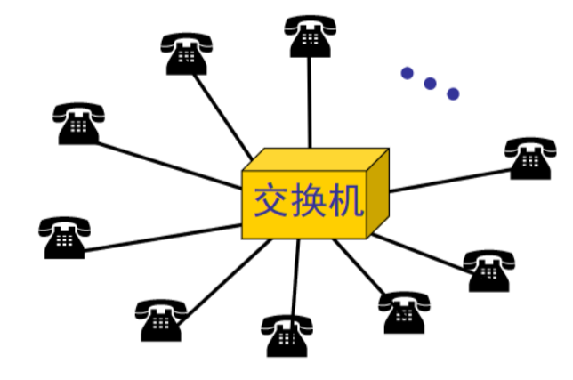
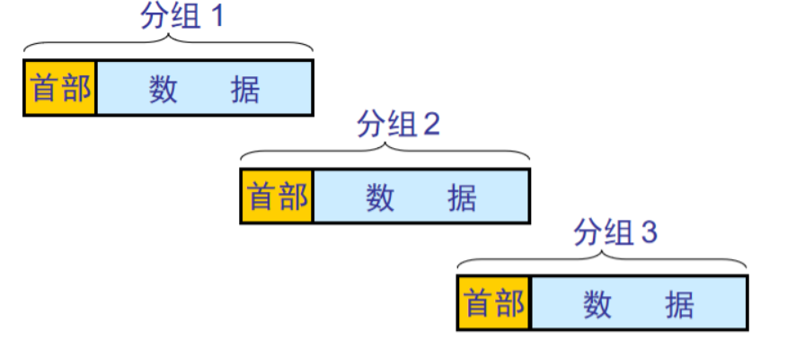
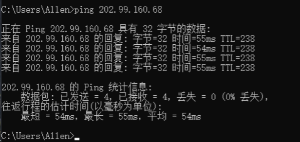

# 一、因特网概述

##### 网络、互联网与因特网

网络

由节点和链路组成，距离一般不超过100 m

互联网

通过路由器把各个网络的节点连起来叫做互联网。这样网络的规模瞬间扩大了，并且路由器设备可以传得很远。因此，该网络从距离上扩展了；通过路由器接交换机从数量上，网络中的计算机数量增加了。

因特网

因特网是全球最大的互联网。主机也叫host,因特网是通过TCP/IP Suite协议实现主机互联的。

**服务角度看：**

**从组成细节角度看：**

**总结：网络：许多计算机连接在一起；互联网：internet，许多网络连接在一起；因特网：Internet，全球最大的一个和互联网**

**问题**：仅仅有网络硬件能保证网络顺畅运行吗？

如同交通系统，仅仅有公路而没有相应的交通法什么样的后果可想难知

##### 因特网发展的三个阶段

1. 第一阶段 ARPANET

- 因特网的发展起源于1969年美国国防部研发的第一个分组交换网络ARPANET。
- 1975年，分组网络进行了互相连接成为了互联网（现在因特网的雏形）。
- 1983年，把 TCP/IP协议 作为因特网的通用协议，所以通常把1983作为 Internet 的元年。由于 TCP/IP协议是美国国防部开发供内部人员使用的，所以没有考虑到安全问题。因特网开放之后，任何人都可以访问因特网，TCP/IP协议 存在的安全漏洞就会被人利用，这是TCP/IP协议的先天不足。

2. 第二阶段：三级网络的因特网

- 1985年出现三级结构的因特网。美国国家基金会围绕6个大型计算机中心建设计算机网络，这个网络一共分3级。
  - 1.比如校园里使用的校园网，企业使用的企业网等多个网
  - 2.接入形成一个地区网；
  - 3.多个地区网连在一起形成主干网。这就是三级结构。
- 此时的因特网还是政府支持的，带宽只有45M

3. 第三阶段：多层次ISP结构的因特网

- 1993年因特网由政府交由ISP公司运营。联通、电信等就是ISP即 **Internet** 服务提供商。ISP分级，并且公网地址有统一安排。比如百度上随便输入一个IP地址：8.8.8.8

##### 多层次的 ISP 结构

比如河北电信可以是第二层ISP，它可以向Internet申请一个地址范围（一个地址段）。那么石家庄电信（本地ISP）可以向第二层ISP的河北电信申请地址范围，这样河北电信（第二层ISP）申请的地址段可以分配给河北各个地方的本地（第三层）ISP。这就是三级ISP结构。

**那么服务器应该放在那一层ISP呢？**

- 如果该网站仅给中国提供网络服务，服务器可以放在第二层ISP，这时访问速度还可以。
- 如果该网站给全球提供网络服务，服务器就放在第一层ISP，这时全球的用户访问的时候都比较快。
- 如果为全球服务的网站服务器接在第三层ISP,全球的用户访问时就会经历如图所示的过程，历经六层ISP结构，除了本地用户访问速度比较快之外，其余用户访问速度都比较慢。

**所以说服务器放在那里取决于服务对象。这就是ISP的分层**

**中国互联网**

如果连接中国移动互联网的用户，访问中国科技网的服务器，速度就会很慢。原因是，不同运行商服务器之间的访问要经过多层ISP结构，速度自然慢（带宽低）。所以，有的公司要在不同运营商的服务器上部署许多个相同网站。在移动这放一个网站，联通上也放一个......这样用户访问该网站的时候，他们可以访问本地服务器的网站就比较快。比如下载软件的时候：

如果用户使用电信上网的就使用电信下载，使用联通上网的就使用联通下载。原因就是选择本地运营商下载，速度会比较快

### ISP、企业网以及网民

- 青园小区的用户通过电信接入Internet，访问电信机房的服务器就比较快；
- 红星小区的用户和石家庄车辆厂通过网通接入Internet，访问网通服务器就比较快；
- 双线机房：一边连联通，一边连电信（即连接多个运营商）。这样电信用户和网通用户访问双线机房服务器的速度都很快。

有的网民调侃：世界上最远的距离不是南极到北极的距离，而是电信到网通的距离。

这就是指跨运营商的网络访问速度就会慢！这就是为什么需要双线机房。

##### 因特网的标准化工作

整个互联网需要众多的设备连接，有线、无线、TCP/IP协议等。这些协议和设备不是一家公司制定和生产的，这就要求大家按照一个标准来制造和研发。这个标准就有因特网协会ISOC制定的。分为两个部门：

- 因特网研究部IRTF：进行理论方面的研究和开发一些需要长期考虑的问题。
- 因特网工程部IETF：集中研究各个领域某些短期、中期的工程问题。

制定因特网的正式标准要经过以下的四个阶段

- 因特网草案(Internet Draft) ——在这个阶段还不是 RFC 文档。
- 建议标准(Proposed Standard) ——从这个阶段开始就成为 RFC 文档。
- 草案标准(Draft Standard)
- 因特网标准(Internet Standard)

各种RFC之间的关系

# 二、因特网的组成

因特网可分为边缘部分和核心部分

边缘部分：接入计算机的因特网

核心部分：指的是能够让计算机通讯的网络的统称

##### 因特网的边缘部分

客服端服务器方式（C/S）

比如通过chrome浏览器输入URL就可以访问一个web网站；那么这个chrome浏览器就是客户端（Client），存放web网站的就是服务器（Server）；这种通信方式就是C/S通讯方式。当然这个网站可以供大量的用户访问

对等链接方式（p 2 p）

**比如什么叫P2P下载？**

比如从网上下载一部电影，一个人下载，速度还可以；两个人下载也还行；如果三个用户都从同一个服务器上下载，这个服务器的带宽就有压力了；下载的人越多，速度就越慢。这是C/S方式。

若使用P2P方式，则每一台计算机是客户端的同时也可以是服务器。比如如图所示，电影资源在服务器C上大小为500M，客户端D从服务器C上下载了250M；此时客户端F也想要下载，那么它可以从客户端D处下载这250M资源；此时客户端D既是客户端也是服务器。这就是对等(P2P),下载资源的时候客户端可以对应很多下载源，同时从多个源上下载同一份文件，这一部分从这下载，另一部分从那下载，下载的人越多，源越多，速度越快就是这样实现的

##### 因特网的核心部分

##### 计算机采用的分组交换方式

电路交换（Circuit Switching）

比如电话拨号机，当电话A要和电话B通讯的时候，交换机就在内部建立电话A和电话B的连接。这就是电路交换，需要通讯时通过交换机建立连接，通讯完之后就释放连接。

电路交换有三个过程：建立连接、通话、释放连接。

例如

当A与B已经建立连接之后，D再想和A建立连接就不行了，因为A与B的连接没断开，出现了“占线”.

**电路交换适合于数据量很大的实时性传输（比如语音和视频）：核心路由器之间可以使用电路交换**

- 就是说允许等待10s，在A与B之间建立电路连接，之后就可以实现数据实时传输，即A说一句话B就能马上收到。
- 不允许A说了一句话，B要等30s才能收到；B说了一句话，A要20s才能收到；这样是不行的。

**缺点**

- 计算机数据具有突发性。
- 这导致通讯线路的利用率很低。

**分组交换方式（Packet Switching）**

**发送端**

假设把这段报文分成三段：

**注意**：

- **每一个**分组的首部都含有**发出地址**和**接收地址**等控制信息。
- 分组交换网中的结点交换机根据收到的分组的首部中的**地址信息**，把分组**转发**到下一个结点交换机。
- 用这样的**存储转发**方式，最后分组就能到达**最终目的地**。

**接收端**

**分组交换的转发**

- 红色和黄色方块表示 H1 向 H5 发送的分组。

主机H1与主机H5通信的时候，比如主机 H1上一个word文档分成了小的数据分组，分组首部都写上目标地址是H5，然后路由器（蓝色的按钮）就按照首部的地址选择到目标地址的传输路径。也就是说主机H1与主机H5通讯，走的不一定是同一条路径。

如图所示：

H1向H5发送分组，可以走A->C->E;可以走A->B->E;可以走A->B->C->E等路径。

H2向H6发送分组，可以走B->E;可以走B->D->E等路径。

> 这就是互联网的分组发送方式：每一个数据包（分组）单独地选择路径，这些路径可以同时被多个计算机来使用，不占线，不需要建立连接。
>
> 而电路交换，在通讯前先选好路线，选好的路线其他人不给走，这根线就被占用了。

**路由器的存储转发功能**

- 在路由器中（图中的A~E）的输入和输出口之间**没有直接连线**
- 路由器处理分组的过程是：
  - 把收到的分组先放入**缓存（暂时存储）**；
  - 查找**转发表**，找出到某个目的地址应从哪个端口转发。即寻找到目的地址的最佳路径，如分组在路由器A中时，判断是从A到B路径的输出端口输出？还是从A到C路径的输出端口输出？
  - 把分组送到最适合的**输出端口**转发出去。

**优点**

- 高效 动态分配传输带宽，对通信链路是逐段占用。
- 灵活 以分组为传送单位和查找路由。
- 迅速 不必先建立连接就能向其他主机发送分组。
- 可靠 保证可靠性的网络协议；分布式的路由选择协议使网络有很好的生存性。

**缺点**

- 时延：分组在各结点存储转发时需要**排队**，这会造成一定的**时延**。
- 开销：分组必须携带首部（里面有必不可少的控制信息）也造成了一定的**开销**。

------

> **报文交换方式（Message Switching）**

- 报文一般比分组长的多。因为报文不分段直接传输
- 报文交换的时延较长。

------

**三种交换方式的比较**

从上往下是时间轴。可见分组交换使用的时间最短；报文交换使用的时间最长。

**分析**

把20M的数据从A经过B、C发送到D。

- 电路交换：花一段建立A->D的连接，此后数据直接从A传输到D，随后再花一段时间释放连接。

- 报文交换：数据不分组，直接将数据以报文形式先从A传输到B，再从B传输到C，最后从C传输到D，需要排队，是一种串行的方式。

- 分组交换：先将20M的数据分组，比如分成4组：P1~P4，每组5M。

  1. 首先P1从A传输到B。

  2. 随后P2再从A传输到B，此时B中同时把P1传输给C。

  3. 接着P3从A传输到B，此时B中同时把P2传输给C，C也同时把P1传输给D。

  4. 然后P4从A传输到B，此时B中同时把P3传输给C，C也同时把P2传输给D。

     此时A上的数据已全部传输了出去，此后B~D的传输过程以此列推。可见分组交换方式是延迟了一个分组的并行传输，所以在三种传输方式中速度最快。

# 三、计算机网络在我国的发展

中国在1994年4月20日正式接入互联网

## 计算机网络的类别

计算机网络最简单的定义：一些互相连接的、自治的计算机的集合。

**按照作用范围**

- 局域网（LAN）：比如学校多间教室的计算机连起来形成的网络。
- 广域网（WAN）：比如石家庄和上海的网络连起来形成的网络。
- 城域网（MAN）：比如覆盖一个城市的网络。
- 个人区域网（PAN）：比如个人的两台电脑找个小交换机连起来形成的网络。

**新的理解**：不单单从网络覆盖范围区分局域网和广域网

- 广域网：应用了广域网技术，自己花钱买服务，花钱买带宽。
- 局域网：应用了局域网技术，自己购买设备，自己维护，带宽固定 100M 1000M（局域网连接一般不超过100m）

# 四、计算机网络的性能

**1.速率**

> 连接在计算机网络上的主机在**数字信道**上传送**数据位数**的速率，也称为data rate 或 bit rate
>
> 单位是b/s ,kb/s,Mb/s,Gb/s
>
> 比如我们使用8M的网线，这个8M表示的是bit，而平时我们下载东西看到的速率是以字节为单位的。**1字节=8bit**，所以实际最高速度只有8/8M。
>
> **数字信道**：比如一台计算机与Internet。计算机在线看电影Internet中为**发送端**，计算机为**接收端**，这就是一个信道。看电影的同时，计算机还从Internet下载文件，又形成一个信道。说信道的时候不是说总的，而是某两个特定点流量传输的速度。比如看电影信道2M带宽，下载4M带宽，我们不能说计算机上网的信道是6M带宽。这是两个信道，一个信道的速率指的是一个发送端，一个接收端传输数据的速率。

**2.带宽**

> 数据通信领域中，数字信道所能传送的最高数据率
>
> 单位b/s，kb/s，Mb/s，Gb/s

**3.吞吐量**

> 即单位时间内通过某个网络的数据量；
>
> 单位b/s，kb/s，Mb/s，Gb/s

**4.时延**

发送时延：比如火车过隧道，火车车长 / 隧道长度

传播时延：即传输指定距离所用的时间。

处理时延：网络节点存储转发处理时间。

排队时延：当多个数据传输到结点A时要进行排队处理。

> 处理时延和排队时延可以理解为坐火车，买票需要排队这是排队时延，买票时看线路决定坐哪班车这是处理时延。

**可以在命令行中测试**：

ping命令粗略判断带宽和时延。

**5.时延带宽积**

- 链路的时延带宽积又称为以**比特**为单位的链路长度。

**6.往返时间**

RTT（Round-Trip Time）

从发送方发送数据开始，到发送方收到接收方确认的时间。如上文所述可以通过ping命令测试往返时间。

**7.利用率**

- **信道利用率**：有数据通过时间 / （有+无）数据通过时间；即指的是某信道有百分之几的时间是被利用的（有数据通过的）；完全空闲的信道利用率是零。
- **网络利用率**：信道利用率的加权平均值；数值在0~1之间。

**时延与网络利用率的关系**

> U 是网络的利用率，数值在 0 到 1 之间。

**利用率增大会导致时延急剧增大。**这就好像公路上的汽车，一条公路跑的汽车少说明该公路利用率低，当该公路跑的车多了，公路的利用率变高了，同时也变拥堵了。

------

**计算机网络的非性能指标**

- 费用
- 质量
- 标准化
- 可靠性
- 可扩展性和可升级性
- 易于管理和维护

# 五、计算机网络体系结构

**几个基本概念**

- ISO：国际标准化组织；
- OSI/RM：互联网法律上的国际标准；
- TCP/IP Suite：因特网事实上的国际标准；
- Network Protocols：数据交换准守的规则、标准或约定；
- 网络体系结构：就三级网络各层及其协议的集合；

------

**分层的必要性**

- 灵活性好；
- **结构上可分割开，各层之间是独立的**：每一层发生改变不会影响其它层（整体）；
- 易于实现和维护；
- **能促进标准化工作**；

> OSI 7层参考模型

- **应用层**：能够产生网络流量和用户交互的应用程序；
- **表示层**：加密和压缩，开发人员需要考虑的问题。比如QQ聊天时如何对传输的聊天记录进行加密？再比如乱码问题，都是表示层需要考虑的问题；
- **会话层**：服务器和客户端建立的会话。该层可以查看木马，输入命令 netstat -nb（参数b可查看木马名称）；

> 木马与病毒的区别：木马一般用于窃取会话信息；病毒一般会破坏计算机。

- 传输层

  ：可以进行

  - **可靠传输**（建立会话），比如下载电影要把电影分成几个小的数据包进行传输，若果丢了其中几个包最后文件就不能运行，所以需要建立会话记录数据包的传输信息；
  - **不可靠传输**（不建立会话），比如URL域名解析，只需要一个数据包就能解决不需要建立会话记录具体信息；
  - **流量控制**：当客户端发送大量数据包给服务器端时，服务器处理不过来，反过来告诉客户端少发点或者慢点发送数据。

- **网络层**：负责IP地址编址，选择最佳路径；

- **数据链路层**：规定数据如何封装，添加物理层地址（MAC地址）；

- **物理层**：规定电压、接口等标准；

------

**应用举例**

典型的案例就是：改了IP地址还能使用服务器吗？

IP地址是**网络层**的工作，服务器提供的服务都是**应用层**的工作；如果采用分层思想设计计算机网络，各层之间相互独立、互不影响就不会出现这样的问题了。

相反如果修改了计算机的IP地址，该计算机就无法使用原来服务器的应用服务了。问题的根源在于没有采用分层的设计思想。把网络层的工作附加到了应用层里面，这样增大了耦合性，导致整个组网的独立性和可维护性较差。

> 所以设计计算机网络的时候要遵守分层原则：每一层的改变不会影响其他层。

------

**网络排错**

> 网民戏称排错三法宝：重装、重启、格式化

网络排错应该从底层到高层，逐一排查。

比如：计算机上不了网了。最基础的应从物理层开始排错，即看看网线插好了没有？路由器是否正常工作？在一层层往上排查。

------

**网络安全和OSI参考模型**

- **物理层安全**：比如断开不使用的交换机接口，防止为其他用户提供接入交换机的机会以窃取交换机连接的其他用户的信息；
- **数据链路层安全**： 比如wifi的加密。不加密的无线信号任何人都可以连上；
- **网络层安全**：比如公司有两个部门：研发部和市场部，他们的网络通过公司的路由器接在一起，路由器接Internet，为了防止研发部资料泄露，可以在路由器中设置研发部的网络不能访问Internet而市场部的可以。
- **应用层安全**：比如SQL注入漏洞、上传漏洞。

------

> TCP/IP 的四层模型

可以看到TCP/IP 四层模型中的**应用层**，包含了OSI七层模型中的的**应用层**、**表示层**和**会话层**；并把**数据链路层**和**物理层**合为一层。

教材中的五层模型，只是把OSI七层模型中的的**应用层**、**表示层**和**会话层**合并为**应用层**；

------

**开放系统信息交换涉及的几个概念**

**关系：**

服务用户与服务提供者这两层中各自的实体使用的协议不同，因此不同层实体之间无法通信

**五层协议对应的数据单元**

例如：主机1向主机2传输数据

**注意**

- 主机1发送数据时，从AP1到1层，每往下传输一层就加入去相应的尾部（首部）。
- 主机2接收数据时，从1层到AP2，每往上传输一层就要剥去相应的尾部（首部）。