#   一、网络安全问题概述

#### 1.1.计算机网络面临的安全性威胁

- 计算机网络上的通信面临以下的四种威胁：

  (1) **截获**——从网络上窃听他人的通信内容。

  (2) **中断**——有意中断他人在网络上的通信。

  (3) **篡改**——故意篡改网络上传送的报文。可应用于域名重定向，即钓鱼网站。

  (4) **伪造**——伪造信息在网络上传送。

- 截获信息的攻击称为**被动攻击**，而更改信息和拒绝用户使用资源的攻击称为**主动攻击**。

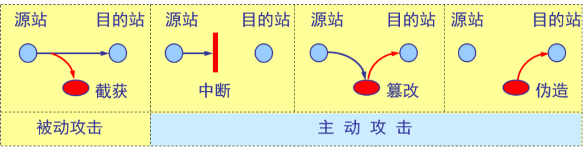

#### 1.2.被动攻击和主动攻击

- 在被动攻击中，攻击者只是观察和分析某一个协议数据单元 PDU 而不干扰信息流。

- 主动攻击是指攻击者对某个连接中通过的 PDU 进行各种处理。

  更改报文流 ；

  拒绝报文服务 ；

  伪造连接初始化 ；

#### 1.3.计算机网络通信安全的目标

- 防止析出报文内容；
- 防止通信量分析；
- 检测更改报文流；
- 检测拒绝报文服务；
- 检测伪造初始化连接。

#### 1.4.恶意程序(rogue program)

- **计算机病毒**——会“传染”其他程序的程序，“传染”是通过修改其他程序来把自身或其变种复制进去完成的。主要影响为更改系统设置，删除文件等，比如"熊猫烧香"。
- **计算机蠕虫**——通过网络的通信功能将自身从一个结点发送到另一个结点并启动运行的程序。影响为逐渐占用CPU资源，直到耗尽计算机的CPU使计算机重启。
- **特洛伊木马**——一种程序，它执行的功能超出所声称的功能。比如盗号木马，灰鸽子木马：中了木马计算机就会被人远程操控。特点为需要与外界网络通信。判断计算机是否中了木马程序：1.查看会话：netstat -n 是否有可疑会话；2.运行 msconfig 查看计算机安装的服务，隐藏微软服务，观察是否有可疑的服务；3.安装杀毒软件。
- **逻辑炸弹**——一种当运行环境满足某种特定条件（比如按时间）时执行其他特殊功能的程序。

#### 1.5.计算机网络安全的内容

- 保密性；
- 安全协议的设计 ；
- 访问控制 ；

#### 1.6.一般的数据加密模型

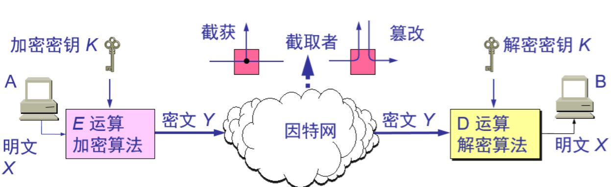

**重要概念 **

- **密码编码学**(cryptography)是密码体制的设计学，而**密码分析学**(cryptanalysis)则是在未知密钥的情况下从密文推演出明文或密钥的技术。密码编码学与密码分析学合起来即为**密码学**(cryptology)。
- 如果不论截取者获得了多少密文，但在密文中都没有足够的信息来唯一地确定出对应的明文，则这一密码体制称为**无条件安全的**，或称为**理论上是不可破**的。
- 如果密码体制中的密码不能被可使用的计算资源破译，则这一密码体制称为在**计算上是安全**的。

# 二、两类密码体制

### 一、对称密钥密码体制

- 所谓常规密钥密码体制，即加密密钥与解密密钥是**相同的**密码体制。
- 这种加密系统又称为**对称密钥系统**。

#### 1.1.对称密钥的缺点与优点

缺点：

- 若通信双方使用的密钥通过网络传输，会有被他人截获的风险，因此密钥不适合在网上传输。
- 若用户A想与多个用户通信需要知道多个密钥，密钥维护量大。

优点：效率高。

#### 1.2.数据加密标准 DES

- 数据加密标准 DES 属于**常规（对称）密钥密码体制**，是一种分组密码。
- 数据加密分为：**加密算法**和**加密密钥**两部分。
- 在加密前，先对整个明文进行分组。每一个组长为 64 位。
- 然后对每一个 64 位 二进制数据进行加密处理，产生一组 64 位密文数据。
- 最后将各组密文串接起来，即得出整个的密文。
- 使用的密钥为 64 位（实际密钥长度为 56 位，有 8 位用于奇偶校验)。

#### 1.3.DES 的保密性

- DES 的保密性仅取决于对密钥的保密，而算法是公开的。尽管人们在破译 DES 方面取得了许多进展，但至今仍未能找到比穷举搜索密钥更有效的方法。

- DES 是世界上第一个公认的实用密码算法标准，它曾对密码学的发展做出了重大贡献。

- DES算法的保密性取决于加密时使用密钥的长度：

  使用56位密钥加密，破解需要3.5或21分钟；

  使用128位密钥加密，破解需要5.4x10的18次方年。

------

### 二、公钥密码体制（非对称密钥密码体制）

- 公钥密码体制使用**不同的加密密钥与解密密钥**，是一种“由已知加密密钥推导出解密密钥在计算上是不可行的”密码体制。
- 使用的密钥分为公钥和私钥，两种密钥成对使用。使用公钥加密和私钥解密；使用私钥加密和公钥解密。
- 现有最著名的公钥密码体制是**RSA** 体制，它基于数论中大数分解问题的体制，由美国三位科学家 Rivest, Shamir 和 Adleman 于 1976 年提出并在 1978 年正式发表的。

#### 2.1.加密密钥与解密密钥

- 公钥和私钥密钥对，是由计算机产生的随机数通过算法得出的两部分。
- 在公钥密码体制中，加密密钥(即公钥) *PK（Public Key）* 是公开信息，而解密密钥(即私钥或秘钥) *SK（Secret Key）* 是需要保密的。
- 加密算法 *E* 和解密算法 *D* 也都是公开的。
- 虽然秘钥 *SK* 是由公钥 *PK* 决定的，但却不能根据 *PK* 计算出 *SK*。

#### 2.2.公钥算法的特点

- 发送者 A 用 B 的公钥 *PK*B 对明文 *X* 加密（*E* 运算）后，在接收者 B 用自己的私钥 *SK*B 解密（*D* 运算），即可恢复出明文：

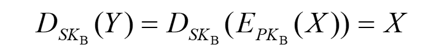

- 解密密钥是接收者专用的秘钥，对其他人都保密。
- 加密密钥是公开的，但不能用它来解密，即：

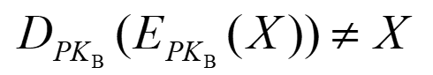

- 加密和解密的运算可以对调，即可用公钥加密，私钥解密；也可用私钥加密，公钥解密。

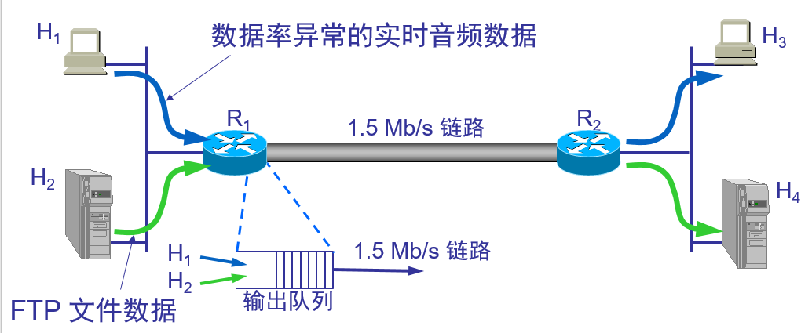

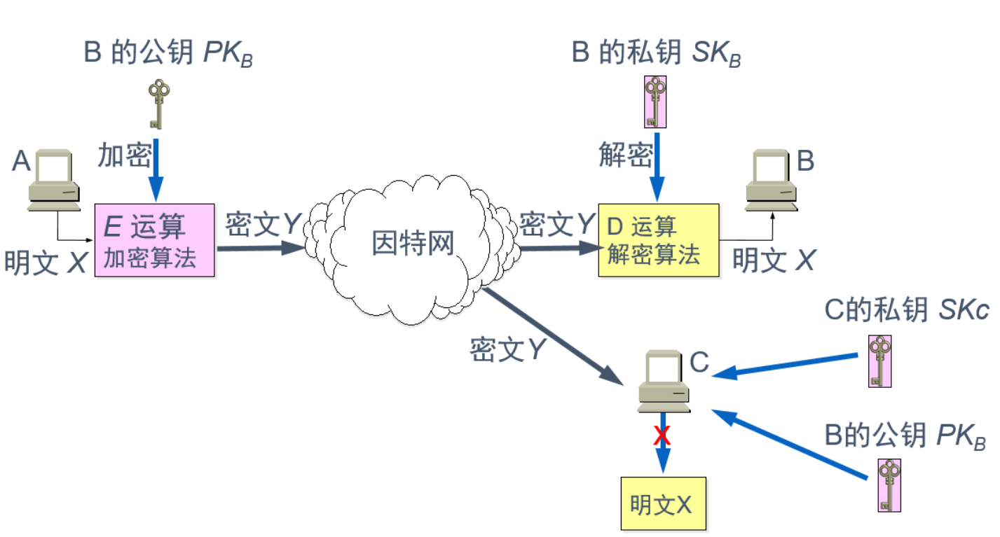

- 若用户A要与用户B进行加密通信，首先B要把自己的公钥PKB发送给A，A使用B的公钥对通信的明文X进行加密，生成密文Y，密文Y通过因特网传输到用户B处，用户B使用自己的私钥SKB对密文Y进行解密得到明文X；
- 如果密文Y在因特网上传输的过程中被用户C截获了，用户C无论是使用用户B的公钥PKB，还是自己的私钥SKC都无法对密文Y进行解密。只有用B的私钥SKB才能解密用B的公钥PKB加密的明文。
- 用户B想要与其他用户进行加密通信，只需要把自己的公钥告诉对方即可。公钥是公开的，没有公钥对应的私钥，即使密文被截获也不能被解密，只要保管好私钥，就能达到较高的安全程度。
- 公钥密码体制的缺点为**效率低**。

#### 2.4.实际应用过程

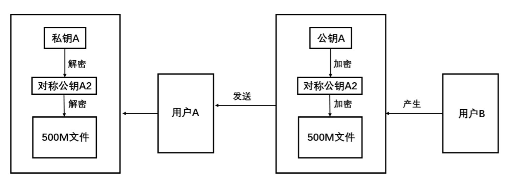

实际进行加密通信时，往往综合使用对称加密和非对称加密的方式。如图所示：B想要给A发送一份500M的文件，如果直接使用A的公钥对500M文件进行加密将会耗费大量时间；

实际做法为：B产生一个相对简单的对称公钥A2，首先使用A2对文件进行加密，由于A2比较简单加密耗时较短。然后使用A的公钥对对称密钥A2进行加密。最后将A、A2和已加密文件组成的整体发送给用户A 。

用户A收到之后，使用私钥解密得到对称公钥A2，再使用A2对文件进行解密得到文件。

**总结：**实际应用过程中使用对称加密和非对称加密相结合的方式，既具备了对称加密的高效率，也具备了非对称加密的安全性。

# 三、数字签名

### 一、数字签名简介

> **数字签名是基于公钥密码体制（非对称密钥密码体制）的。**

#### 1.1.基本特征

数字签名必须保证以下三点：

- **报文鉴别**——接收者能够核实发送者对报文的签名；
- **报文的完整性**——接收者不能伪造对报文的签名或更改报文内容。
- **不可否认**——发送者事后不能抵赖对报文的签名；

#### 1.2.数字签名的验证过程

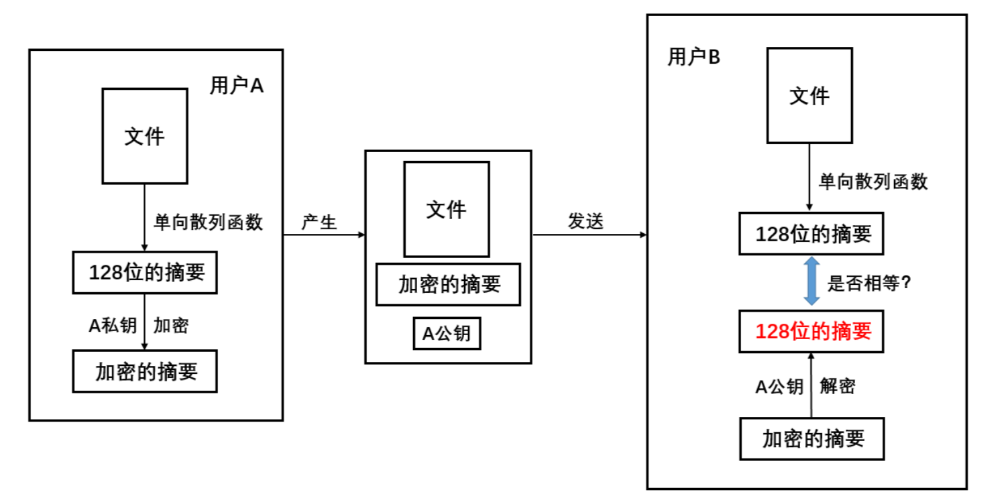

上图位用户A使用数字签名向用户B传输一份文件的过程：

- 首先，文件经过单向散列函数的处理得到一份占128位的摘要（无论文件多大，经过单向散列函数的处理，生成的摘要都是128位），这份摘要相当于该文件的"指纹"，能够唯一地识别文件。**注意：**只要文件发生改动，经过单向散列函数处理后得到地摘要都会不一样。所以，文件和文件的摘要具有很强的对应关系。
- 随后，用户A使用自己地私钥对这份128位地摘要进行加密，得到一份加密地摘要。
- 然后，用户A把文件、加密的摘要和公钥打包一起发给用户B。传输的过程中并没有对文件进行加密处理。
- 用户B将收到的文件经过单向散列函数处理得出一份128位摘要，这份摘要是通过收到的文件得到的，存在被更改的可能；使用A提供的公钥对收到的"加密的摘要"进行解密得到另一份128位摘要，这份摘要是通过原始文件得到的，一般认为代表真正的文件；然后将两份摘要进行比较。
- 如果两份摘要相等，说明文件经过用户A签名之后，在传输的过程中没有被更改；若不相等，说明文件在传输过程中被更改了，或者说已经不是原来的文件了，此时用户A的签名失效。

> **数字签名三个特征的验证**

- **不可否认**——只有用户A拥有私钥A，并能使用私钥A产生"加密的摘要"，这样用户A就不能否认给用户B发送了经过签名的密文。
- **报文的完整性**——用户B通过比较得出的两份摘要是否相等，可以判断签名或文件内容是否发生改变。
- **报文鉴别**——用户B可以使用收到的公钥对"加密的摘要"进行解密，从而核实用户A对文件的签名。

> **需要强调**

- 用户A使用私钥对由文件生成的128位摘要进行加密的过程称为**数字签名的过程**，得到的**"加密的摘要"**，称为该文件的**数据签名**。
- 用户A使用私钥加密的是摘要而不是文件。
- 用户B验证签名实际上是比较得出的两份摘要是否相等。

#### 1.3.数字签名使用的场合

什么时候使用这种不对文件加密，而对文件的摘要加密（对文件进行签名）的技术呢？

- 数字签名解决的核心问题是：**确保收到的文件没有被更改**。
- 比如：公司的领导给员工下发放假通知，这时候就需要对邮件进行数字签名来证明这个通知是领导发的。员工收到通知，看到上面有领导的签名，于是就可以放心休假了。如果有人冒充领导发通知，上面没有领导的签名，员工休假回来就要扣工资。同样的，通知有了领导的签名，领导想抵赖也不行。

------

### 二、证书颁发机构CA

#### 2.1CA简介

- 证书颁发机构，即认证中心**CA** (Certification Authority)，来将公钥与其对应的实体（人或机器）进行**绑定**(binding)；即给公司或个人颁发证书。
- 认证中心一般由政府出资建立。每个实体都有CA 发来的**证书**(certificate)，里面有公钥及其拥有者的标识信息。此证书被 CA 进行了数字签名。任何用户都可从可信的地方获得认证中心 CA 的公钥，此公钥用来验证某个公钥是否为某个实体所拥有。有的大公司也提供认证中心服务。

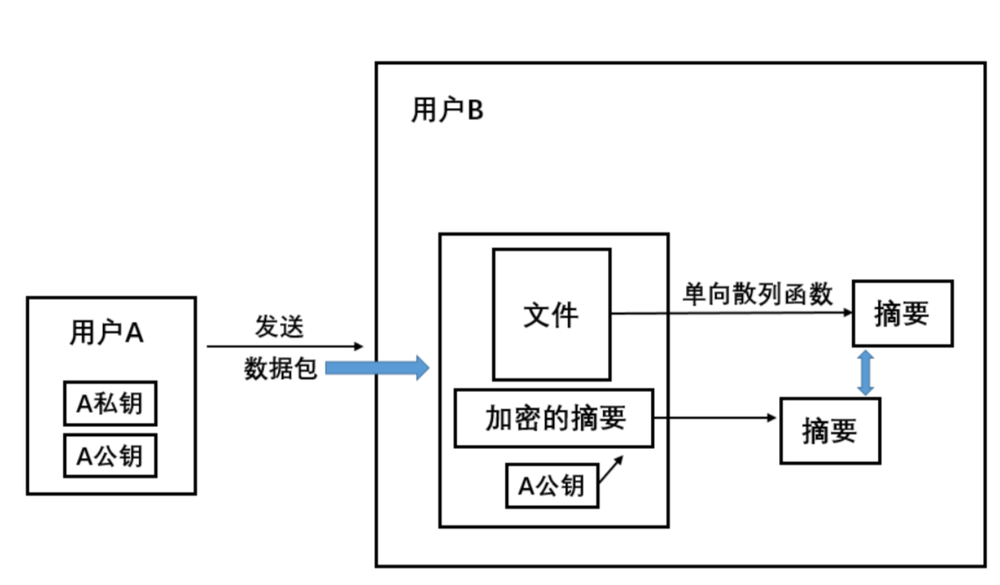

如图所示，用户A使用数字签名时给用户B发送了一个数据包，数据包中包含了A的公钥、文件和加密的摘要。那么问题来了：**用户B如何确定收到的公钥是用户A发送的，而不是他人冒充用户A发送的呢？**

- 举个例子：把用户A的公钥和私钥假设为身份证。如果是用户A自己造的身份证别人会信吗？反之，用户A拿着真正的身份证去住宾馆，老板一开始也不相信身份证是用户A的，但是老板相信给用户A发身份证的公安局，老板通过比对公安网上对应身份证号码的信息就可以判断这个身份证是不是用户A的，由此可以确认用户A的身份。
- 同理，B一开始并不确认收到的公钥是来自用户A的，用户A也可抵赖B收到的公钥不是自己发送的。这时就需要有一个双方都信任的第三方证书颁发机构来协调。

#### 2.2.证书颁发和使用过程

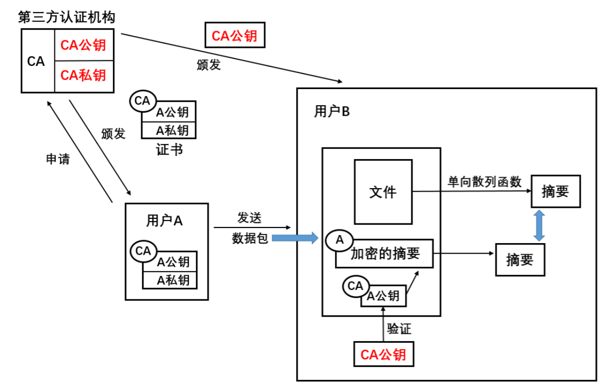

- 首先，用户A向证书颁发机构提交个人信息，申请证书。通过CA审核后，CA生成用户A的证书，证书中包括了A的公钥和私钥还有CA的数字签名。证书颁发机构CA本身拥有一对密钥，这是对CA所颁发的证书进行数字签名和保密的基础，绝不能泄露。

- 用户A收到的证书中包括了带有CA数字签名的，专属A公钥和私钥，CA的数字签名确保了别人不能伪造用户A的公钥和私钥。

- 同时，用户B也必须信任给用户A颁发证书的第三方认证机构CA，即用户B拥有CA颁发的"CA公钥"。

- 通信时，用户A向用户B发送的数据包中的"加密的摘要"上有用户A的数字签名，“A公钥” 上有认证机构CA的数字签名。用户B收到数据包之后，先要验证收到的 “A公钥” 是否来源合法：是认证机构颁发的带有CA签名的公钥吗？用户B并不信任用户A，但是用户B信任第三方认证机构CA。所以，用户B先使用证书颁发机构颁发的 "CA公钥" 验证收到的 "A公钥" 是否由同一认证机构颁发，是否在颁发之后更改过。

  验证通过后，用户B便相信收到的 "A公钥" 确实来自真实的用户A。随后再使用 "A公钥" 对 "加密的摘要" 进行解密，进行上文提到的对比操作，以判断文件是否更改。

#### 2.3.查看计算机信任的认证机构

信任一个第三方认证机构就意味着拥有该机构颁发的包含该机构公钥的证书。

#### 2.4.证书的吊销

当用户A遗失或泄露了CA颁发的证书后，为了避免他人使用该证书冒充用户A，用户A向认证机构CA "挂失" 该证书。于是认证机构CA把该证书放入该认证机构的证书吊销列表（CRL）中，并在网上公示。

用户B在收到用户A的公钥时，除了要验证该公钥是否位认证机构颁发的，还要登录认证机构的网站查看该公钥是否已被认证机构吊销变为无效证书。

#### 2.5.总结

认证机构CA的作用：

- 为企业和用户颁发数字证书，确保这些企业和个人的身份是真实的；
- 发布证书吊销列表，供用户查询收到的证书是否已被机构吊销而无效；

认证机构发挥作用的前提：

- 企业和个人都要信任认证机构。

# 四、Internet上使用的安全协议

> 网络安全是分层实现的，从应用层安全到数据链路层安全。

### 一、运输层安全协议：安全套接字SSL

#### 1.1.简介

- **SSL** 是安全套接层 (Secure Socket Layer)，可对万维网客户与服务器之间传送的数据进行加密和鉴别。
- SSL 在双方的联络阶段协商将使用的加密算法和密钥，以及客户与服务器之间的鉴别。
- 在联络阶段完成之后，所有传送的数据都使用在联络阶段商定的会话密钥。
- SSL 不仅被所有常用的浏览器和万维网服务器所支持，而且也是**运输层安全协议 TLS** (Transport Layer Security)的基础。

#### 1.2.SSL 的位置

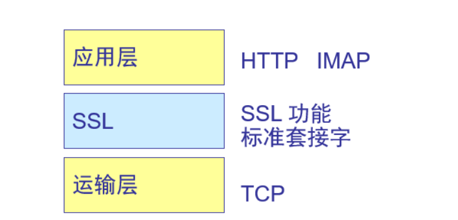

- 在发送方，SSL 接收应用层的数据（如 HTTP 或 IMAP 报文），对数据进行加密，然后把加了密的数据送往运输层 TCP 套接字。
- 在接收方，SSL 从 TCP 套接字读取数据，解密后把数据交给应用层。（发送方和接收方都有SSL层）

#### 1.3.使用SSL技术的例子

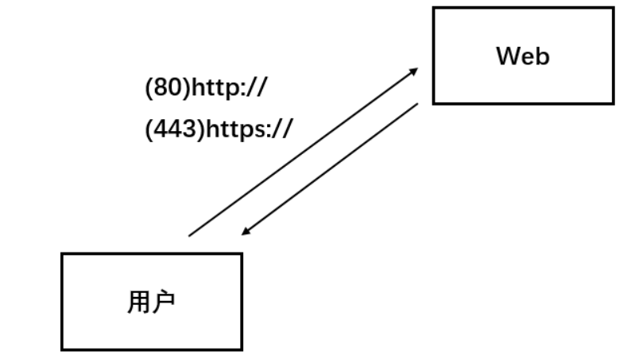

当我们访问网站时，一般不涉及输入账号密码等操作的网页使用的都是 "HTTP" 协议（使用80端口），即网站域名开头为：http://；当涉及账号密码等敏感信息的操作时，网站一般都会使用 "HTTPS"协议（使用443端口），"S"表示的即是SSL (Secure Socket Layer)，即网站域名开头为：https://。

> **补充**

HTTP协议使用了安全套接字（SSL）变成了HTTPS协议，使用的端口由80变为443，其他应用层的协议也可以使用安全套接字：

- IMAPS：TCP-993；
- POP3S：TCP-995；
- SMTPS：TCP-465；

#### 1.4.安全套接字实现的过程：https

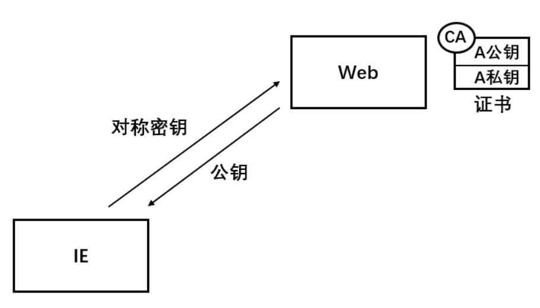

https既采用了对称加密的效率，也采用了非对称加密的安全。

通信前Web服务器先把证书中的公钥交给IE浏览器（客户），IE浏览器根据收到的公钥生成一个对称密钥，然后使用公钥加密对称密钥并发送给Web服务器。

Web服务器使用私钥解密收到的加密后的对称密钥，随后使用对称密钥加密需要传输的数据。在之后的通信中都采用该对称密钥对数据加密和解密。

在传输对称密钥的过程中使用非对称加密，在传输数据过程中使用对称加密。这样既保证了数据传输的安全，也提高了效率。

所以，在使用https通信的时候一开始都不会太快，因为要协商对称密钥，协商好之后才会快起来。

#### 1.5.SSL 实现的三个功能

- **SSL 服务器鉴别** ：允许用户证实服务器的身份。具有 SSL 功能的浏览器维持一个表，上面有一些可信赖的**认证中心** CA (Certificate Authority)和它们的公钥。
- **加密的 SSL 会话** ：客户和服务器交互的所有数据都在发送方加密，在接收方解密。
- **SSL 客户鉴别** ：允许服务器证实客户的身份。

### 二、网络层安全协议：IPSec

网络安全是分层实现的。

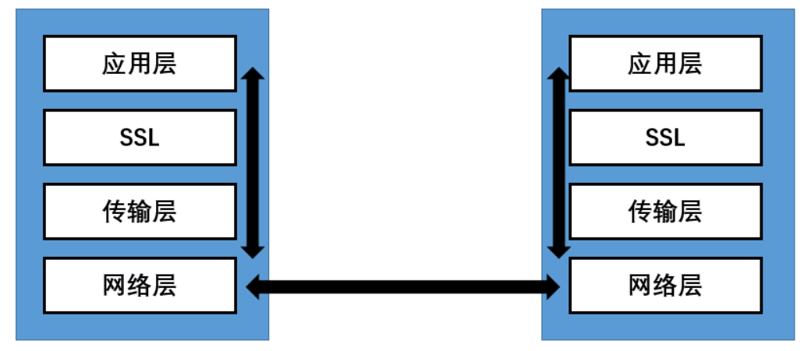

- 应用层安全：比如微软的 "Outlook" 邮箱，可以通过在应用程序中的某些设置实现数据传输的安全。应用层安全的特点为需要应用程序的支持。

- 传输层安全：传输安全是通过夹在应用层和传输层中间的SSL层实现的，发送方的SSL可以将应用层的数据加密后给传输层，接收方的SSL传输层收到的数据解密后给应用层。SSL安全的特点为需要配置相应证书。

- 网络层安全：属于底层安全，不需要应用程序支持，也不需要配置证书，对用户来说是透明的，即用户并不知道数据在该层进行了加密。

  比如，未加密的数据经过发送方的网卡实现了加密，接收方的网卡实现数据解密，整个过程用户是不知道的，是透明的，即使数据在传输过程中被截获了，第三方也不能破解其中内容；或者数据被篡改了，接收方也能发现，这便是网络层安全。

#### 2.1.IPsec与安全关联 SA

网络层保密是指所有在 IP 数据报中的数据都是加密的。

> **IPsec 中最主要的两个部分 **

- **鉴别首部 AH** (Authentication Header)： AH鉴别源点和检查数据完整性，但不能保密。类似于数字签名，用于确保数据的来源并判断数据是否被更改。
- **封装安全有效载荷 ESP** (Encapsulation Security Payload)：ESP 比 AH 复杂得多，它鉴别源点、检查数据完整性和提供保密。 类似于既使用数字签名，又使用共享密钥对数据进行加密。

> **安全关联 SA(Security Association) **

- 在使用 AH 或 ESP 之前，先要从源主机到目的主机建立一条网络层的逻辑连接。此逻辑连接叫做安全关联 SA
- IPsec 就把传统的因特网无连接的网络层转换为具有逻辑连接的层。
- SA（安全关联）是构成IPSec的基础，是两个通信实体经协商（利用IKE协议）建立起来的一种协定，它决定了用来保护数据分组安全的安全协议（AH协议或者ESP协议）、转码方式、密钥及密钥的有效存在时间等。

#### 2.2.安全关联的特点

- 安全关联是一个单向连接。它由一个三元组唯一地确定，包括：

  (1) 安全协议（使用 AH 或 ESP）的标识符；

  (2) 此单向连接的源 IP 地址；

  (3) 一个 32 位的连接标识符，称为**安全参数索引** SPI (Security Parameter Index)；

- 对于一个给定的安全关联 SA，每一个 IPsec 数据报都有一个存放 SPI 的字段。通过此 SA 的所有数据报都使用同样的 SPI 值。

#### 2.4.鉴别首部协议 AH

- 在使用鉴别首部协议 AH 时，把 AH 首部插在原数据报数据部分的前面，同时把 IP 首部中的协议字段置为 51。
- 在传输过程中，中间的路由器都不查看 AH 首部。当数据报到达终点时，目的主机才处理 AH 字段，以鉴别源点和检查数据报的完整性。

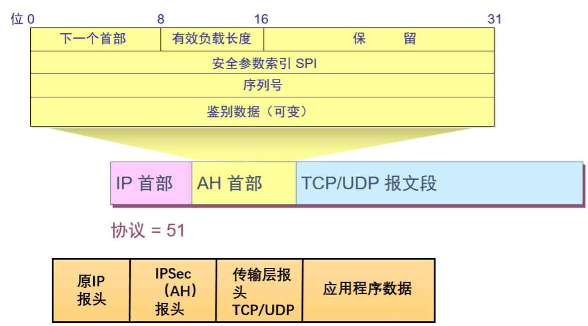

> **AH首部**

(1) 下一个首部(8 位)。标志紧接着本首部的下一个首部的类型（如 TCP 或 UDP）。

(2) 有效载荷长度(8 位)，即鉴别数据字段的长度，以 32 位字为单位。

(3) 安全参数索引 **SPI** (32 位)。标志安全关联，两个计算机进行通讯时的SPI值是固定的。

(4) 序号(32 位)。鉴别数据字段的长度，以32 位字为单位。

(5) 保留(16 位)。为今后用。

(6) 鉴别数据(可变)。为 32 位字的整数倍，它包含了**经数字签名的报文摘要**。因此可用来鉴别源主机和检查 IP 数据报的完整性。

#### 2.5.封装安全有效载荷 ESP

使用 ESP 时，IP 数据报首部的协议字段置为 **50**。当 IP 首部检查到协议字段是 50 时，就知道在 IP 首部后面紧接着的是 ESP 首部，同时在原 IP 数据报后面增加了两个字段，即 ESP 尾部和 ESP 数据。

- **ESP 首部：**里面有标识一个安全关联的安全参数索引 SPI (32 位)，和序号(32 位)。
- **ESP 尾部：**里面有下一个首部（8 位，作用和 AH 首部的一样）。ESP 尾部和原来数据报的数据部分一起进行加密，因此攻击者无法得知所使用的运输层协议。
- **ESP 鉴别：**和 AH 中的鉴别数据是一样的。因此，用 ESP 封装的数据报既有鉴别源站和检查数据报完整性的功能，又能提供保密。

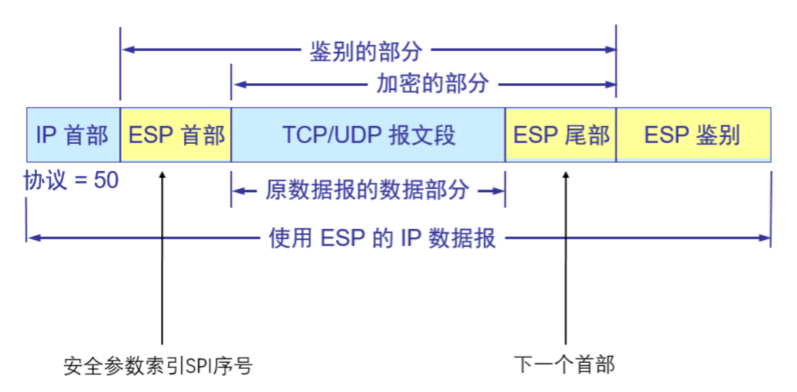

# 五、数据链路层安全

之前讲到的网络层安全，指的是通信数据出发送方计算机网卡的时候加密，进接收方计算机网卡的时候解密，即计算机到计算机之间的安全。现在所说的数据链路层安全指的是通信数据在出了发送方计算机网卡之后，到进接收方计算机网卡之前这段连接的安全，即路由器到路由器之间的安全。

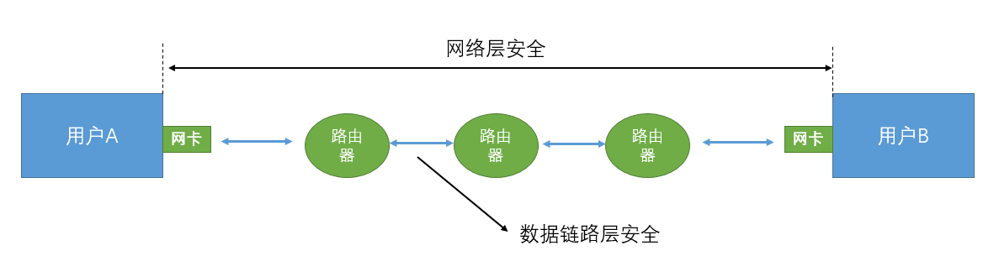

# 六、防火墙（firewall）

#### 1.1.简介

- **防火墙**是由软件、硬件构成的系统，是一种特殊编程的**路由器**，用来在两个网络之间实施接入控制策略。接入控制策略是由使用防火墙的单位自行制订的，为的是可以最适合本单位的需要。
- 防火墙内的网络称为“**可信赖的网络**”(trusted network)，而将外部的因特网称为“**不可信赖的网络**”(untrusted network)。
- 防火墙可用来解决内联网和外联网的安全问题。

#### 1.2.防火墙在互连网络中的位置

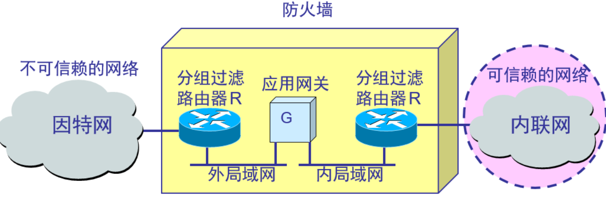

- 可在防火墙中设置内网中哪些用户可以访问因特网，可以访问因特网中的哪些地址，是否可以访问图片等。

#### 1.3.防火墙的功能

- 防火墙的功能有两个：**阻止**和**允许**。
- “阻止”就是阻止某种类型的通信量通过防火墙（从外部网络到内部网络，或反过来）。
- “允许”的功能与“阻止”恰好相反。
- 防火墙必须能够识别通信量的各种类型。不过在大多数情况下防火墙的主要功能是“阻止”。

#### 1.4.防火墙技术一般分为两类

- **网络级防火墙**——基于数据包的源地址、目标地址、协议和端口等来控制进出流量，但是不能查看数据包的内容；
- **应用级防火墙**——基于数据包的源地址、目标地址、协议和端口等来控制用户名、时间段、内容等方面，能够直接看到数据包中的内容，也可以防止病毒进入内网。功能比网络级防火墙强大许多，属于高级防火墙，能够进行更多的控制。比如微软的ISA和TMG防火墙。

#### 1.5.防火墙网络拓扑结构

- **边缘防火墙**：

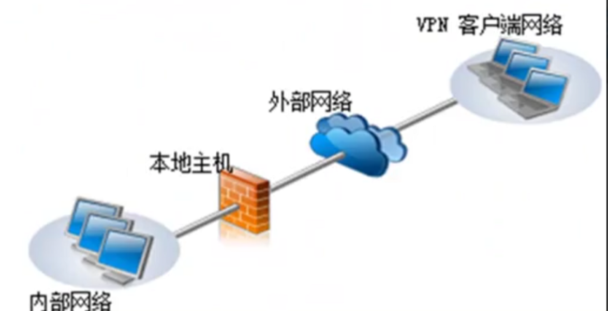

这是最简单的防火墙架构。

- **三向外围网**：

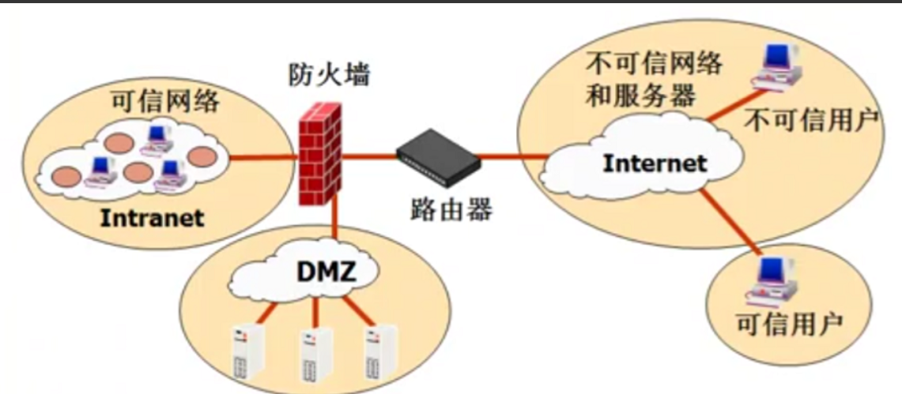

之所以称为"三向外围网"，是因为防火墙引出了三个接口，分别连接内网、服务器和外部网络。外部网络可通过防火墙访问服务器，但不能访问内网，而内网却可以通过防火墙访问外网。

- **背靠背防火墙**：

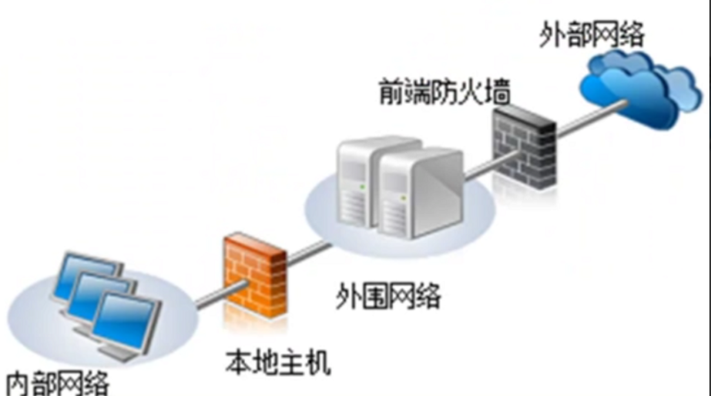

图中的 "外围网络" 指的是服务器，外部网络可通过前端防火墙访问服务器，如果想要访问内网还需要经过本地主机的防火墙的拦截和控制。这样外网用户想要入侵内网需要突破两层防火墙才能到达内网，所以该结构较安全，一般两个防火墙应使用不同厂家的。