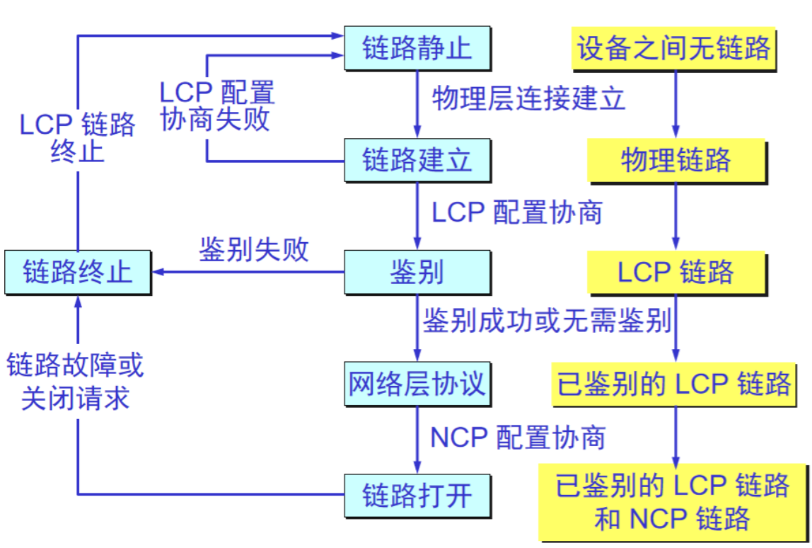
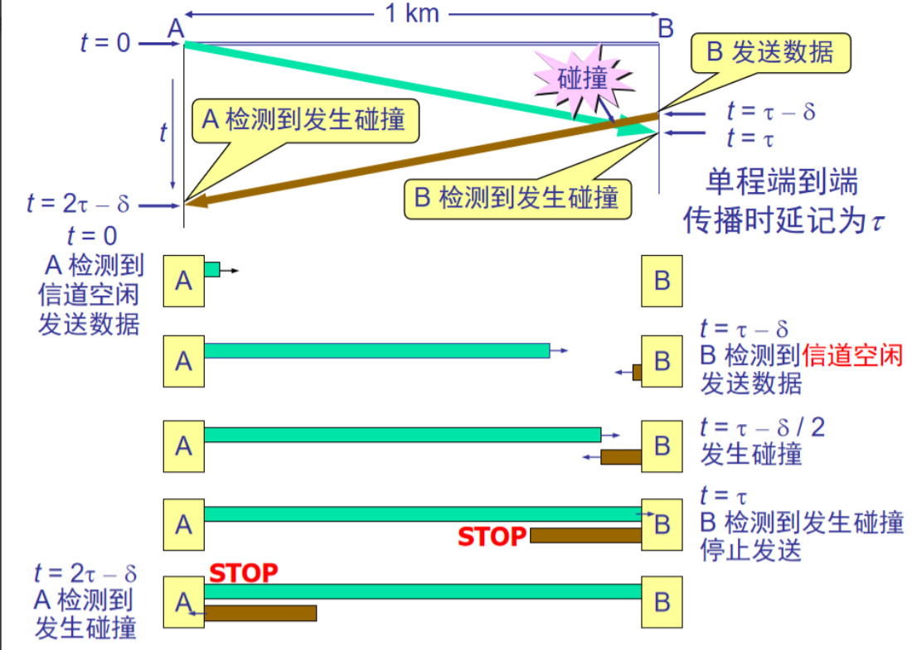
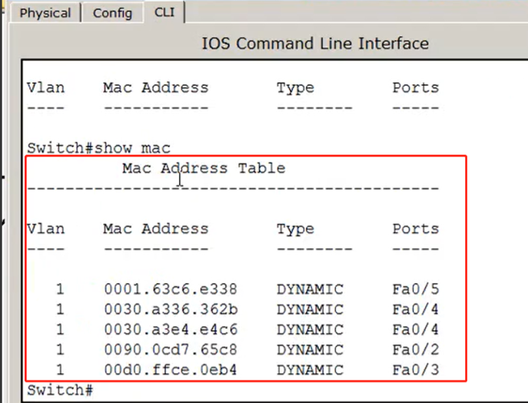

# 一、数据链路层的基本概念

数据发送模型

- 从主机到路由器

应用层准备数据；传输层把数据分成段，编上号；在网络层给每一段加上IP地址和网络层的一些信息；在数据链路层加上数据链路层的一些信息；然后变成比特流往上传输。

- 从路由器到路由器

如图所示，数据每经过一个路由器都要经过同样的三个过程：通过线路进行比特流的传输到达物理层；路由器接到数据之后检查数据链路层中的MAC地址是否是指向自己的；如果是给自己的再看网络层中数据帧的地址决定从哪个端口发出去（如何转发）

本章我们仅从数据链路层观察帧的流动。

- 从计算机到路由器；
- 从路由器到路由器；
- 从路由器到计算机；

------

**数据链路层的信道类型**

数据链路层使用的信道主要有以下两种类型：

- **点对点信道**：这种信道使用一对一的点对点通信方式。
- **广播信道**：这种信道使用一对多的光波通信方式，因此过程比较复杂。广播信道上连接的主机很多，因此必须使用专门的共享信道协议来协调这些主机的数据发送。

**链路与数据链路**

**链路**：是一条点到点的物理线路段，中间没有任何其他点。

- 一条链路只是一条通路的一个组成部分。

**数据链路（data link）**：除了物理线路外，还必须有通信协议来控制这些数据的传输。若把实现这些协议的硬件和软件加到链路上，就构成了数据链路。

- 现在最常用的方法是使用适配器（即网卡）来实现这些协议的硬件和软件。
- 一般的适配器都包括了数据链路层和物理层这两层的功能。

**数据链路层传输的是帧**

**数据链路层像个数字管道 **

- 常常在两个对等的数据链路层之间画出一个数字管道，而在这条数字管道上传输的数据单位是**帧**。

早期的数据通信协议曾叫作**通信规程**(procedure)。因此在数据链路层，规程和协议是同义语

# 二、使用点对点信道的数据链路层

## 三个基本问题

**数据链路层的三个基本问题**

- 封装成帧：必须知道每一帧数据哪里开始，哪里结束，保证每一帧数据的完整。
- 透明传输：当帧的数据部分出现帧头或帧尾标志位的数据时，需要对其进行转义。
- 差错控制：判断传输中是否出现差错。

### 封装成帧

- 封装成帧(framing)就是在一段数据的前后分别添加首部和尾部，然后就构成了一个帧。确定帧的界限。
- 首部和尾部的一个重要作用就是进行**帧定界**。

**用控制字符进行帧定界的方法举例 **

试想：帧还未发送完，发送端出了问题，只能重发该帧，接收端却直接收了前面的“半截子帧”，它会抛弃吗？

答案是会抛弃，接收端直接收有成对的帧头和帧尾的数据

若数据中存在与帧结束符相同的数据，那么计算机会误以为该数据即为帧结束符，而造成错误。

**解决透明传输问题**

- 发送端的数据链路层在数据中出现控制字符“SOH”或“EOT”的前面插入一个转义字符“ESC”(其十六进制编码是 1B)。
- **字节填充**(byte stuffing)或**字符填充**(character stuffing)——接收端的数据链路层在将数据送往网络层之前删除插入的转义字符。
- 如果转义字符也出现数据当中，那么应在转义字符前面插入一个转义字符。当接收端收到连续的两个转义字符时，就删除其中前面的一个。

### 差错控制

传输过程中可能会产生**比特差错**：1可能变成0而0也可能变成1.

在一段时间内，传输错误的比特占所传输比特总数的比率称为**误码率**BER(Bit Error Rate)。

误码率与信噪比有很大的关系。

为了保证数据传输的可靠性，在计算机网络传输数据时，必须采用各种差错检测措施。

**解决方法**

> **循环冗余检验的原理(CRC)**

**原理说明**

- 被除数为101001；根据除数的位数n在被除数后面加 n-1 个0；比如除数四位就在被除数后加三个0；
- 进行的是异或运算，相同得0，不同得1；
- 得到的商可以舍去，我们只要余数；在原来数据101001的后面加上余数001（前面被除数尾部加了多少位商就保留多少位），则实际传输的数据为：101001 001
- 接收端受到数据101001 001之后，除以1101如果商为0，则说明数据传输过程中没有错误，**接受**；如果商不为0说明传输过程中出现错误，把该数据**丢弃**；
- 过于除数，是数据链路层的协议决定的，用户不必关心。

**帧检验序列 FCS**

- 在数据后面添加上的冗余码称为**帧检验序列** FCS (Frame Check Sequence)。
- 循环冗余检验 CRC 和帧检验序列 FCS并不等同。
  - CRC 是一种常用的**检错方法**，而 FCS 是添加在数据后面的**冗余码**。
  - FCS 可以用 CRC 这种方法得出，但 CRC 并非用来获得 FCS 的唯一方法。

**小结**

> 仅用循环冗余检验 CRC 差错检测技术只能做到**无差错接受**(accept)。

- “无差错接受”是指：“凡是接受的帧（即**不包括丢弃的帧**），我们都能以非常接近于 1 的概率认为这些帧在传输过程中没有产生差错”
- 要做到“**可靠传输**”（即发送什么就收到什么）就必须再加上**确认**和**重传**机制。
- **无差别接收**只是在数据在路由器之间传输时进行，并不要求路由器**确认**或**重传**数据，而是路由器的始端和末端连接的计算机和服务器之间会进行数据的**确认**或**重传**。

**CRC并不能100%准确，也可能多次错误碰巧造成余数为零**

# 三、点对点协议PPP

### 点对点协议 PPP

**PPP 协议的特点 **

- 现在全世界使用得最多的数据链路层协议是**点对点协议** PPP (Point-to-Point Protocol)。
- 用户使用拨号电话线接入因特网时，一般都是使用 PPP 协议。

**PPP协议使用场合**

用户到ISP的链路使用PPP协议。该协议可以验证用户身份并且自动分配IP地址。

**PPP 协议应满足的需求**

- 简单——这是首要的要求
- 封装成帧
- 透明性
- 多种网络层协议
- 多种类型链路 （可以是光纤，双绞线等）
- 差错检测
- 检测连接状态
- 最大传送单元
- 网络层地址协商
- 数据压缩协商

**PPP 协议不需要的功能**

- 纠错
- 流量控制
- 序号
- 多点线路
- 半双工或单工链路

------

**PPP 协议的组成**

- 1992 年制订了 PPP 协议。经过 1993 年和 1994 年的修订，现在的 PPP 协议已成为因特网的正式标准[RFC 1661]。
- PPP 协议有三个组成部分
  - 一个将 IP 数据报封装到串行链路的方法。
  - **链路控制协议** **LCP** (Link Control Protocol)。建立并维护数据链路连接。
  - **网络控制协议** **NCP** (Network Control Protocol)。 允许在点到点连接上使用多种网络层协议，如图所示：

**PPP 协议的帧格式**

- - 十六进制的7E，用二进制表示为0111 1110 表示帧头；帧尾也为7E；
  - 十六进制的FF是目标地址，在点到点线路中这是固定的，（因为只有两头，一头发出，只有另一头接收一种可能）。
  - 十六进制的03也是固定的；
  - **PPP 有一个 2 个字节的协议字段**：标识信息部分是什么内容。（如快递外面的分类标签）
    - 当协议字段为 0x0021 时，PPP 帧的信息字段就是IP 数据报。
    - 若为 0xC021，则信息字段是 PPP 链路控制数据。
    - 若为 0x8021，则表示这是网络控制数据。
    - 若为 0xC023，则表示信息字段是安全性认真PAP。
    - 若为 0xC025，则表示信息字段是LQR。
    - 若为 0xC223，则表信息字段是安全性认证CHAP。
  - 2字节的FCS为**帧检验序列**。

------

**透明传输问题**

问题：信息字段中出现了标志字段的值，可能会被误认为是“标志位”，这时应该怎么办？

- 当 PPP 用在同步传输（传输的可能是比特流）链路时，协议规定采用硬件来完成比特填充（和 HDLC 的做法一样）即**零比特填充**。
- 当 PPP 用在异步传输（传输的是字节）时，就使用一种特殊的**字节填充法**。

> **字节填充**

- 将信息字段中出现的每一个 0x7E（即以7E结尾的数据） 字节转变成为 2 字节序列 (0x7D, 0x5E)。
- 若信息字段中出现一个 0x7D 的字节（即以7D结尾的数据）, 则将其转变成为 2 字节序列 (0x7D, 0x5D)。
- 若信息字段中出现 ASCII 码的控制字符（即数值小于 0x20 的字符），则在该字符前面要加入一个 0x7D 字节，同时将该字符的编码加以改变。

> **零比特填充**

这样就不会产生歧义，解决了透明传输的问题。

------

**PPP协议不提供使用序号和确认的可靠传输**

> PPP 协议之所以不使用序号和确认机制是出于以下的考虑：

- 在数据链路层出现差错的概率不大时，使用比较简单的 PPP 协议较为合理。
- 在因特网环境下，PPP 的信息字段放入的数据是 IP 数据报。数据链路层的可靠传输并不能够保证网络层的传输也是可靠的。
- 帧检验序列 FCS 字段可保证无差错接受。

**PPP协议的工作状态**

- 当用户拨号接入 ISP 时，路由器的调制解调器对拨号做出确认，并建立一条物理连接。
- PC 机向路由器发送一系列的 LCP 分组（封装成多个 PPP 帧）。
- 这些分组及其响应选择一些 PPP 参数，和进行网络层配置，NCP 给新接入的 PC机分配一个临时的 IP 地址，使 PC 机成为因特网上的一个主机。
- 通信完毕时，NCP 释放网络层连接，收回原来分配出去的 IP 地址。接着，LCP 释放数据链路层连接。最后释放的是物理层的连接。

# 四、使用广播信道的链路层

### 局域网的数据链路层

- 局域网最主要的特点是：网络为一个单位所拥有，且地理范围和站点数目均有限。
- 局域网具有如下的一些主要优点：
  - 具有广播功能，从一个站点可很方便地访问全网。局域网上的主机可共享连接在局域网上的各种硬件和软件资源。
  - 便于系统的扩展和逐渐地演变，各设备的位置可灵活调整和改变。
  - 提高了系统的可靠性、可用性和残存性。

**局域网的拓扑**

**媒体共享技术**

静态划分信道

- 频分复用
- 时分复用
- 波分复用
- 码分复用

动态媒体接入控制（多点接入），现在主要采用的方式

- 随机接入（主要被以太网采用）。
- 受控接入 ，如多点线路探询(polling)，或轮询。（目前已不被采用）。

**适配器的作用**

- 网络接口板又称为**通信适配器**(adapter)或**网络接口卡** NIC (Network Interface Card)，或“**网卡**”。
- 适配器的重要功能：
  - 进行串行/并行转换。
  - 对数据进行缓存。
  - 在计算机的操作系统安装设备驱动程序。
  - 实现以太网协议。

**认识以太网**

- 最初的以太网是将许多计算机都连接到一根总线上。当初认为这样的连接方法既简单又可靠，因为总线上没有有源器件。

**以太网的广播方式发送**

- 总线上的每一个工作的计算机都能检测到 B 发送的数据信号。
- 由于只有计算机 D 的地址与数据帧首部写入的地址一致，因此只有 D 才接收这个数据帧。
- 其他所有的计算机（A, C 和 E）都检测到不是发送给它们的数据帧，因此就丢弃这个数据帧而不能够收下来。
- 具有广播特性的总线上实现了一对一的通信。

**以太网采用的协议是**：载波监听多点接入/碰撞检测 **CSMA/CD**

> 这是使用**广播信道**的数据链路层使用的协议；使用**点对点信道**的数据链路层使用的是**PPP协议**；注意区分。

- “**多点接入**”表示许多计算机以多点接入的方式连接在一根总线上。
- “**载波监听**”是指每一个站在发送数据之前先要检测一下总线上是否有其他计算机在发送数据，如果有，则暂时不要发送数据，以免**发生碰撞**。
- 总线上并没有什么“载波”。因此， “载波监听”就是用电子技术检测总线上有没有其他计算机发送的数据信号。

**碰撞检测**

- “**碰撞检测**”就是计算机边发送数据边检测信道上的信号电压大小。
- 当几个站同时在总线上发送数据时，总线上的信号电压摆动值将会增大（互相叠加）。
- 当一个站检测到的信号电压摆动值超过一定的门限值时，就认为总线上至少有两个站同时在发送数据，表明产生了碰撞。
- 所谓“碰撞”就是发生了冲突。因此“碰撞检测”也称为“冲突检测”。

- 图中可见，在A发出的信号到达B之前，B向A发出了信号；两个信号发生碰撞，碰撞后B向A发出的信号（棕色箭头）变为了叠加信号，到达A处后，被检验出是叠加信号，A由此判断信号发生了碰撞。
- 可知A端检测到发生碰撞的最大事件为2τ。
- 可知线路越长，检测到发生碰撞的时间越长，所以以太网网线不超过100m是有道理的。

**重要特性**

- 使用 CSMA/CD 协议的以太网不能进行全双工通信而只能进行双向交替通信（半双工通信）。
- 每个站在发送数据之后的一小段时间内，存在着遭遇碰撞的可能性。
- 这种**发送的不确定性**使整个以太网的平均通信量远小于以太网的最高数据率。

**争用期**

- 最先发送数据帧的站，在发送数据帧后至多经过时间 2τ （两倍的端到端往返时延）就可知道发送的数据帧是否遭受了碰撞。
- 以太网的端到端往返时延 2τ 称为**争用期**，或**碰撞窗口**。
- 经过争用期这段时间还没有检测到碰撞，才能肯定这次发送不会发生碰撞。

**争用期的长度**

- 以太网取 51.2 μs 为争用期的长度。
- 对于 10 Mb/s 以太网，在争用期内可发送512 bit，即 64 字节。
- 以太网在发送数据时，若前 64 字节没有发生冲突，则后续的数据就不会发生冲突。

**最短有效帧**

- 如果发生冲突，就一定是在发送的前 64 字节之内。
- 由于一检测到冲突就立即中止发送，这时已经发送出去的数据一定小于 64 字节。
- 以太网规定了最短有效帧长为 64 字节，凡长度小于 64 字节的帧都是由于冲突而异常中止的**无效帧**。

**二进制指数类型退避算法**

- 发生碰撞的站在停止发送数据后，要推迟（退避）一个随机时间才能再发送数据。

  - 确定基本退避时间，一般是取为争用期 2τ。

  - 定义重传次数 k ，k ≤ 10，即

    k = Min[重传次数, 10]

  - 从整数集合[0,1,…, (2k - 1)]中随机地取出一个数，记为 r。重传所需的时延就是 r 倍的基本退避时间。

  - 当重传达 16 次仍不能成功时即丢弃该帧，并向高层报告。

**以太网的两个标准**

- DIX Ethernet V2 是世界上第一个局域网产品（以太网）的规约。
- IEEE 的 802.3 标准。
- DIX Ethernet V2 标准与 IEEE 的 802.3 标准只有很小的差别，因此可以将 802.3 局域网简称为“**以太网**”。
- 严格说来，“以太网”应当是指符合 DIX Ethernet V2 标准的局域网

**以太网与数据链路层的两个子层**

为了使数据链路层能更好地适应多种局域网标准，802 委员会就将局域网的数据链路层拆成两个子层：

- 逻辑链路控制 **LLC** (Logical Link Control)子层。（现在一般不考虑该层）
- 媒体接入控制 **MAC** (Medium Access Control)子层。

**以太网提供的服务**

- 以太网提供的服务是**不可靠**的交付，即尽最大努力的交付。
- 当目的站收到有差错的数据帧时就丢弃此帧，其他什么也不做。差错的纠正由高层来决定。
- 如果高层发现丢失了一些数据而进行重传，但以太网并不知道这是一个重传的帧，而是当作一个新的数据帧来发送。

# 五、使用广播信道的以太网

### 1.使用集线器的星型拓扑

- 传统以太网最初是使用粗同轴电缆，后来演进到使用比较便宜的细同轴电缆，最后发展为使用更便宜和更灵活的双绞线。
- 这种以太网采用星形拓扑，在星形的中心则增加了一种可靠性非常高的设备，叫做**集线器(hub)** （现在已很少使用）

**星形网 10BASE-T**

- 不用电缆而使用**无屏蔽双绞线**。每个站需要用**两对**双绞线，分别用于发送和接收。
- 集线器使用了大规模集成电路芯片，因此这样的硬件设备的可靠性已大大提高了。
- 10BASE-T 的通信距离稍短，每个站到集线器的距离不超过 **100 m**。
- 这种 **10 Mb/s** 速率的无屏蔽双绞线星形网的出现，既降低了成本，又提高了可靠性。
- 其他还有**100Base-FX**(快速以太网即光纤)、100Base-T、100Base-T4等

10BASE-T 双绞线以太网的出现，是局域网发展史上的一个非常重要的里程碑，它为以太网在局域网中的统治地位奠定了牢固的基础。

**集线器的特点**

具有三个接口的集线器：

- 集线器是使用电子器件来模拟实际电缆线的工作，**因此整个系统仍然像一个传统的以太网那样运行**。
- 使用集线器的以太网在逻辑上仍是一个总线网，各工作站使用的还是 CSMA/CD 协议，并共享逻辑上的总线。
- 集线器很像一个多接口的转发器，工作在**物理层**。

------

### 2.以太网的信道利用率

以太网信道被占用的情况下：

- 争用期长度为 2τ，即端到端传播时延的两倍。检测到碰撞后不发送干扰信号。
- 帧长为 L (bit)，数据发送速率为 C (b/s)，因而帧的发送时间为 L/C = T0 (s)。

一个帧从开始发送，经可能发生的碰撞后，将再重传数次，到发送成功且信道转为空闲(即再经过时间 τ 使得信道上无信号在传播)时为止，是发送一帧所需的平均时间。（时间 τ 为一端到达另一端所需时间）。

**以太网的信道利用率：参数a**

- 要提高以太网的信道利用率，就必须减小 τ 与 T0 之比（即T0相对于 τ 要大）。在以太网中定义了参数 a，它是以太网单程端到端时延 τ 与帧的发送时间 T0 之比：

- a→0 表示一发生碰撞就立即可以检测出来，并立即停止发送，因而信道利用率很高。
- a 越大，表明争用期所占的比例增大，每发生一次碰撞就浪费许多信道资源，使得信道利用率明显降低。

**对以太网参数的要求**

要保证参数a小则：

- τ 不能大，即以太网的连线的长度不能太长，否则 τ 的数值会太大。
- T0不能小，即以太网的帧要有一定长，否则 T0 的值会太小。

**信道利用率的最大值 Smax **

- 在**理想化**的情况下，以太网上的各站发送数据都不会产生碰撞（这显然已经不是 **CSMA/CD**，而是需要使用一种特殊的调度方法），即总线一旦空闲就有某一个站立即发送数据。
- 发送一帧占用线路的时间是 T0 + τ，而帧本身的发送时间是 T0。于是我们可计算出理想情况下的极限信道利用率 Smax为：

> 这是不可能出现的，使用**CSMA/CD协议**的以太网数据的传输一定会发生碰撞。

------

### 3.以太网的MAC层

**3.1MAC 层的硬件地址**

- 在局域网中，**硬件地址**又称为**物理地址**，或 **MAC 地址**。（硬件出厂时芯片就会烧录一个全球唯一的MAC地址）
- 802 标准所说的“地址”严格地讲应当是每一个站的“**名字**”或**标识符**。
- 但鉴于大家都早已习惯了将这种 48 位的“名字”称为“地址”，所以通常采用这种习惯用法，尽管这种说法并不太严格。

**48位的MAC地址**

- IEEE 的**注册管理机构** RA 负责向厂家分配地址字段的前三个字节(即高位 24 位)。
- 地址字段中的后三个字节(即低位 24 位)由厂家自行指派，称为**扩展标识符**，必须保证生产出的适配器没有重复地址。
- 一个地址块可以生成224个不同的地址。这种 48 位地址称为 MAC-48，它的通用名称是EUI-48。
- MAC地址”实际上就是适配器地址或适配器标识符EUI-48。

> 可以通过命令行窗口查看本计算机的MAC（物理）地址

**适配器检查 MAC 地址**

适配器从网络上每收到一个 MAC 帧就首先用硬件检查 MAC 帧中的 MAC 地址.

- 如果是发往本站的帧则收下，然后再进行其他的处理。
- 否则就将此帧丢弃，不再进行其他的处理。

发往本站的帧”包括以下三种帧：

- **单播**(unicast)帧（一对一）
- **广播**(broadcast)帧（一对全体）
- **多播**(multicast)帧（一对多）

> **案例**

一台计算机在多个教室都能上网，唯独在某间教室不能上网，排除网线与计算机的故障。原因在于在不能上网那间教室出现了MAC地址冲突。本来网卡的MAC地址出厂时就定死了，但是我们可以告诉计算机，不使用该网卡的MAC地址而是重新指定一个MAC地址，这样就有可能出现MAC地址冲突造成网络故障。

**更改MAC地址**

打开设备管理器，找到相应的网卡，右键属性，找到网络地址，即可手动更改。

好处：可以蹭网呀~

**MAC帧格式**

常用的以太网MAC帧格式有以下两种标准：

- DIX Ethernet V2标准
- IEEE 的 802.3 标准

最常用的MAC帧是以太网V2的格式。

> 总的格式

- 可以看到MAC帧的开头插入了8个字节内容，其中只有**帧开始界定符**而没有结束符。这是因为MAC帧采用的是曼彻斯特编码，没数据时没有电平跳变表示结束。

> 各个部分

为何数据字段最小长度为64字节？因为以太网规定了**最短有效帧**长为 64 字节，凡长度小于 64 字节的帧都是由于冲突而异常中止的**无效帧**。

**抓包验证**

图中可见目的MAC地址为六个字节

图中框出来的是六个字节的源MAC地址；

- 图中框出来的是两字节的类型标识，图中 08 00表示的是 IP 地址。

**无效的MAC帧**

- 数据字段的长度与长度字段的值不一致；
- 帧的长度不是整数个字节；
- 用收到的帧检验序列 FCS 查出有差错；
- 数据字段的长度不在 46 ~ 1500 字节之间。
- 有效的 MAC 帧长度为 64 ~ 1518 字节之间。
- 对于检查出的无效 MAC 帧就简单地丢弃。以太网不负责重传丢弃的帧。

**帧间最小间隔**

- 帧间最小间隔为 9.6 μs，相当于 96 bit 的发送时间。
- 一个站在检测到总线开始空闲后，还要等待 9.6 μs 才能再次发送数据。
- 这样做是为了使刚刚收到数据帧的站的接收缓存来得及清理，做好接收下一帧的准备

# 六、扩展的以太网

### 1.在物理层扩展以太网

- **主机使用光纤和一对光纤调制解调器连接到集线器，使以太网的距离扩大。**

- **用多个集线器可连成更大的局域网，在数量上扩展**。

假设某大学有三个系，各自有一个局域网。

用集线器组成更大的局域网，都在一个**碰撞域**中，

> 优点:

- 使原来属于不同碰撞域的局域网上的计算机能够进行跨碰撞域的通信。
- 扩大了局域网覆盖的地理范围。

> 缺点

- 碰撞域增大了，每一台计算机与另一台计算机通信都要通过主干集线器给所有计算机发送数据，但总的吞吐量并未提高。计算机数量越多效率越低，所以计算机数量不宜超过30台。
- 如果不同的碰撞域使用不同的数据率，那么就不能用集线器将它们互连起来。

------

### 2.在数据链路层扩展以太网

- 在数据链路层扩展局域网是使用**网桥**。
- 网桥工作在数据链路层，它根据 MAC 帧的目的地址对收到的帧进行转发。
- 网桥具有过滤帧的功能。当网桥收到一个帧时，并不是向所有的接口转发此帧，而是先检查此帧的目的 MAC 地址，然后再确定将该帧转发到哪一个接口

**网桥的内部结构**

- 假设①~⑥表示的MAC地址分别为 MA~MF;
- 通讯前，网桥并不知道接口1和2分别对应哪些MAC地址，当通过一次信之后，网桥就学习到了，接口1对应MAC地址MA、MB、MC；接口2对应MAC地址MD、ME、MF;
- 之后的通讯中，如果是同一接口所对应MAC地址间的通讯，比如MA 与 MB通信，网桥就不会把数据通过接口2传给接口2对应的MAC地址，即把数据传输线路一分为二，接口1对应地址间通信时不影响接口2对应地址间的通信，不会出现占线问题，提高了信道的利用率。

**网桥使各网段成为隔离开的碰撞域**

- 假设计算机AF对应MAC地址MAMF；
- 图中网桥B1左接口对应MAC地址MA、MB；右接口对应MC、MD、ME、MF;
- 网桥B2做借口对应MAC地址MA、MB、MC、MD；右接口对应ME、MF;

**使用网桥带来的好处 **

- 过滤通信量。
- 扩大了物理范围。
- 提高了可靠性。
- 可互连不同物理层、不同 MAC 子层和不同速率（如10 Mb/s 和 100 Mb/s 以太网）的局域网。

**使用网桥带来的缺点**

- 存储转发增加了时延。
- 在MAC 子层并没有流量控制功能。
- 具有不同 MAC 子层的网段桥接在一起时时延更大。
- 网桥只适合于用户数不太多(不超过几百个)和通信量不太大的局域网，否则有时还会因传播过多的广播信息而产生网络拥塞。这就是所谓的**广播风暴**。

**透明网桥**

- 目前使用得最多的网桥是**透明网桥**(transparent bridge)。
- “透明”是指局域网上的站点并不知道所发送的帧将经过哪几个网桥，因为网桥对各站来说是看不见的。
- 透明网桥是一种**即插即用设备**，其标准是 IEEE 802.1D。

**自学习算法**

网桥应当按照以下自学习算法处理收到的帧和建立转发表

- 若从 A 发出的帧从接口 x 进入了某网桥，那么从这个接口出发沿相反方向一定可把一个帧传送到 A。
- 网桥每收到一个帧，就记下其源地址和进入网桥的接口，作为转发表中的一个项目。
- 在建立转发表时是把帧首部中的源地址写在“地址”这一栏的下面。
- 在转发帧时，则是根据收到的帧首部中的目的地址来转发的。这时就把在“地址”栏下面已经记下的源地址当作目的地址，而把记下的进入接口当作转发接口。

转发表的建立过程如下所示：

**多接口网桥：以太网交换机**

> **由来**

之前，网桥通常连接多个集线器，每一个集线器连接多台计算机，是一个冲突域；如果网桥接口很多，不连集线器直接与计算机相连就减少了冲突域，这就是成为了交换机。

> **特点**

- 连接同一台交换机的多台计算机，比如A~F，若A与B通信交换机直接将A的数据转给B，不会向其他计算机发送通讯数据；如果计算机F为黑客，由于A与B的通讯数据没有传输给F，即使使用抓包工具也无法窃听数据。
- 如果A与B通信的同时C也与B通信也不会造成冲突，因为交换机的接口有缓存功能，请求通讯的数据会在相应接口处排队等候，从而避免冲突。
- 如果说某一交换机是10M交换机，指的是每个接口的带宽是10M，如果交换机有24口，那么整体的交换能力就是240M；**接口的带宽是独享的**。
- 如果计算机接的是交换机，可以把网卡设置为**全双工**，即可以同时收发数据。
- **所以使用交换机进行通讯较为安全，并且没有冲突效率高**

**用以太网交换机扩展局域网**

**使用Cisco Packet Tracer仿真验证**

图中为一个交换机连接一个集线器和几台计算机，接线器也连接几台计算机。

未通讯前交换机的MAC地址表是空的。

通过命令行通信之后，再输入命令show mac查看MAC地址表，可见已生成MAC地址表。从图中可以看出 口Fa0/4 对应两个MAC地址，即该口为集线器（Hub）连接两台计算机的同一个接口。

如果在集线器中再添加一台计算机。

在命令行中再次查看MAC地址表：可见口 Fa0/4 对应三个MAC地址，与集线器（Hub）加上新增的一台计算机，同一个接口一共连接三台计算机一致。

**透明网桥使用了生成树算法 **

- 这是为了避免产生转发的帧在网络中不断地兜圈子。

**生成树算法**

**虚拟局域网**

LAN和VLAN

- LAN 即局域网，即一个集线器接多台计算机组成一个LAN。一个路由器连接两个LAN，则每个LAN表示一个网段。
- VLAN 即虚拟局域网，这是使用交换机才有的概念。

交换机的使用使得VLAN的创建成为了可能。

- 虚拟局域网 VLAN

   

  是由一些局域网网段构成的与物理位置无关的逻辑组。

  - 这些网段具有某些共同的需求。
  - 每一个 VLAN 的帧都有一个明确的标识符，指明发送这个帧的工作站是属于哪一个 VLAN。

- 虚拟局域网其实只是局域网给用户提供的一种服务，而并不是一种新型局域网。

如图所示如果我们想把不同部门划分为不同网段，不使用物理层划分，这时就可以创建虚拟局域网。可以看到销售部的计算机在一到三层都有，但是却是放在一个网段的；人力资源部与工程部的计算机同理。这些计算机没有接在同一个交换机上，却可以实现仅在销售部内的计算机中发送广播，不影响其他部门。即一个VLAN就是一个广播域就是一个网段，这就是虚拟局域网，更加安全和灵活。

> 如果不采用VLAN，各个部门的计算机都接在同一个交换机，都是一个网段，那么工程部门就可以看到销售部和人力资源部的共享资源，这是不安全的。

> **举例说明**

**简单情况**

如果一个单位有一个交换机，有两个部门，打算把两个部门分成两个网段。这时就可以把交换机的接口分成两部分，左边一半接口分给VLAN1，右边一半接口分给VLAN2，即一个部门一个VLAN，就等价于把交换机切成两半，两半彼此之间互不影响各自计算机的通信,即VLAN1内的通信绝不会传到VLAN2中。所以VLAN1中的计算机到VLAN2中计算机在数据链路层上就不通了，这就是VLAN所能达到的安全级别。

- 这是同一个交换器两个网段，即使IP地址相同，不同网段也不能互相通信，通过路由器连接才能进行通信。

**复杂情况**

由于有两台交换机，每台交换机分为VLAN1与VLAN2两个网段，所以上述情况相当于有四个交换机。每个部门分别由两个交换机，同一个部门需要通信所以需要用一根线把两个交换机连起来，形成一个网段。所以上图一共有两个网段，每个部门一个网段。

若有多个部门，则再将每个交换机分为多份，不同交换机的每份再通过线路连成一个网段。这些线路可以合并为以下的**干道链路**：

- 该干道链路可以传输不同VLAN（网段）的数据。
- 当VLAN1中的计算机A发出广播时可以通过SwitchA直接传给计算机B；想要传给同一个同是VLAN1网段的计算机C则需要借助干道链路的传输。
- 干道链路为了判断传输的数据是VLAN1还是VLAN2的，需要对传进来的数据加上相应的标记，从而从SwiitchA传输到SwitchB之后仅给计算机C发送数据，而不给G和H发送。
- 干道链路的这种数据帧传输方式属于**统计时分复用**（贴上标签，随便排序）。
- 所以数据帧在进干道链路时会加上标签，出干道链路时会去掉标签。这个过程计算机A与C都是不知道的，即这个过程是透明（看不见）的。
- VLAN是可以跨交换机的网段，在没有交换机之前，用集线器连的网就没有这个技术。

> 回头看

再看该图，可发现交换机左端的线都是能传输不同网段的数据的，因此这些线路都是干道链路，连接的交换机左端口应配置为干道端口（**中继端口**）；接计算机的右端口叫**接入端口**(access端口），该端口接属于不同网段的计算机。

- 不同VLAN之间的通信可以通过外置路由器连接各交换机实现；也可通过另一个交换机实现。

再如下图：

如图，新增一个市场部，里面的计算机都接在同一个交换机上，为同一个网段VLAN4，则Switch4左端线路传输的只有VLAN4的数据为非干道链路，则该交换机左端口可配置成**非中继端口**。

- **规律**：一个交换机上传输多个VLAN，就要配置成干道链路。

**虚拟局域网帧格式**

- 虚拟局域网协议允许在以太网的帧格式中插入一个 4 字节的标识符，称为 VLAN **标记**(tag)，用来指明发送该帧的工作站属于哪一个虚拟局域网。

# 七、高速以太网

### 1.100BASE-T 以太网

- 速率达到或超过 100 Mb/s 的以太网称为**高速以太网**。
- 在双绞线上传送 100 Mb/s 基带信号的星型拓扑以太网，仍使用 IEEE 802.3 的**CSMA/CD** 协议。100BASE-T 以太网又称为**快速以太网**(Fast Ethernet)。

**三种不同的物理层标准**

- **100BASE-TX**

  使用 2 对 UTP 5 类线或屏蔽双绞线 STP。

- **100BASE-FX**

  使用 2 对光纤。

- **100BASE-T4**

  使用 4 对 UTP 3 类线或 5 类线。

**100BASE-T 以太网的特点**

- 可在**全双工方式**下工作而无冲突发生。因此，**不使用 CSMA/CD** 协议。因为交换机的接口有存储转发功能，多个数据使用同一个接口需要排队。
- MAC 帧格式仍然是 802.3 标准规定的。
- 保持最短帧长不变，但将一个网段的最大电缆长度减小到 100 m。
- 帧间时间间隔从原来的 9.6 μs 改为现在的 0.96 μs。

------

### 2.吉比特以太网

- 允许在 1 Gb/s 下全双工和半双工两种方式工作。
- 使用 802.3 协议规定的帧格式。
- 在半双工方式下使用 CSMA/CD 协议（全双工方式不需要使用 CSMA/CD 协议）。
- 与 10BASE-T 和 100BASE-T 技术向后兼容。

**吉比特以太网的物理层**

- 1000BASE-X 基于光纤通道的物理层：
  - 1000BASE-SX SX表示短波长；
  - 1000BASE-LX LX表示长波长；
  - 1000BASE-CX CX表示铜线；
- 1000BASE-T
  - 使用 4对 5 类线 UTP

**吉比特以太网的配置举例**

### 3.10吉比特以太网

- 10 吉比特以太网与 10 Mb/s，100 Mb/s 和 1 Gb/s 以太网的**帧格式完全相同**。
- 10 吉比特以太网还保留了 802.3 标准规定的以太网最小和最大帧长，便于升级。
- 10 吉比特以太网不再使用铜线而**只使用光纤**作为传输媒体。
- 10 吉比特以太网**只工作在全双工方式**，因此没有争用问题，也**不使用 CSMA/CD 协议**。

**端到端的以太网传输 **

- 10 吉比特以太网的出现，以太网的工作范围已经从局域网（校园网、企业网）扩大到城域网和广域网，从而实现了端到端的以太网传输。
- 这种工作方式的好处是：
  成熟的技术；
  互操作性很好；
  在广域网中使用以太网时价格便宜；
  统一的帧格式简化了操作和管理；

------

### 4.使用高速以太网进行宽带接入

- 以太网已成功地把速率提高到 1 ~ 10 Gb/s ，所覆盖的地理范围也扩展到了城域网和广域网，因此现在人们正在尝试使用以太网进行宽带接入。
- 以太网接入的重要特点是它可提供双向的宽带通信，并且可根据用户对带宽的需求灵活地进行带宽升级。
- 采用以太网接入可实现端到端的以太网传输，中间不需要再进行帧格式的转换。这就提高了数据的传输效率和降低了传输的成本。

这就是现在所说的光纤到户，虽然光纤能达到1GB/s的速度，但是实际上运营商并不会把速度提的这么高。

**Cisco建网三层模型**

- 接入层交换机直接接计算机，它的接口一定要多，才能接更多的计算机。
- 汇聚层交换机把接入层交换机的流量进行汇聚。
- 核心层交换机进行各大楼汇聚交换机之间的通信。如果需要连网，可通过核心层

> **举例**

# 八、交换机实现的接入安全

如图所示，为了保证安全，一般交换机的一个接口只对应一台计算机。

> 这里有个细节刚开始可见交换机接口是橙色的，这表示交换机正在生成树，从而决定阻断哪些连接，转发哪些连接，这个过程是必不可少的。

如果一个端口接入多个计算机，如下图所示：

那么，为保证安全，连接两台计算机的交换机上的该端口应该关闭。即可以**为交换机的接口绑定相应的MAC地址**。