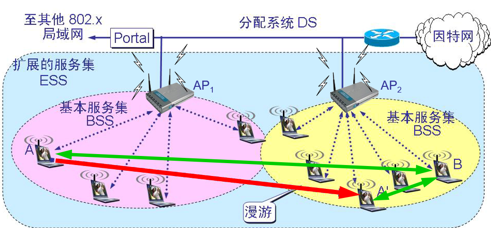
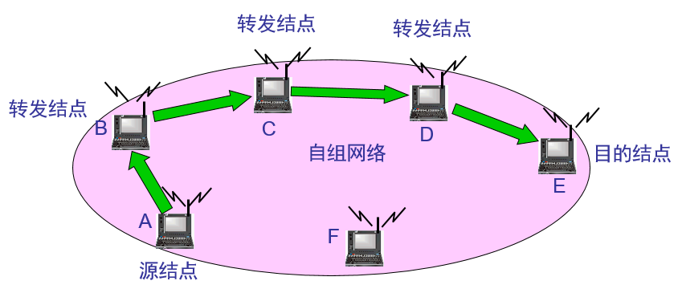

# 一、无线局域网WLAN

## 无线局域网WLAN

### 一、概述

- 有线局域网的组成如下图所示，多台计算机通过双绞线连接到一个集线器（hub）或交换机（switch）上，组成一个有限局域网。

无线网卡与接入点 AP (Access Point)连接，组成一个无线局域网。无线AP可以给连接的计算机分配地址，连接同一个AP的计算机分配的地址都在同一网段。相比有线网络，无线网络的信号易受建筑物遮挡影响导致信号变弱，辐射范围变小。

------

### 二、无线局域网的组成

#### 2.1.简介

有固定基础设施的无线局域网:

- 一个基本服务集 BSS 包括**一个基站**和**若干个移动站**，即一个AP与连接它的计算机。所有的站在本 BSS 以内都可以直接通信，但在和本 BSS 以外的站通信时 ，都要通过本 BSS 的基站。

- 基本服务集内的基站叫做**接入点 AP** (Access Point)其作用和网桥相似。当网络管理员安装 AP 时，必须为该 AP 分配

  一个不超过 32 字节的**服务集标识符 SSID** （即无线WLAN的名字）和一个**信道**（即规定使用什么频率）。

  

  

  通过SSID来选择连接不同的无线AP，还可以设置连接密码，并且一般选择连接信号强的AP。

- 一个基本服务集可以是孤立的，也可通过接入点 AP连接到一个主干**分配系统**（相当于交换机） DluS (Distribution System)，然后再接入到另一个基本服务集，构成**扩展的服务集**ESS (Extended Service Set)。扩展服务集内设备的地址可以是同一网段。

- ESS 还可通过**门户**(portal)为无线用户提供到非 802.11 无线局域网的接入。例如通过添加路由器把无线用户接入到有线连接的因特网，门户的作用就相当于一个网桥。

- 移动站 A 从某一个基本服务集**漫游**到另一个基本服务集（到 A' 的位置），仍可保持与另一个移动站 B 进行通信。

#### 2.2.与接入点 AP 建立关联(association)

- 一个移动站（用户的通信设备）若要加入到一个基本服务集 BSS，就必须先选择一个接入点 AP（相当于基站），并与此接入点**建立关联**。
- 建立关联就表示这个移动站加入了选定的 AP 所属的子网，并和这个 AP 之间创建了一个虚拟线路。
- 只有关联的 AP 才向这个移动站发送数据帧，而这个移动站也只有通过关联的 AP 才能向其他站点发送数据帧。

#### 2.3.移动站与 AP 建立关联的方法

- **被动扫描**：即移动站等待接收接入站周期性发出的**信标帧**(beacon frame)。

  信标帧中包含有若干系统参数（如服务集标识符 SSID 以及支持的速率等）。

- **主动扫描**：即移动站主动发出**探测请求帧**(probe request frame)，然后等待从 AP 发回的**探测响应帧**(probe response frame)。

#### 2.4.热点(hot spot)

- 现在许多地方，如办公室、机场、快餐店、旅馆、购物中心等都能够向公众提供有偿或无偿接入 Wi-Fi 的服务。这样的地点就叫做**热点**。
- 由许多热点和 AP 连接起来的区域叫做**热区**。

#### 2.5.手机打电话的过程

如图所示，移动和联通等通信运营商在全国各地建了很多个基站。当拥有移动设备手机的用户A出现在城市A时，他的手机会自动连接最近的，信号最强的基站A并进行注册；同样的，用户B在城市B出现，他的手机也会自动连接最近的基站B并进行注册；这样在联通或移动的数据库里面就会这样的记录：什么手机号现在在哪一个基站上注册了。

- 当用户A向用户B打电话的时候，用户A先与基站A建立通信，基站A通过查找数据库找到用户B注册的基站B，再通过光纤与城市B的基站B连接，最后通过基站B与用户B通信。
- 在全国范围内基站数量越多，没有信号的地方就越少，所以我们打电话总是能通，这就是打电话时如何实现通信的过程。
- 当用户A移动到，基站A1附近，用户A就会在基站A1上注册，此时就会更改数据库中用户A与基站的绑定信息。也就是说，移动或联通的用户在移动位置的时候都要更新数据库。这样便能精准、实时地掌握用户所注册的基站，实现随时随地的通信。
- 这就是为什么跨省跨市移动的时候，就会收到"xxx欢迎你"的短信的原因。当我们移动时，我们的手机就会就近地在当地的基站上注册，并更新数据库。因此，联通移动等运行商就能掌握我们的位置信息了，于是给我们发送欢迎短信。所以说犯罪分子只要一使用手机通讯就知道他的大概位置了，这也是同样的道理。

**总结：**用户通过手机与基站连接，基站通过查找数据库找到通信方所注册的基站，通过光纤与之连接，再通过该基站实现与通信方的通信。而非手机间直接通信，因为没有这么大的信号强度。

同样的，手机也是通过联通或移动的基站来访问Internet。手机通过3G或4G信号连接联通或移动的基站，基站通过光纤连接路由器，通过在路由器上设置网关便能连接Internet。这样只要有信号，手机能打电话，就能联系到基站，就能通过基站连接光纤接入Internet。这就是为什么我们感觉无论在哪里打开手机都能上网，其实就是通过基站连接Internet的。

------

### 三、组建无线局域网示例

#### 3.1.学校的无线网络举例

下图为学校教师办公室组建无线局域网的案例：

- 首先在每间办公室安装一个AP；
- 然后每间办公室的AP使用一根电缆连接到机房的交换机上；
- 机房的交换机通过路由器连接Internet；

这样每间办公室内的用户都可以就近连接无线AP，实现无线上网。

#### 3.2.家庭计算机上网过程

大多数网民都是采用电话线拨号上网的。

> 直接通过连接猫（调制解调器）上网。

以前的电话线是直接接电话机，现在的电话线则接在分离器上。从分离器中拉出一根线接调制解调器（猫）的ADSL接口，猫上的LAN接口为局域网接口（网线接口）直接与计算机的网卡进行连接。随后，在计算机上创建ADSL的拨号连接，输入对应账号密码，拨通后计算机的ADSL拨号连接就获得一个公网的IP地址，即计算机可以访问Internet了。

这种通过电话线连接猫的上网方式只允许连接一台计算机，不符合多台计算机上网的需求。

> 通过连接无线路由器上网。

使用无线路由器可以满足多台计算机上网的需求。无线路由器相当于一个专门建立ADSL拨号连接的设备。

- 如图，无线路由器的WLAN接口连接猫的LAN接口，给无线路由器配好拨号的账号密码后，只要给它供电它便会自动拨号上网，WLAN接口相当于一台电脑，获得了一个公网地址，可以访问Internet了。
- 无线路由器上的LAN接口（以太网口）相当于四个接口的交换机，可以连接四台计算机的有线网卡，把它们的地址设为同一网段即可上网。
- 无线路由器上的天线是提供无线服务的，供手机和笔记本等设备连接，这些使用无线连接和使用LAN接口有线连接的设备地址都在同一网段。
- 当只有无线路由器A可以拨号上网时，可以在无线路由器B的LAN接口中引出一根线连接无线路由器A的LAN接口，这样无线路由器B就相当于一个交换机，只要把无线路由器B连接的设备地址和网关分别设置为无线路由器A所在网段和网关，便可实现网络共享。

千万不要把无线路由器当成路由器，认为不同的LAN接口在不同网段。实际上无线路由器相当于三个设备的集合：

- 连接猫建立ADSL拨号连接的路由器；
- 连接有线用户的交换机；
- 与设备的无线网卡连接的独立AP；

当路由器ADSL拨号通了之后，路由器获得一个公网IP地址。无线路由器中的三部分连接的所有设备都通过该公网地址上网，所以这些设备的IP地址都在一个网段上。

------

### 四、移动自组网络

#### 4.1.简介

自组网络是没有固定基础设施（即没有 AP）的无线局域网。这种网络由一些处于平等状态的移动站之间相互通信组成的临时网络。

#### 4.2.移动自组网络的应用前景

- 在军事领域中，携带了移动站的战士可利用临时建立的移动自组网络进行通信；
- 这种组网方式也能够应用到作战的地面车辆群和坦克群，以及海上的舰艇群、空中的机群；
- 当出现自然灾害时，在抢险救灾时利用移动自组网络进行及时的通信往往很有效的；

# 二、无线个人区域网WPAN

#### 1.1.概述

- 在个人工作地方把属于个人使用的电子设备用无线技术连接起来自组网络，不需要使用接入点 AP。
- 整个网络的范围大约在 10 m 左右。
- **无线个人区域网** WPAN 和**个人区域网** PAN (Personal Area Network)并不完全等同，因为 PAN 不一定都是使用无线连接的。

> **WPAN 和 WLAN 并不一样**

- WPAN 是以个人为中心来使用的无线人个区域网，它实际上就是一个低功率、小范围、低速率和低价格的电缆替代技术。WPAN 都工作在 2.4 GHz 的 ISM 频段。
- 而 WLAN 却是同时为许多用户服务的无线局域网，它是一个大功率、中等范围、高速率的局域网。

#### 1.2.蓝牙系统(Bluetooth)

- 最早使用的 WPAN 是 1994 年爱立信公司推出的蓝牙系统，其标准是 IEEE 802.15.1 。
- 蓝牙的数据率为 720 kb/s，通信范围在 10 米左右。
- 蓝牙使用 TDM 方式和扩频跳频 FHSS 技术组成不用基站的**皮可网**(piconet)。

#### 1.3.皮可网(piconet)

- Piconet 直译就是“微微网”，表示这种无线网络的覆盖面积非常小。
- 每一个皮可网有一个主设备(Master)和最多7个工作的从设备(Slave)。
- 通过共享**主设备**或**从设备**，可以把多个皮可网链接起来，形成一个范围更大的**扩散网**(scatternet)。

- 这种主从工作方式的个人区域网实现起来价格就会比较便宜。

#### 1.4.低速 WPAN

- 低速 WPAN 主要用于工业监控组网、办公自动化与控制等领域，其速率是 2 ~ 250 kb/s。
- 低速 WPAN 的标准是 IEEE 802.15.4。最近新修订的标准是 IEEE 802.15.4-2006。
- 低速 WPAN 中最重要的就是 **ZigBee**。
- ZigBee 技术主要用于各种电子设备（固定的、便携的或移动的）之间的无线通信，其主要特点是通信距离短（10 ~ 80 m），传输数据速率低，并且成本低廉。

> **ZigBee 的特点**

- 功耗非常低。在工作时，信号的收发时间很短；而在非工作时，ZigBee 结点处于休眠状态，非常省电。对于某些工作时间和总时间之比小于 1% 的情况，电池的寿命甚至可以超过10 年。
- 网络容量大。一个 ZigBee 的网络最多包括有255 个结点，其中一个是**主设备**，其余则是**从设备**。若是通过**网络协调器**，整个网络最多可以支持超过 64000 个结点。

#### 1.5.高速 WPAN

- **高速 WPAN** 用于在便携式多媒体装置之间传送数据，支持11 ~ 55 Mb/s的数据率，标准是 802.15.3， 。
- IEEE 802.15.3a 工作组还提出了更高数据率的物理层标准的**超高速 WPAN**，它使用超宽带 UWB 技术。
- UWB 技术工作在 3.1 ~ 10.6 GHz 微波频段，有非常高的信道带宽。超宽带信号的带宽应超过信号中心频率的 25% 以上，或信号的绝对带宽超过 500 MHz。
- 超宽带技术使用了瞬间高速脉冲，可支持 100 ~ 400 Mb/s 的数据率，可用于小范围内高速传送图像或 DVD 质量的多媒体视频文件。

# 三、无线城域网 WMAN (Wireless Metropolitan Area Network)

#### 1.1.概述

- 2002 年 4 月通过了 802.16 无线城域网的标准。欧洲的 ETSI 也制订类似的无线城域网标准 HiperMAN。
- WMAN 可提供“最后一英里”的**宽带无线接入**（固定的、移动的和便携的）。
- 在许多情况下，无线城域网可用来代替现有的有线宽带接入，因此它有时又称为**无线本地环路**。

#### 1.2.WiMAX

- WiMAX 常用来表示无线城域网 WMAN，这与Wi-Fi 常用来表示无线局域网 WLAN 相似。
- IEEE 的 802.16 工作组是无线城域网标准的制订者，而 WiMAX 论坛则是 802.16 技术的推动者。
- 两个正式标准：
  - 802.16d（它的正式名字是 802.16-2004），是固定宽带无线接入空中接口标准（2 ~ 66 GHz频段）。
  - 802.16 的增强版本，即 802.16e，是支持移动性的宽带无线接入空中接口标准（2 ~ 6 GHz频段），它向下兼容 802.16-2004。
- 802.16 无线城域网服务范围的示意图：

#### 1.3.几种无线网络的比较

这是几种无线网络的对比图，图中横轴表示无线信号的覆盖范围，纵轴表示无线信号的带宽（速度）。