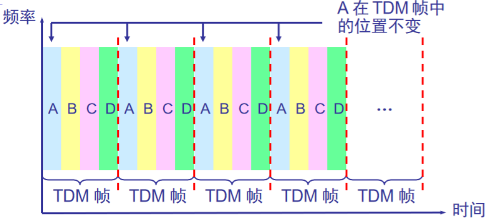
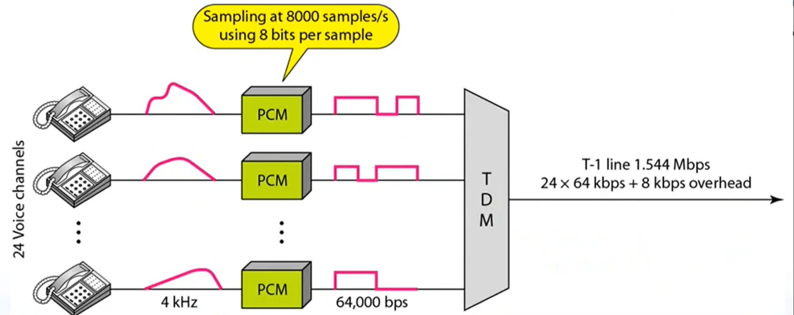

# 一、物理层的基本概念

物理层解决如何在连接各种计算机的**传输媒体**上传输**数据比特流**，而不是指具体的传输媒体。

物理层的主要任务描述为：确定与传输媒体的接口的一些特性，即：

- **机械特性**：例接口形状，大小，引线数目；

  

- **电气特性**：例规定电压范围（-5V到+5V）；
- **功能特性**：例规定-5V表示0，+5V表示1；
- **过程特性**：也称规程特性，规定建立连接时各个相关部件的工作步骤

# 二、数据通信的基础知识

典型的数据通信模型：

**相关术语**

通信的目的是传送消息。

- 数据（data）——运送消息的实体；
- 信号（signal）——数据的电气或电磁的表现；
  - “数字信号”——代表消息的参数的取值是离散的；
  - “模拟信号”——代表消息的参数的取值是连续的；
- 码元（code）——在使用时间域的波形标识数字信号时，则代表不同离散数值的基本波形就形成了码元；

在数字通信中常常使用时间间隔相同的符号来表示一个二进制数字，这样的时间间隔内的信号称为二进制码元。而这个间隔被称为码元长度。1码元长度可以携带nbit的信息量。

------

**有关信道的几个基本概念**

信道一般表示向一个方向传送信息的媒体。所以通信线路往往包含一条发送消息的信道和一条接收信息的信道。

- **单向信道**（单工通信）——只能有一个方向的通信而没有反方向的交互；比如电台广播；
- **双向交替通信**（半双工通信）——通信的双方都可以发送消息，但不能双方**同时**发送（当然也就不能同时**接收**）；比如对讲机；
- **双向同时通信**（全双工通信）——通信的双方可以同时发送和接收数据；比如打电话；

> **基带（baseband）信号和带通（band pass）信号**

- **基带信号**（即基本频带信号）——来自信源的信号。像计算机输出的代表各种文字或图像文件的数据信号都属于基带信号。基带信号就是发出的直接表达了要传输的信息的信号，比如我们说活的声波就是基带信号。
- **带通信号**——把基带信号经过载波调制后，把信号的频率范围搬移到较高的频段以便在信道中传输（即仅在一段频率范围内能够通过信道）。

由于在近距离范围内基带信号的衰减不大，从而信号内容不会发生变化。因此在传输距离较近时，计算机网络都采用**基带传输**方式。例如计算机到监视器、打印机等外设的信号就是基带传输的。

------

**几种基本的调制方法**

- **调幅（AM）**：载波的振幅随基带数字信号而变化；
- **调频（FM）**：载波频率随基带数字信号而变化；
- **调相（PM）**：载波的初始相位随基带数字信号而变化；

**常用编码**

- **单极性不归零码**：只是用一个电压值，用高电平表示1，没电压表示0，下图（a）；
- **双极性不归零码**：用正电平和负电平分别表示二进制的1和0，正负幅值相等，下图（b）；

**双极性归零码**：正负零三个电平，信号本身携带同步信息；

a）为单极性归零码；（b）为双极性归零码0

> 以上编码方式的缺点为：接收端无法判断数据传输是否结束。即数据尾部的0是有效数据还是没数据显示的没意义的0.

- **曼彻斯特编码**

该编码方式完善了上述编码方式的缺点。

- bit中间有信号，低——高跳变为0

bit中间有信号，高——低跳变为1

采用曼彻斯特编码，一个时钟周期只可以表示一个bit，并且必须通过两次采样才能得到一个bit但它能携带时钟信号，且可表示没有数据传输

**差分曼彻斯特编码**

**注意**：每个图中都有四个bit。

差分曼彻斯特编码与曼彻斯特编码相同，但抗干扰性能强于曼彻斯特编码。

判断（差分）曼彻斯特编码时，忽略bit与bit间的“竖线”，可判断得更加清楚。

**信道的极限容量**

- 有失真，但可识别

  

- 失真大，不可识别

> 理想条件下的信号传输：奈氏准则

1924 年，奈奎斯特(Nyquist)就推导出了著名的**奈氏准则**。他给出了在假定的理想条件下，为了避免码间串扰，码元的传输速率的上限值。

在任何信道中，码元传输的速率是有上限的，否则就会**出现码间串扰**的问题，使接收端对码元的判决（即识别）成为不可能。（比如说话速度太快，别人就听不清你说什么了）

如果信道的频带越宽，也就是能够通过的信号高频分量越多，那么就可以用更高的速率传送码元而不出现码间串扰。

**奈氏准则**

**理想低通信道的最高码元传输速率=2WBaud**

- W是理想低通信道的带宽，单位为HZ;
- Baud是波特，是码元传输速率的单位；

**波特**：在调制解调器中经常用到波特这个概念，Bit是信息量，如果一个码元含有3个Bit信息量，那么1波特=3Bit/s

> 有干扰条件下的信号传输：香农公式

香农(Shannon)用信息论的理论推导出了带宽受限且有高斯白噪声干扰的信道的**极限、无差错**的信息传输速率。

**式中S/N表示信噪比**

- 信道的带宽或信道中的信噪比越大，则信息的极限传输速率就越高。
- 若信道带宽 W 或信噪比 S/N 没有上限（当然实际信道不可能是这样的），则信道的极限信息传输速率 C 也就没有上限。
- 实际信道上能够达到的信息传输速率要比香农的极限传输速率低不少。
- 对于频带宽度已确定的信道，如果信噪比不能再提高了，并且码元传输速率也达到了上限值，那么还有办法提高信息的传输速率。这就是用编码的方法让每一个码元携带更多比特的信息量。

**奈氏准则和香农公式的应用范围**

# 三、物理层下的传输媒体

**电信领域使用的电磁波的频谱**

**导向传输媒体**

导向传输媒体中，电磁波沿着固体媒体传播

**双绞线**

- 屏蔽双绞线 STP (Shielded Twisted Pair)：一般用于长距离；

  

无屏蔽双绞线 UTP (Unshielded Twisted Pair)：一般用于短距离；

**同轴电缆**

- 50 Ω 同轴电缆：用于数字传输，由于多用于基带传输，也叫基带同轴电缆；

- 75 Ω 同轴电缆：用于模拟传输，即宽带同轴电缆；

  

**光纤**

光纤传输距离长，衰减小，窃听信号难

光在光纤中的折射

光纤的工作原理

多模光纤和单模光纤

- 单模光纤只能传输一种电磁波模式；多模光纤只可以传播多个电磁波模式）。

  实际上单模光纤与多模光纤之分，也就是纤芯的直径之分。单模光纤细，细到光在传播过程中几乎不发生折射；多模光纤粗。

  由于信号在单模光纤内几乎不折射，所以单模光纤传播特性好，带宽可达10GHZ,可以在一根光纤中传输60套PAL-D电视节目。

  ------

  **非导向传输媒体**

  非导向传输媒体就是自由空间，其中的电磁波传输被称为无线传输。

  - 无线传输所使用的频段很广。
  - **短波**通信主要是靠电离层的反射，但短波信道的通信质量较差（如收音机）。
  - **微波**在空间主要是直线传播。（所以要有中间设备对波进行扩大）
    - 地面微波接力通信
    - 卫星通信

**物理层设备——集线器**

工作特点：它在网络中只起到信号放大和重发作用，其目的是扩大网络的传输范围，而**不具备**信号的定向传送能力，（现在已很少见都被交换机替代了）。

- 最大传输距离：100m；

  即计算机A到集线器的网线距离最大为100m，计算机B也是100m，则计算机A与B之间距离可以为200m。

- 集线器是一个大的冲突域；

  多台计算机A、B、C、D通过连接同一台集线器上网；它们都有各自的网卡地址，若A与B通信，集线器并不会判断通信对象，而会把A的通信分别转发给B、C、D，造成C、D间被占线而无法通信，即半双工通信；同时也存在窃听的安全漏洞；并且会造成带宽平分。10台机器连10M的集线器，每台机器只有1M带宽。

# 四、信道复用技术

复用（multiplexing）是通信技术中的基本概念

**频分复用FDM(Frequency Division Multiplexing)** 

- 用户在分配到一定的频带后，在通信过程中自始至终都占用这个频带。
- **频分复用**的所有用户在同样的时间占用不同的带宽资源（请注意，这里的“带宽”是频率带宽而不是数据的发送速率）

如图：

**输入端**

三种输入波形分别使用不同频率的波进行调制，调制之后的波再叠加得到总的波形。

**输出端**

总的波形经过分离器（Filter）分离，再经过相应的波形解调得到原来需要传输的波形。这就叫做**频分复用**技术。

**频分复用FDW的例子**

比如打电话：

三台电话的三种波形在合并之前没有采取信道复用，那么一端的两台电话同时打给另一端的同一台电话就会出现占线；传输过程中三种波形通过合并为一个波实现了信道复用。

再看下面例子：

最左侧的电话有12个语音信道，每个信道占带宽4kHZ，通过频分复用可以变成48kHZ的一个组（信道）；5个组再进一步频分复用形成60个语音信道的一个240kHZ的超级组；10个超级组再进一步复用形成了600个了2.52MHZ的Master groud；还可以进一步复用。

比如电话公司通过频分复用技术，用一根电话线（干道电路）就可以为整个公司提供通信服务。

------

**时分复用TDM(Time Division Multiplexing) **

- **时分复用**则是将时间划分为一段段等长的**时分复用帧**（TDM 帧）。每一个时分复用的用户在每一个 TDM 帧中占用固定序号的时隙。
- 每一个用户所占用的时隙是**周期性地出现**（其周期就是 TDM 帧的长度）。
- TDM 信号也称为**等时**(isochronous)信号。
- 时分复用的所有用户是在不同的时间占用**同样的**频带宽度。

A、B、C、D在TDM帧中的位置是不变的。

可以看到四个信号分别对应TDM帧中的四部分，比如最右边的帧1010，对应四个信号的最后一位数据1010；以此类推（注意是从低位向高位的顺序存放数据）

**时分复用器**

**缺点**：时分复用可能会造成线路资源的浪费。

使用时分复用系统传送计算机数据时，会给每部分数据分配固定的资源（比如A1~A3），由于计算机数据的突发性质，可能会造成有的部分比如A2、A3、B2等部分没有数据，但是C却不能使用A与B所占的资源，所以用户对分配到的子信道的利用率一般是不高的。

**统计时分复用 STDM(Statistic TDM) **

这种方式为传输的每一种数据都贴上标签，接收时按照标签来辨别各自属于那一部分数据。

简单点说就是，原来的时分复用，固定顺序，分配固定空间，不管各个空间内是否存有数据；统计时分复用，随意顺序，有需求才分配空间并贴上固定的标签，以便接收后分类。

通俗来说：**时分复用**：把容量为100人的三个宿舍1,2,3分别分配给A、B、C三个班，而不管宿舍有没有住满；统计时分复用：先把ABC三个班的人放在一起，先塞满了1号宿舍，再分配2号宿舍，每个班的人凭借各班的标签区分是哪班的学生。

显然统计时分复用，资源利用率更高。

------

**波分复用 WDM(Wavelength Division Multiplexing)**

波分复用就是光的频分复用。

示意图：

**码分复用 CDM(Code Division Multiplexing)**

最普通的例子就是手机打电话。比如联通公司发送总的信号是一样的，那么当多人同时打电话时如何判断打的是A手机而不是B手机呢？

常用的名词是**码分多址 CDMA** (Code Division Multiple Access)。

- 各用户使用经过特殊挑选的不同码型，因此彼此不会造成干扰。
- 这种系统发送的信号有很强的抗干扰能力，其频谱类似于白噪声，不易被他人发现。
- 每一个比特时间划分为 m 个短的间隔，称为**码片**(chip)。

**CDMA的工作原理**

> 发送端

- 每个站被指派一个唯一的 m bit 码片序列；
  - 如发送比特 1，则发送自己的 m bit 码片序列；
  - 如发送比特 0，则发送该码片序列的二进制反码；
- 例如，S 站的 8 bit 码片序列是 00011011；
  - 发送比特 1 时，就发送序列 00011011；
  - 发送比特 0 时，就发送序列 11100100；

> 接收端

**CDMA的重要特点**

- 每个站分配的码片序列不仅必须各不相同，并且还必须互相正交(orthogonal)。

**码片序列的正交关系**

- 令向量 S 表示站 S 的码片向量，令 T 表示其他任何站的码片向量。
- 两个不同站的码片序列正交，就是向量 S 和T 的规格化内积(inner product)都是 0：

例如：若向量S=（-1 -1 -1 +1 +1 -1 +1 +1 ）

 向量T=（-1 -1 +1 -1 +1 +1 +1 -1）

代入上式可知两个码片序列是正交的；

**正交关系的另一个特性**

- 任何一个码片向量和该码片向量自己的规格化内积都是1 ；

  

- 一个码片向量和该码片反码的向量的规格化内积值是 –1；

现在就可以解释打电话的问题了：

如果联通公司发的总信号的码片序列如图R所示，R承载了电话AD所传输的信息，电话AD使用自己电话的码片序列与R进行规格化内积，得到的结果是+1和-1表示该手机能接收到该信号，结果是0表示该手机不能接收到该信号。

比如 A·R=（1-1+3+1-1+3+1+1）/8=1；

其余的以此类推带入公式算即可，得到A·R=1；B·R=-1；C·R=0；D·R=1；即A、B、D都能接收到信号。

所以想要在别人通信的时候自己也能听到，只需要造一个与监听对象手机相同的码片序列的电话卡，即可对通话信息进行解码，获取相同的通话信息。

**缺点**

- 把1bit分为了m bit 这样手机数量越多码片就会分得越长，m越大，则表示1bit需要增多的频率

# 五、数字传输系统

**脉码调制 PCM 体制**

- 脉码调制 PCM 体制最初是为了在电话局之间的中继线上传送多路的电话；
- 由于历史上的原因，PCM 有两个互不兼容的国际标准，即北美的 24 路 PCM（简称为 T1）和欧洲的 30 路 PCM（简称为 E1）。我国采用的是欧洲的 E1 标准；
- E1 的速率是 2.048 Mb/s，而 T1 的速率是 1.544 Mb/s；
- 当需要有更高的数据率时，可采用复用的方法

这是一个模拟信号 -> 采样 -> 调制 ->数字信号

上面的是E1标准，为了把输入信号表示清楚，每秒钟采样8000次，每次采样使用8bit的数据；承载的数据量为2.048Mb/s；

上面则是T1标准，同样每秒钟采样8000次，每次采样使用8bit的数据；承载的数据量为1.544Mb/s；

# 六、宽带接入技术

**xDSL技术**

- XDSL 技术就是用数字技术对现有的模拟电话用户线进行改造，使它能够承载宽带业务。
- 虽然标准模拟电话信号的频带被限制在 300~3400 kHz 的范围内，但用户线本身实际可通过的信号频率仍然超过 1 MHz。
- xDSL 技术就把 0~4 kHz 低端频谱留给传统电话使用，而**把原来没有被利用的高端频谱留给用户上网使用**。
- DSL 就是**数字用户线**(Digital Subscriber Line)的缩写。而 DSL 的前缀 x 则表示在数字用户线上实现的不同宽带方案。其中使用最多的是**ADSL (**Asymmetric Digital Subscriber Line)：**非对称数字用户线**

- 从图中可以看出，电话线能通过信号的频率范围为11103kHZ;把04kHZ的频段给通话使用；26108kHZ频段给上行；1381104kHZ频段给下行；上行指从用户到 ISP，而下行指从 ISP 到用户。可以看出，上传和下载的信道是部队称的，下载的信道比上传的多。

  以前没有ADSL技术的时候，使用的是模拟信号，这样拨号上网就不能打电话了。

xDSL的接入方式是这样的：

**用户端**

输入信号分为通信与上网。

**电话公司端**

也把输入信号分为通信与上网。

示意图：

**光纤接入技术**

> **光纤同轴混合网HFC (Hybrid Fiber Coax)**

- HFC 网是在目前覆盖面很广的有线电视网 CATV 的基础上开发的一种居民宽带接入网。
- HFC 网除可传送 CATV 外，还提供电话、数据和其他宽带交互型业务。

**主要特点**

- HFC网的主干线路采用光纤；
- HFC 网采用结点体系结构 

HFC 网具有比 CATV 网更宽的频谱，且具有双向传输功能 ；

> **FTTx 技术**

- FTTx（光纤到……）也是一种实现宽带居民接入网的方案。这里字母 x 可代表不同意思。
- **光纤到家** FTTH (Fiber To The Home)：光纤一直铺设到用户家庭可能是居民接入网最后的解决方法。
- **光纤到大楼** FTTB (Fiber To The Building)：光纤进入大楼后就转换为电信号，然后用电缆或双绞线分配到各用户。
- **光纤到路边** FTTC (Fiber To The Curb)：从路边到各用户可使用星形结构双绞线作为传输媒体