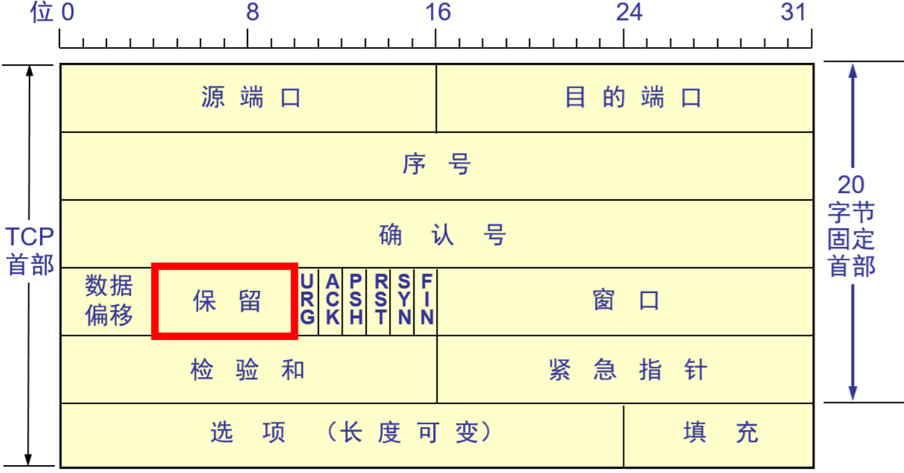
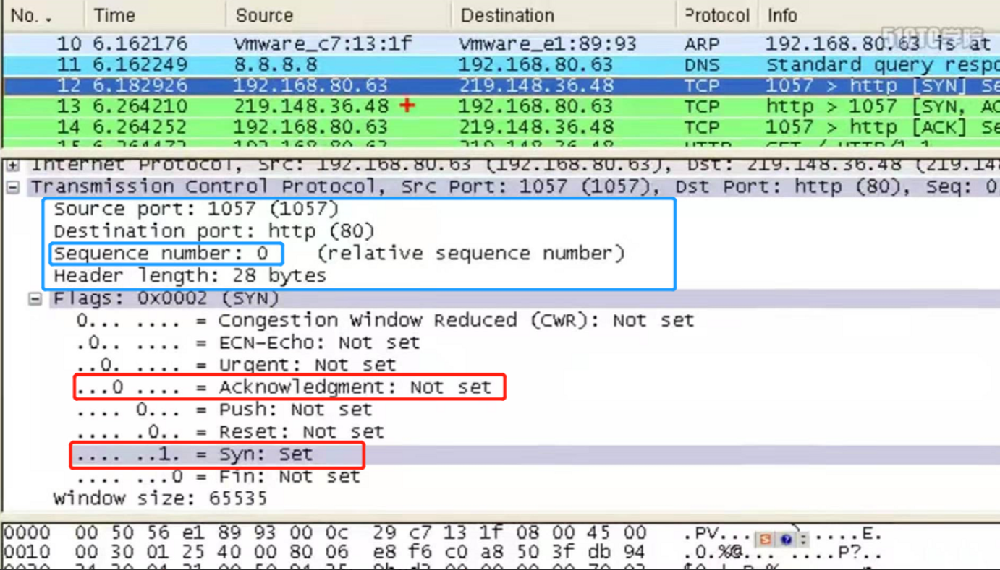
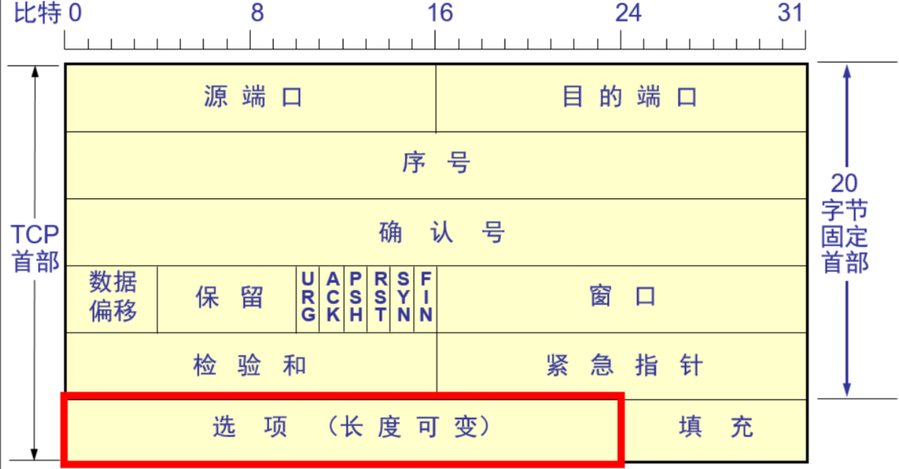
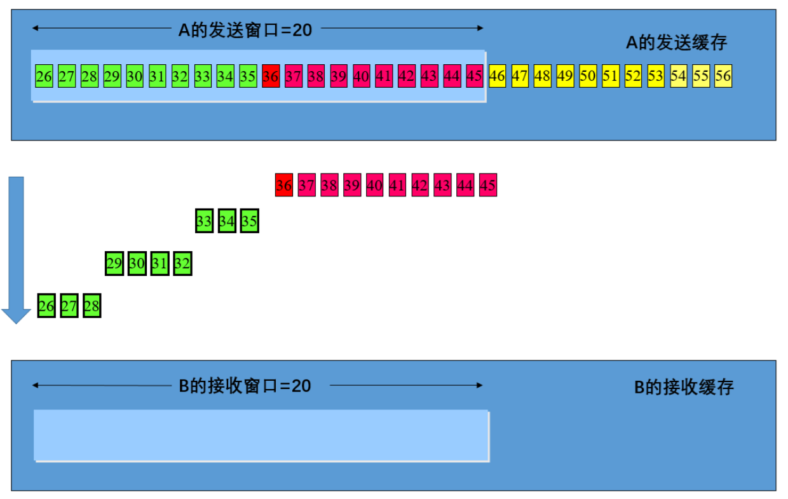
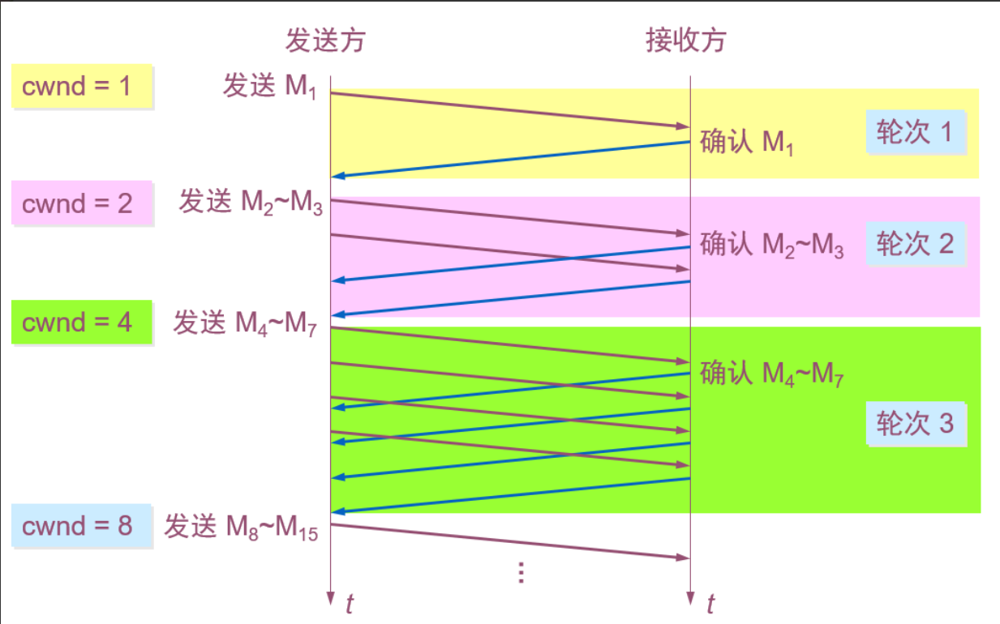

# 一、运输层概述

> **搞清楚一个概念，五层结构说的是TCP/IP协议，而大多数的设备通信都采用TCP/IP协议。**

回顾：

**网络层：** IP协议（RIP，OSPF，BGP这些是选择路径的协议）、ICMP、ARP、IGMP

**运输层：**TCP协议（可靠传输）、UDP（不可靠传输）

**应用层：**HTTP协议 、HTTPS协议 、FTP、DNS 、SMTP（发邮件）、PoP3（收邮件）、RDP

#### 1.1.运输层两个协议的应用场景

- TCP 分段传输，编号（给每段数据编号，接收端按编号检查，丢了哪个包就叫发送端重传），流量控制，是可靠性传输，建立会话：netstat -n可查看会话。例如：qq传文件（发送方要把数据分成多个数据包并编上号，接收端收到之后检查编号是否完整，再把所有数据包按编号串起来才能完整接受）、访问网站、上传文件。
- UDP不编号，一个数据包就能完成数据通信，只扔出一个数据包，丢了就连接失败，不建立会话，是不可靠传输。例如：qq聊天、多播（老师把自己的电脑画面播到每个学生电脑上）；

#### 1.2.运输层与应用层之间的关系

- 使用http不可靠传输时，使用80端口，http=TCP+80（端口）；
- 使用https安全传输时，使用443端口，https=TCP+443（端口）；
- ftp=TCP+21;
- SMTP=TCP+25;
- POP3=TCP+110;
- RDP=TCP+3389;
- 共享文件夹=TCP+445；
- SQL=TCP+1433;
- DNS=UDP+53 or TCP+53;

应用层协议其实就是传输层的两种主要协议加上相应端口来表示是哪一种应用层协议。其实就是传输层协议加上一个使用的端口号就表示一种应用。比如可以这样命名一个应用层协议：KON=TCP+4000 。

#### 1.3.应用层协议和服务之间的关系

服务（对外提供的服务）运行后在TCP或UDP的某个端口侦听客户端请求。

一台计算机上可能运行有多种服务，但是只有一个IP地址。

- Web：80；
- ftp：21；
- smtp：25；
- pop3：110；

假设IP地址为：101.100.0.0，用端口来定位服务，用IP地址来定位计算机。

查看自己计算机侦听的端口：

```
netstat -an
```


测试远程计算机打开的端口：

```
telnet 10.7.1.53 21
```


端口代表服务，如果telnet命令返回提示端口失败，说明不能访问这个服务。

#### 1.4.更改端口增加服务器安全

黑客可能会使用端口扫描工具，扫描到用户计算机打开侦听的端口，以此判断用户计算机提供的哪种服务，以展开攻击。

可以通过更改服务对应的端口增加服务器的安全性能。

#### 1.5.Windows防火墙的作用

- 一台计算机对外提供一种服务就会监听一个对应的端口。比如装上ftp服务，该计算机就在网卡上侦听21端口，是可见的，可用netstat -an查看侦听端口，安装Web服务，计算机就打开80端口侦听客户端的请求，若没有启用该服务，使用netstat -an命令查看时看不到80端口的。客户端要连接时，数据包要写上目标端口，比如目标端口为21，服务器就知道客户端访问的是ftp服务，也就是上面所说的用端口来区分服务。
- 如果把计算机的所有端口都关闭，那么该计算机相当于在互联网上隐身了，谁也访问不了它。但是它却可以访问其他计算机，因为Windows防火墙不拦截出去的流量，拦截进来的流量（计算机与外界通信完毕，端口关闭，是动态的）。例如：你ping别人不通，别人ping你通，说明别人设置了防火墙。
- 如果该计算机装了许多服务，但是只向外提供Web服务，只需要在网卡上打开80端口，关闭其余端口，发送过来的数据包只能访问80端口服务，若数据包目标端口为21端口，网卡会进行拦截，这样即使服务器本身运行了ftp服务，打开了21端口侦听，外面也访问不了，即使ftp服务有漏洞外面用户也攻击不了。也就是说在服务器上只开必要的端口，其实是增加了服务器的安全。
- **总结：**Windows防火墙的特点为：拦截外界向内部的主动访问，不拦截内部向外部的访问；

#### 1.6.Windows防火墙防不了木马程序

- 木马程序也就是所谓的后门，比如灰鸽子木马。通过伪装成图标、图片、或连接使用户主动下载并自动安装木马程序，把电脑控制权移交给黑客，由此绕开了Windows防火墙（防止的是外界主动入侵，不拦截内部向外访问）。
- 可以通过netstat -n命令查看建立的会话来观测新增端口，以此判断是否中了木马程序。木马程序与杀毒软件冲突，打开杀毒软件即可消灭木马程序。

#### 1.7.网络层实现的安全

- 使用网络层安全设置，严格控制流量的出入。如果该计算机只提供Web服务，那么该计算机只允许目标地址或源地址为80端口的数据包通过，从而达到严格管控其他目标地址或源地址非80端口的数据包的出入。比如灰鸽子木马使用的是8000端口，即使用户主动下载并安装了木马程序，由于出去的相关数据包源地址为8000端口（非80端口），所以会被拦截，以此在网络层实现信息安全。
- 打开本地安全策略窗口，在IP安全策略...选项右键可新建安全策略，自定义计算机允许哪些网段的，以哪些端口为目标端口或源端口的相关数据包的进出。

# 二、运输层的功能

#### 0.1.简介

- 运输层为应用进程之间提供**端到端**的逻辑通信（网络层是为**主机之间**提供逻辑通信）。
- 运输层还要对收到的报文进行**差错检测**。
- 运输层需要有两种不同的运输协议，即面向连接的 TCP 和无连接的 UDP。

#### 0.2.两种不同的运输协议

- 运输层向高层用户**屏蔽**了下面网络核心的细节（如网络拓扑、所采用的路由选择协议等），它使应用进程看见的就是好像在两个运输层实体之间有一条端到端的逻辑通信信道。
- 当运输层采用面向连接的 TCP 协议时，尽管下面的网络是不可靠的（只提供尽最大努力服务），但这种逻辑通信信道就相当于一条全双工的**可靠信道**。
- 当运输层采用无连接的 UDP 协议时，这种逻辑通信信道是一条**不可靠信道**。

------

### 一、运输层的两个主要协议

#### 1.1.TCP/IP 的运输层有两个不同的协议：

- 用户数据报协议 **UDP** (User Datagram Protocol)；
- 传输控制协议 **TCP** (Transmission Control Protocol)；

**TCP 与 UDP **

- 两个对等运输实体在通信时传送的数据单位叫作**运输协议数据单元** TPDU (Transport Protocol Data Unit)；
- TCP 传送的数据单位协议是 **TCP 报文段**(segment)，即分段传输；
- UDP 传送的数据单位协议是 **UDP 报文**或**用户数据报**，即整个数据包传输；
- TCP/IP 体系中的运输层协议：


- UDP 在传送数据之前**不需要先建立连接**。对方的运输层在收到 UDP 报文后，不需要给出任何确认。虽然 UDP 不提供可靠交付，但在某些情况下 UDP 是一种最有效的工作方式。
- TCP 则提供**面向连接**的服务。TCP 不提供广播或多播服务。由于 TCP 要提供可靠的、面向连接的运输服务，因此不可避免地增加了许多的开销。这不仅使协议数据单元的首部增大很多，还要占用许多的处理机资源。

------

### 二、运输层的端口

为了使运行不同操作系统的计算机的应用进程能够互相通信，就**必须用统一的方法**对 TCP/IP 体系的应用进程进行标志。

- 解决这个问题的方法就是在运输层使用**协议端口号**(protocol port number)，或通常简称为**端口**(port)。
- 虽然通信的终点是应用进程，但我们可以把端口想象是通信的终点，因为我们只要把要传送的报文交到目的主机的某一个合适的目的端口，剩下的工作（即最后交付目的进程）就由 TCP 来完成。
- 硬件端口是不同硬件设备进行交互的**接口**，而软件端口是应用层的各种协议进程与运输实体进行层间交互的一种**地址**。

#### 2.1.TCP 的端口

- 端口用一个 16 位端口号进行标志。
- 端口号只具有**本地**意义，即端口号只是为了标志本计算机应用层中的各进程。在因特网中不同计算机的相同端口号是没有联系的。

#### 2.2.三类端口

- **熟知端口：**数值一般为0~1023.

  **FTP：21；**

  **TELNET：23；**

  **SMTP：25；**

  **DNS：53；**

  **HTTP：80；**

  **HTTPS：443；**

  **RDP：3389；**

  ...

- **登记端口号：**数值为1024~49151。这是给没有熟知端口号的应用程序使用的，使用这个范围的端口号必须在 IANA 登记，以防止重复；

- **客户端口号：**或**短暂端口号**，数值为49152~65535。是留给客户进程选择暂时使用。当服务器进程收到客户进程的报文时，就知道了客户进程所使用的动态端口号。通信结束后，这个端口号可供其他客户进程以后使用。

#### 2.3.示例

在命令行窗口输入：

```
netstat -n
```

查看计算机建立的会话。


可以看到没打开一个进程就会建立一个会话，比如打开两个网页就会建立两个会话，并且在本地地址中每个进程的端口号都是不重复的，其中外部地址中的“443”端口号表示HTTPS协议，“80”表示HTTP协议。

# 三、运输层协议TCP和UDP

### 一、用户数据报协议 UDP

#### 1.1.UDP 概述

- UDP 只在 IP 的数据报服务之上增加了很少一点的功能，即端口的功能和差错检测的功能。
- 虽然 UDP 用户数据报只能提供不可靠的交付，但 UDP 在某些方面有其特殊的优点。

#### 1.2.UDP的主要特点

- UDP 是无连接的，即发送数据之前不需要建立连接。
- UDP 使用尽最大努力交付，即不保证可靠交付，同时也不使用拥塞控制。
- UDP 是面向报文的。UDP 没有拥塞控制，很适合多媒体通信的要求。
- UDP 支持一对一、一对多、多对一和多对多的交互通信。
- UDP 的首部开销小，只有 8 个字节。
- **UDP 是面向报文的 **


#### 1.3.UDP 首部的格式


可以看到UDP的首部没有“编号”字段，因为UDP协议只需要传输一个数据包，所以不需要编号。


用户数据报 UDP 有两个字段：**数据字段**和**首部字段**。首部字段有 8 个字节，由 4 个字段组成，每个字段都是两个字节。


- 在计算检验和时，临时把“**伪首部**”和 UDP 用户数据报连接在一起。伪首部仅仅是为了计算检验和。

#### 1.4.计算 UDP 检验和的例子


明确需要计算“校验和”来检验UDP报文的准确性即可。

------

### 二、传输控制协议TCP

在网络中传输数据，有的数据比较小，一个数据包就可以传完，这时使用UDP协议；有的数据比如电影500M比较大，这就要求把数据分段传输，分成的每个段就是一个数据包，依次传输和接收。传输的过程中有可能丢包，这就导致某些数据包缺失接收端无法打开整个文件，但是网络层不负责保证可靠传输，这就要依靠传输层的TCP协议来**实现可靠传输**。

再者，TCP协议还要有一个**流量控制**的功能，简单点说，服务器功能强大发数据很快，接收端无法及时处理就会给服务器发信息，告诉服务器减缓发送数据的速度。

还必须要有**避免网络拥塞**的功能。

#### 2.1.TCP概述

- TCP 是**面向连接**的运输层协议。即传输数据前需先建立连接确保网络通畅。
- 每一条 TCP 连接只能有两个**端点**(endpoint)，每一条 TCP 连接只能是**点对点**的（一对一，一个发一个收）。
- TCP 提供**可靠交付**的服务。
- TCP 提供**全双工**通信，A与B通信，A发数据给B，B要给A发送返馈信息，表示数据是否收到。
- **面向字节流**。

#### 2.2.TCP面向字节流的概念


**应当注意：**

- TCP 连接是一条虚连接而不是一条真正的物理连接。
- TCP 对应用进程一次把多长的报文发送到TCP 的缓存中是不关心的。
- TCP 根据对方给出的窗口值和当前网络拥塞的程度来决定一个报文段应包含多少个字节（UDP 发送的报文长度是应用进程给出的）。
- TCP 可把太长的数据块划分短一些再传送。TCP 也可等待积累有足够多的字节后再构成报文段发送出去。

#### 2.3.TCP 的连接

- TCP 把连接作为最基本的抽象。
- 每一条 TCP 连接有两个端点。
- TCP 连接的端点不是主机，不是主机的IP 地址，不是应用进程，也不是运输层的协议端口。TCP 连接的端点叫做**套接字**(socket)或**插口**。
- 端口号拼接到(contatenated with) IP 地址即构成了套接字。即端点=IP地址+端口号。


每一条 **TCP** 连接唯一地被通信两端的两个端点（即两个套接字）所确定。即：


**socket 多种不同的意思**

- 应用编程接口 API 称为 socket API, 简称为 socket。
- socket API 中使用的一个函数名也叫作 socket。
- 调用 socket 函数的端点称为 socket。
- 调用 socket 函数时其返回值称为 socket 描述符，可简称为 socket。
- 在操作系统内核中连网协议的 Berkeley 实现，称为 socket 实现。

# 四、TCP可靠传输的工作原理

### 一、停止等待协议

#### 1.1.简介


- 在发送完一个分组后，必须暂时保留已发送的分组的副本。
- 分组和确认分组都必须进行编号。
- 超时计时器的重传时间应当比数据在分组传输的平均往返时间更长一些。

#### 1.2.确认数据包丢失和迟到


- 当确认M1的数据包丢失时，A经过一段超时时间后重传M1，B接收并丢弃重复的M1之后，重传确认M1数据包；
- 当B发送的确认M1数据包由于网络原因，绕远路了，在A端规定的超时时间内未到达A，A端就会重传M1，B接收并丢弃重复的M1之后，重传确认M1数据包，并继续通信。当迟到的确认M1数据包到达A时，A收下数据包但什么也不做。

> **记住一点：只要没有告诉我你收到了，就表明你没收到，我就要重发。**

#### 1.3.可靠通信的实现

- 使用上述的确认和重传机制，我们就可以**在不可靠的传输网络上实现可靠的通信**。
- 这种可靠传输协议常称为**自动重传请求ARQ** (Automatic Repeat reQuest)。
- ARQ 表明重传的请求是**自动**进行的。接收方不需要请求发送方重传某个出错的分组 。

#### 1.4.信道利用率

停止等待协议的优点是简单，但缺点是信道利用率太低。


- TD表示发送分组数据包用的时间，RTT是数据包传输往返的时间，TA是接受确认用的时间。
- 信道的利用率 *U* ：


可以到这样信道的利用率U是很低的。

#### 1.5.流水线传输

由以上公式可知，只要提高发送数据包时间TD就可以提高信道利用率U，采用流水线传输方式。

- 发送方可**连续发送**多个分组，不必每发完一个分组就停顿下来等待对方的确认。
- 由于信道上一直有数据不间断地传送，这种传输方式可获得很高的信道利用率 。


ACK表示确认报文。

现在大多采用这种方式，那如何保证可靠传输呢？采用连续ARQ协议。

#### 1.6.连续 ARQ 协议


- 假设发送窗口是5，也就是发送方一次性能发5个数据包。当发送方收到数据包1的接收确认后表示接收方接收了数据包1，之后发送窗口向前滑动一个数据包，在发送窗口中删除数据包1的缓存。
- 即如果发送了5个数据包后没有收到确认信息就会停止继续发送数据包。
- 滑动窗口方式仍需每个数据包对应一个确认，效率不高，接收端可采用累积确认。

#### 1.7.累积确认

- 接收方一般采用**累积确认**的方式。即不必对收到的分组逐个发送确认，而是对按序到达的最后一个分组发送确认，这样就表示：**到这个分组为止的所有分组都已正确收到了**。
- 累积确认有的优点是：容易实现，即使确认丢失也不必重传。缺点是：不能向发送方反映出接收方已经正确收到的有分组的信息。

#### 1.8.Go-back-N（回退 N）

- 如果发送方发送了前 5 个分组，而中间的第 3 个分组丢失了。这时接收方只能对前两个分组发出确认。发送方无法知道后面三个分组的下落，而只好把后面的三个分组都再重传一次。
- 这就叫做 Go-back-N（回退 N），表示需要再退回来重传已发送过的 *N* 个分组。
- 可见当通信线路质量不好时，连续 ARQ 协议会带来负面的影响。

#### 1.9.TCP 可靠通信的具体实现

- TCP 连接的每一端都必须设有两个窗口——一个**发送窗口**和一个**接收窗口**。
- TCP 的可靠传输机制用**字节的序号**进行控制。TCP 所有的确认都是**基于序号**而不是基于报文段。
- TCP 两端的四个窗口经常处于**动态变化**之中。
- TCP连接的往返时间 RTT 也**不是固定不变**的。需要使用特定的算法估算较为合理的重传时间

# 五、TCP报文段的首部格式

#### 1.1.首部字段详解


- TCP首部包括20字节的固定首部部分及长度可变的其他选项，所以TCP首部长度可变。20个字节又分为5部分，每部分4个字节32位，如图中的5行，每行表示32位。
- 在**传输层**，TCP报文段包括：TCP首部和TCP数据部分；在**网络层**，TCP报文段成为IP数据部分，加上IP首部组成IP数据报；在**数据链路层**，还要在IP数据报前面加上数据链路层的首部。


**源端口和目的端口**字段——各占 2 字节（16位）。端口是运输层与应用层的服务接口。运输层的复用和分用功能都要通过端口才能实现。


**序号**字段——占 4 字节。TCP 连接中传送的数据流中的每一个字节都编上一个序号。序号字段的值则指的是本报文段所发送的数据的第一个字节的序号。比如分组的第一个数据包由文件的14个字节数据组成，那么该数据包所添加的序号就是1，同理第二个数据包由文件的59个字节数据组成，那么该数据包所添加的序号就是5；


**确认号**字段——占 4 字节，是期望收到对方的下一个报文段的数据的第一个字节的序号。比如接收端收到由文件14个字节数据+TCP首部组成的数据包后，删除首部提取14个字节数据，返回的确认号为5，即告诉发送端下一次应该发送文件的第5个字节及其之后字节组成的数据包过来。


**数据偏移**（即首部长度）——占 4 位，它指出 TCP 报文段的数据起始处距离 TCP 报文段的起始处有多远，也就是TCP首部的长度。“数据偏移”的单位是 32 位字（以 4 字节为计算单位），最大1111表示15x4=60个字节，即表示TCP首部最大长度为60个字节，因此“选项”部分最多40个字节。



**保留**字段——占 6 位，保留为今后使用，但目前应置为 0。


这里的六位二进制位，分别表示不同含义：

- **紧急 URG** —— 当 URG = 1 时，表明紧急指针字段有效。它告诉系统此报文段中有紧急数据，应尽快传送(相当于高优先级的数据)。 即URG=1的数据包不用排队直接优先传输。

- **同步 SYN** —— 同步 SYN = 1 表示这是一个连接请求或连接接受报文。即A想与B建立连接，发送过去的第一个数据包（第一次握手）中SYN=1；B返回的数据包（第二次握手）中SYN=1表示同意建立连接。

- **确认 ACK** —— 只有当 ACK = 1 时确认号字段才有效。当 ACK = 0 时，确认号无效。

  ACK是对已接受数据的确认，当A与B还在请求连接阶段，A向B发送的第一个数据包（第一次握手）中ACK=0，无效，所以数据包中不显示，表示还没从B中接收到数据；序号Seq也为0，表示A还未向B发送数据；SYN=1，表示正在建立连接。

  同理，B向A返回一个数据包（第二次握手）中，确认号ACK=1，表示B收到了A序号为0的数据包；序号Seq=0，也表示B还未向A发送数据；SYN=1表示同意建立连接。

  A再向B发送一个数据包（第三次握手）中，确认号ACK=1，表示A收到了B发出的数据包；序号Seq=1，表示A已向B发送了1个数据包（即第一次握手）；SYN=0，表示已建立连接。

  以下为计算机打开网页与Web服务器建立连接时抓取的第一个数据包（第一次握手）：



可以看到计算机发出的第一个数据包（第一次握手）中，SYN=1，Seq=1，ACK=0无效，所以在蓝色框内只能看到序号Seq，看不到确认号ACK；

以下为抓取的第三个数据包（第三次握手）：


计算机发出第二个数据包（第三次握手）中，由于已经同步，建立连接，所以SYN=0，此后ACK都为1，所以蓝色框中可以看到序号Seq和确认号ACK。

所以，抓包时看到大量的SYN数据包，说明计算机在大量建立会话。另外在建立连接（三次握手）时，SYN与ACK的值与正常通讯时不一样。

**有一种攻击就是针对建立连接时SYN同步的机制**

比如地址为102的计算机B想要与地址为101的计算机A建立连接，B向A发送请求连接数据包，并设置数据包中的源地址为不存在，A收到之后向该不存在的地址发出同意连接的数据包，发送完之后需要等待回复。于是B继续上述操作，以此类推A不断发出同意连接数据包并不断等待，由此大量耗费系统资源。

下图为使用SYN同步攻击软件攻击XP系统过程中，捕获的数据包：


红色框中的地址是攻击软件瞎编的不存在的地址，蓝色框中显示建立的会话全是请求连接的TCP报文。

**Land攻击**

原理与SYN攻击类似，都是通过不断建立同步SYN会话，耗尽系统资源。不同之处在于，Land攻击发起的请求同步数据包目标地址和源地址都是攻击对象的地址。


可以看到在Land攻击时捕获的数据包，都是请求同步SYN数据包且源地址和目标地址都为攻击对象地址 192.168.80.66 。

- **推送 PSH** (PuSH) —— 接收 TCP 收到 PSH = 1 的报文段，就尽快地交付接收应用进程，而不再等到整个缓存都填满了后再向上交付。
- **复位 RST** (ReSeT) —— 当 RST = 1 时，表明 TCP 连接中出现严重差错（如由于主机崩溃或其他原因），必须释放连接，然后再重新建立运输连接。
- **终止 FIN** (FINis) —— 用来释放一个连接。FIN = 1 表明此报文段的发送端的数据已发送完毕，并要求释放运输连接。


**窗口**字段 —— 占 2 字节，用来让对方设置发送窗口的依据，单位为字节。


如图A要告诉B自己的接收缓存为Y1，B根据A的接收缓存Y1决定发送缓存X2；同理B告诉A自己的接收缓存Y2，A根据B的接收缓存Y2决定自己的发送缓存X1。也就是A/B的接收缓存决定了B/A的发送缓存。


可以看见建立TCP连接时发送的三个数据包（三次握手）的第一个数据包中，Window Size：65535；表示的即是某一连接方的**窗口**大小。


**检验和** —— 占 2 字节。检验和字段检验的范围包括首部和数据这两部分。在计算检验和时，要在 TCP 报文段的前面加上 12 字节的伪首部。


- **紧急指针**字段 —— 占 16 位，指出在本报文段中紧急数据共有多少个字节（紧急数据放在本报文段数据的最前面）。



**选项**字段 —— 长度可变。TCP 最初只规定了一种选项，即最大报文段长度 MSS (Maximum Segment Size)是 TCP 报文段中的数据字段的最大长度。数据字段加上 TCP 首部才等于整个的 TCP 报文段。

MSS 告诉对方 TCP：“我的缓存所能接收的报文段的数据字段的最大长度是 MSS 个字节。”

**其他选项**有：窗口扩大选项、时间戳选项、选择确认选项（SACK）。


- **填充**字段 —— 这是为了使整个首部长度是 4 字节的整数倍。

#### 1.2.抓包验证

通过抓取计算机访问Web网站过程抓到的数据包，分析验证TCP报文段的结构。


这就是建立TCP连接的“三次握手”过程，可以看到第一个数据包（第一次握手），是计算机给web站点发的，建立会话数据包都是SYN类型的，MSS表示最大数据包，即计算机告诉Web站点我支持的最大数据包容量为1460个字节；

第二个数据包（第二次握手），是Web站点给计算机发的同步数据包，告诉计算机我支持的最大数据包为1460个字节。还告诉计算机Win即Web服务器的发送窗口的缓存最多为60240个字节，当Web服务器发送完60240个数据包之后没有收到确认信息，就停止发送数据包。

第三个数据包（第三次握手），是计算机给Web服务器发送的。Win=65535，表示告诉服务器计算机移动窗口最大缓存为65535个字节，说明计算机最多能接收处理来自Web服务器的65535个字节数据，若Web服务器没有收到确认，就暂停传输数据包，等计算机处理完了再继续发送。

可以看到建立会话的三个数据包，不仅为了测试网络是否通畅，还协商了一些参数。

下面就到正题了，可以看到HTTP协议只用一个数据包就能解决问题。


选中TCP协议可以看到目标端口是80，源端口是1057，序号是1，确认号是1，TCP首部长度是20个字节。

之后便是Web服务器给计算机发送网站数据，其中夹杂着计算机给Web服务器的数据包是否收到的反馈信息。

#### 1.3.TCP首部参数图解：


- 黄色表示TCP报文数据部分，蓝色表示TCP首部。可以看到四段TCP报文中序号Seq都是TCP报文数据部分的第一个字节的编号。因为计算机给Web服务器发送的数据为1203字节，所以Web服务器给计算机发送的三个TCP报文中确认号都是204，表示Web服务器收到了1203个字节数据，让计算机从数据的第204个字节开始发。
- 第五段为计算机给Web服务器发的第二个TCP报文，因为发送的第一个TCP报文已包含1203个字节数据，所以第二个TCP报文发送的数据从204字节开始，所以该报文序号为204；由于收到了Web服务器发的三个TCP报文总计12053个字节的数据，所以该报文的确认号为2054，表示告诉Web服务器，我收到了你传输的1~2053个字节，接着从2054个字节开始给我发数据。
- 这就是确认号和序号怎么来的。

# 六、TCP 可靠传输与流量控制的实现

### 一、TCP可靠传输的实现

> 现在所讲的可靠传输是根据之前所说的可靠传输原理的实现，是现实中应用的技术。

#### 1.1.以字节为单位的滑动窗口


如图A端一份文件分为了多个字节，每个字节用带有字节号的方块表示。A需要把这份文件发个B，发送时文件先放入A的发送缓存中排队，准备发送。B中有一个接收缓存，用于存放接收到的由文件分成的多个字节数据。

- 通信时，B要与A建立会话（连接）（TCP是面向连接的），建立连接时B计算机要根据自己的接收缓存的大小设定合适的接收窗口，单位为字节，并告诉A计算机。如图中B的接收窗口设为20字节。
- A根据B告知的接收窗口大小设定字节的发送窗口为20个字节，二者要一致。
- 随后A开始向B发送数据，第一个发送的数据包可以是由2628字节组成，不用等待B回复确认信息，继续发送发送窗口中剩下的2945字节数据。于是可以发出由2932字节组成的第二个数据包、由3335字节组成的第三个数据包、由36~45字节组成的第四个数据包（组成一个数据包的字节数是不固定的）。



- A发出总共包含2645二十个字节的四个数据包，A在没有收到B的确认信息前不能把发送窗口中2635字节的数据删除，因为由于网络原因可能需要重发这些字节的数据。但是发送窗口外的数据不能继续发送。
- 当B收到了前两个数据包发现编号是连续的，就向A发送一个确认信息，表示已正确无误接收了前7个字节数据并要求A发送第36个字节之后的数据，即确认号ACK=36；


A收到B发出的确认信息之后，发送窗口删除窗口中2632字节数据的缓存，并向右移动到33字节处。即4652字节的数据进入发送窗口可以以数据包的形式向B发送。


紧接着B陆续接收到数据包2、3，并向A发送确认信息。由于已发送了数据包1的确认信息，所以B的接收窗口向右移动，把数据包1包含的2632字节数据移出接收窗口。这就相当于B计算机已经接收到了文件的2632字节部分，相当于下载东西时的临时文件，应用进程可读取该部分。


如此循环，A的发送缓存和B的接收缓存会动态地清理空间，供发送窗口和接收窗口循环使用，直至把文件传输完成。这就是以字节为单位的滑动窗口实现的TCP可靠传输。

**注意：**


- A中，P3 – P1 = A 的发送窗口（又称为通知窗口）；

  P2 – P1 = 已发送但尚未收到确认的字节数；

  P3 – P2 = 允许发送但尚未发送的字节数（又称为可用窗口）。


- A 的发送窗口内的序号都已用完，但还没有再收到确认，必须停止发送。

#### 1.2.当存在数据包丢失情况下实现可靠传输


A向B发送3个数据包，再发送过程中第二个数据包丢了，只有第一个和第三个数据包到达B。


- 2629连续字节数据到达B后，B向A发送确认数据包，其中ACK=30，A收到后相应地移动发送窗口；B只接收到3035字节数据中的3335字节，于是向A发送确认数据包，其中有一个选择性确认号SACK，告诉A端收到了3335字节，只需要发送缺失的3032字节数据即可。最终B收到3035连续的字节了，再向A发送确认数据包，其中ACK=36，A收到后再次移动发送窗口。

**补充说明：**

- A 的发送窗口并不总是和 B 的接收窗口一样大（因为有一定的时间滞后）。
- TCP 标准没有规定对不按序到达的数据应如何处理。通常是先临时存放在接收窗口中，等到字节流中所缺少的字节收到后，再按序交付上层的应用进程。
- TCP 要求接收方必须有累积确认的功能，这样可以减小传输开销。

------

### 二、超时重传时间的选择

#### 2.1.加权平均往返时间RTT

TCP 每发送一个报文段，就对这个报文段设置一次计时器。只要计时器设置的重传时间到但还没有收到确认，就要重传这一报文段。

由于网络的通畅情况随时间变化，所以数据往返时间RTT是变化的。采用以下公式计算新的平均往返时间。


- 式中RTTs表示**加权平均往返时间** （又称为**平滑的往返时间**），即传输数据时多次往返时间RTT的平均值。
- 式中，0 < a < 1。若 a 接近于零，表示新RTTs值较依赖旧RTT值，说明 RTT 值更新较慢，网速稳定；若选择 a 接近于 1，表示新RTTs值较依赖新RTT值，说明 RTT 值更新较快，网速不稳定。
- RFC 2988 推荐的 a 值为 1/8，即 0.125。

#### 2.2.超时重传时间 RTO (RetransmissionTime-Out)

- RTO 应略大于上面得出的加权平均往返时间 RTTs。

- RFC 2988 建议使用下式计算 RTO：

   **RTO = RTTs + 4 x RTTd**

- RTTd 是 **RTT 的偏差的加权平均值**。

- RFC 2988 建议这样计算 RTTd。第一次测量时，RTTd 值取为测量到的 RTT 样本值的一半。在以后的测量中，则使用下式计算加权平均的 RTTd：


- β 是个小于 1 的系数，其推荐值是 1/4，即 0.25。

**往返时间的测量相当复杂 **


- TCP 报文段 1 没有收到确认。重传（即报文段 2）后，收到了确认报文段 ACK。
- 如何判定此确认报文段是对原来的报文段 1 的确认，还是对重传的报文段 2 的确认？

#### 2.3.Karn 算法

- 在计算平均往返时间 RTT 时，只要报文段重传了，就不采用其往返时间样本。
- 这样得出的加权平均平均往返时间 RTTS 和超时重传时间 RTO 就较准确。

#### 2.4.修正的 Karn 算法

- 报文段每重传一次，就把 RTO 增大一些：


- 系数 g 的典型值是 2 。
- 当不再发生报文段的重传时，才根据报文段的往返时延更新平均往返时延 RTT 和超时重传时间 RTO 的数值。
- 实践证明，这种策略较为合理。

#### 2.5.选择确认 SACK (Selective ACK)

- 接收方收到了和前面的字节流不连续的两个字节块。
- 如果这些字节的序号都在接收窗口之内，那么接收方就先收下这些数据，但要把这些信息准确地告诉发送方，使发送方不要再重复发送这些已收到的数据。
- RFC 2018 的规定：
  - 如果要使用选择确认，那么在建立 TCP 连接时，就要在 TCP 首部的选项中加上“允许 SACK”的选项，而且双方必须都事先商定好。
  - 如果使用选择确认，那么原来首部中的“确认号字段”的用法仍然不变。只是以后在 TCP 报文段的首部中都增加了 SACK 选项，以便报告收到的不连续的字节块的边界。
  - 由于首部选项的长度最多只有 40 字节，而指明一个边界就要用掉 4 字节，因此在选项中最多只能指明 4 个字节块的边界信息。

------

### 三、TCP的流量控制

#### 3.1.利用滑动窗口实现流量控制

- 一般说来，我们总是希望数据传输得更快一些。但如果发送方把数据发送得过快，接收方就可能来不及接收，这就会造成数据的丢失。
- **流量控制**(flow control)就是让发送方的发送速率不要太快，既要让接收方来得及接收，也不要使网络发生拥塞。
- **流量控制举例：**

A 向 B 发送数据。在连接建立时，B 告诉 A：“我的接收窗口 rwnd = 400（字节）”。


由图可知，利用滑动窗口机制可以很方便地在 TCP 连接上实现流量控制。

# 七、TCP的拥塞控制

### 一、拥塞控制的一般原理

#### 1.1.简介

- 在某段时间，若对网络中某资源的需求超过了该资源所能提供的可用部分，网络的性能就要变坏——产生**拥塞**(congestion)。

- 出现资源拥塞的条件：

   对资源需求的总和 > 可用资源

- **拥塞控制**是一个全局性的过程，涉及到所有的主机、所有的路由器，以及与降低网络传输性能有关的所有因素。

- **流量控制**往往指在给定的发送端和接收端之间的点对点通信量的控制，它所要做的就是抑制发送端发送数据的速率，以便使接收端来得及接收。

#### 1.2.拥塞控制所起的作用


- 吞吐量(throughput)表示在单位时间内通过某个网络（或信道、接口）的数据量。比如某网络的带宽为100M，那么该网络的最大吞吐量为100M/s 。
- 可以看到，理想的拥塞控制为：随着传输数据量（负载）的增加，数据传输速度（吞吐量）越来越快，当吞吐量达到网络的最大带宽时，继续增大传输数据量，传输的速度（吞吐量）也不会再增加，所以这样并不会造成网络拥塞导致传输速度（吞吐量）下降。例如，路由器间的带宽为100M，当传输150M数据时，路由器把处理不过来的50M数据扔掉，继续保持100M的传输速度。
- 当无拥塞控制时，假设两路由器间的网络带宽为100M，当传输的数据小于100M时，随着数据量（负载）的增加丢包情况越来越明显，此时成为轻度拥塞；当传输的数据量（负载）大于100M时，大量的数据包使路由器无法及时处理，错误情况越来越多，最后路由器死机，无法传输数据导致**死锁**，此时吞吐量为0。
- 在实际的拥塞控制中，网络设备随着传输的数据量（提供的负载）越来越大，传输的速度（吞吐量）越快，丢包率也越来越大，依靠拥塞控制机制会适当降低数据传输的速度（吞吐量），以减少拥塞。

------

### 二、拥塞控制方法

#### 2.1.简介

- 发送方维持一个叫做**拥塞窗口 cwnd** (congestion window)的状态变量。

  拥塞窗口的大小取决于网络的拥塞程度，并且动态地在变化。发送方让自己的发送窗口等于拥塞窗口。如再考虑到接收方的接收能力，则发送窗口还可能小于拥塞窗口。

- 发送方控制拥塞窗口的原则是：

  - 只要网络没有出现拥塞，拥塞窗口就再增大一些，以便把更多的分组发送出去。
  - 只要网络出现拥塞，拥塞窗口就减小一些，以减少注入到网络中的分组数。

#### 2.2.慢开始和拥塞避免（1988年提出）

- 慢开始图例：



发送窗口一般等于拥塞窗口。

第一轮：刚开始cwnd=1，发送窗口也为1，发送方先发送一个报文M1测试连接通畅程度，当收到对M1报文的确认之后，cwnd+1，即发送窗口变为2，可以同时发送两个报文M2~M3；

第二轮：发送方发送两个报文M2M3，发送方收到了M2报文的确认后使cwnd+1变为3，收到了M3报文确认后cwnd+1变为4，即每收到一个对新报文的确认（重传的不算在内）就使cwnd+1。由此cwnd=4，即发送窗口也为4，可以同时发送四个报文M4M7 。

以此类推第三轮之后cwnd=8。传输速度由慢开始，每轮翻倍，最后传输速度越来越快。

> **传输轮次 (transmission round)**

- 使用慢开始算法后，每经过一个**传输轮次**，拥塞窗口 cwnd 就加倍。
- 一个传输轮次所经历的时间其实就是往返时间 RTT。

> **慢开始门限状态变量ssthresh**

- 当 cwnd < ssthresh 时，使用慢开始算法（cwnd每轮加倍）。
- 当 cwnd > ssthresh 时，停止使用慢开始算法而改用拥塞避免算法。
- **拥塞避免算法**的思路是让拥塞窗口 cwnd 缓慢地增大，即每经过一个往返时间 RTT 就把发送方的拥塞窗口 cwnd 加 1，而不是加倍，使拥塞窗口 cwnd 按线性规律缓慢增长。
- 当 cwnd = ssthresh 时，既可使用慢开始算法，也可使用拥塞避免算法。

> **当网络出现拥塞时**

- 无论处于慢开始阶段还是拥塞避免阶段，只要发送方判断网络出现拥塞（其根据就是没有按时收到确认数据包），就要把慢开始门限 ssthresh 设置为出现拥塞时的发送方发送窗口值（多数情况下等于cwnd）的一半（但不能小于2）。
- 然后把拥塞窗口 cwnd 重新设置为 1，执行慢开始算法。
- 这样做的目的就是要迅速减少主机发送到网络中的分组数，使得发生拥塞的路由器有足够时间把队列中积压的分组处理完毕。

> **慢开始和拥塞避免算法的实现举例 **


- 可以看到，开始时采用慢开始算法，每经历一轮cwnd翻倍，传输的数据包翻倍，到第4轮时cwnd=16，意味着可以同时发送16个数据包，到达了设定的慢开始门限值ssthresh，随后采用拥塞避免算法。
- 采用拥塞避免算法期间，每经历一轮cwnd+1。当cwnd=24时，发送方不能准时收到确认数据包（即丢包），判断出现网络拥塞，于是把慢开始门限值ssthresh重新设为当前cwnd值（24）的一半，即12，并把cwnd重置为1 ，再次进入慢开始阶段。
- 可以看到：采用慢开始算法，cwnd按指数规律增长；采用拥塞避免算法，cwnd按线性规律增长。

> **注意**

- “拥塞避免”并非指完全能够避免了拥塞。利用以上的措施要完全避免网络拥塞还是不可能的。
- “拥塞避免”是说在拥塞避免阶段把拥塞窗口控制为按线性规律增长，使网络比较不容易出现拥塞。

#### 2.3.快重传和快恢复（1990年提出）

> **快重传举例**

当不出现丢包情况时，接收方是每接收多个数据包才给发送方一个确认。例如每收到5个连续的数据包，发送以此确认信息。

当出现丢包情况时：如发送数据包M1~M5，丢失了M3，如按上述规律，接收方要等到接收完M5后才能向发送方反馈丢失M4的信息。实际上，接收方接连收到不连续的数据包M2、M4，就已经发现丢失了M3，可采用以下的快重传方式。


- 快重传算法要求接收方每收到一个失序的报文段后就立即发出重复确认。这样做可以让发送方尽早知道有报文段没有到达接收方。
- 发送方只要一连收到三个重复确认就应当立即重传对方尚未收到的报文段。

> **快恢复算法 **

- 当发送端收到连续三个重复的确认时，就执行“乘法减小”算法，把慢开始门限 ssthresh 减半。但接下去不执行慢开始算法。

- 由于发送方现在认为网络很可能没有发生拥塞，因此现在不执行慢开始算法，即拥塞窗口 cwnd 现在不设置为 1 。而是将cwnd当前值减半作为新的慢开始门限 ssthresh 值，并让cwnd的值等于这个新的慢开始门限ssthresh值。

  也有人认为，由于接收了三个重复的ACK，按照上述规律没收到一个ACK，cwnd+1，所以cwnd=新ssthresh+3，这里采用前一种观点。

  随后开始执行拥塞避免算法（“加法增大”），使拥塞窗口缓慢地线性增大。 这便是快恢复算法。

- 下为图例：


可以看到，当发送端收到3个重复的确认后，执行快重传算法，cwnd

快恢复是配套着快重传使用的，快恢复是相对于慢开始算法而言的。使用快恢复算法时，cwnd从较大值开始，通过拥塞避免算法逐渐线性增大，经过较短时间便能恢复比较快的传输速度；使用慢开始算法时，cwnd从1开始，需要较常时间才能达到较快的速度。

#### 2.4.发送窗口的上限值

前面讲过发送方的发送窗口是由接收方的接收窗口决定的。例如接收方的接收窗口为100字节，那么发送方的发送窗口就为100字节。实际上：

- 发送方的发送窗口的上限值应当取为接收方窗口 rwnd 和拥塞窗口 cwnd 这两个变量中较小的一个，即应按以下公式确定：


- 即刚开始发送数据时，由于网络情况未知cwnd的值由1开始按指数规律增大，而接收窗口的是固定的假设为100字节。此时 cwnd < rwnd ，网络的拥塞窗口cwnd限制了发送窗口的最大值。
- 之后cwnd的值越来越大，最后被限制在接收方的接收窗口大小100字节上。此时此时 cwnd > rwnd ，接收方的接收能力限制了发送窗口的最大值。

# 八、TCP传输连接管理

### 一、传输连接的三个阶段

#### 1.1.概述

- 传输连接就有三个阶段，即：**连接建立**、**数据传送**和**连接释放**。
- 连接建立过程中要解决以下三个问题：
  - 要使每一方能够确知对方的存在。
  - 要允许双方协商一些参数（如最大报文段长度，最大窗口大小，服务质量等）。
  - 能够对运输实体资源（如缓存大小，连接表中的项目等）进行分配。
- TCP 连接的建立都是采用**客户服务器方式**。
- 主动发起连接建立的应用进程叫做**客户**(client)。
- 被动等待连接建立的应用进程叫做**服务器**(server)。

------

### 二、TCP 的连接建立

#### 2.1.用三次握手建立 TCP 连接

当客户端A想要访问服务器B上的服务，需要与B建立连接了，就要经历如下三次握手过程：


- 第一次握手：A先向B发送一个同步数据包（报文）。

  在报文的TCP首部中：标志位：**同步SYN**为1，表示这是一个请求建立连接的数据包；确认标记位ACK为0，说明该数据包的确认号无效，所以该标志位可省略；序号`Seq=x`，`x`为所传送数据的第一个字节的序号。

- 第二次握手：B收到A发送的第一个数据包后，根据标志位SYN=1与ACK=1，判断出为主动建立连接的数据包。若B同意连接，则B发送一个数据包进行回应。

  在数据包的TCP首部中：标志位：**同步SYN**=1；标志位：**确认ACK**=1；序号seq=y，y的值由B指定表示B发送数据时的第一个数据字节的序号；确认号ack=x+1，表示已经收到A发送的x个字节数据，并告诉A下次应从数据的第x+1个字节开始发送。

> 注意区分ACK和ack：在TCP首部中前者为标志位**确认 ACK** ——占 1 字节，只有当 ACK = 1 时确认号字段才有效。当 ACK = 0 时，确认号无效。；后者为**确认号**字段——占 4 字节，是期望收到对方的下一个报文段的数据的第一个字节的序号。

- 第三次握手：A收到B的确认之后，再给A发送一个数据包。

  在数据包的TCP首部中：已经没有有效的标志位：**同步SYN**了（即SYN=0），表示双方已同意建立连接；标志位**确认ACK**=1，表示收到B的确认数据包；序号seq=x+1，表示发出的数据包就是数据的第x+1个字节；确认号ack=y+1，表示收到了B发送y字节数据，并告诉B下次应从数据的第y+1个字节开始发送。

#### 2.2.为何有第三次握手？

客户端向服务器发出建立连接的请求以及服务器向客户端确认这个请求，这两个数据包（前两次握手）足以证明客户端与服务器之间的网络是畅通的，并且协商数据通信所需要的参数。比如协商接收窗口大小，所支持的数据包最大字节数等。

如果没有最后一个数据包确认（第三次握手），A先发出一个建立连接的请求数据包，由于网络原因绕远路了。A经过设定的超时时间后还未收到B的确认数据包，于是发出第二个建立连接的请求数据包，这次网路通畅，数据包很快到达B，B的确认数据包也很快就到达A。于是A与B开始传输数据，过了一会A第一次发出的建立连接的请求数据包到达了B，B以为是再次建立连接，所以又发出一个确认数据包。由于A已经收到了一个确认数据包，所以会忽略B发来的第二个确认数据包，但是B发出确认数据包之后就要一直等待A的回复，而A永远也不会回复。由此造成服务器资源浪费，这种情况多了B计算机可能就停止响应了。

第三次握手（第三个数据包）作用在于，告诉B计算机，B第二次握手发给A的确认数据包A收到了，是有效的。**避免B计算机等待造成资源浪费。**随后A与B可进行下一步的通信。

#### 2.3.三次握手建立TCP连接过程的各状态


- A发出请求建立连接的数据包之后进入**SYN-SENT**状态，表示发送了请求建立连接的同步数据包。
- B收到A发出的请求建立连接的数据包之后，结束**LISTEN**状态，进入**SYN-RCVD**状态并向A发出确认数据包。
- A收到确认数据包之后，结束SYN-SENT状态，进入**ESTABLISHED**状态，并向B发送确认数据包。
- B收到A的确认数据包之后，结束SYN-RCVD状态，进入**ESTABLISHED**状态。

A与B都进入**ESTABLISHED**状态之后，开始传输数据，由此完成三次握手。

**查看这些状态**

可通过：

```
netstat -n
```

在命令行窗口查看计算机建立的会话的装态。由于建立TCP连接的三次握手过程非常快，我们可以通过访问一个不存在的网址来查看：比如http://192.168.80.200


可以看到建立TCP连接时，本计算机访问了该地址的80端口（对应Web服务），并且TCP连接状态为SYN-SENT。此外本计算机还有其他已经建立的TCP连接，状态为ESTABLISHED。

如何查看**SYN-RCVD**状态呢？可通过模拟SYN攻击（大量模拟虚构地址与本计算机建立会话）即可查看该状态：


框内为SYN攻击虚构的地址，可看到建立TCP连接的会话都处于SYN-RECEIVED状态。

那么平常如果看到计算机有大量处于SYN-RECEIVED状态的会话说明有人利用SYN攻击器在攻击你的电脑。

------

### 三、TCP的连接释放

#### 3.1.使用四次挥手释放TCP连接

数据传输结束后，通信的双方都可主动释放连接。下为A主动释放TCP连接。


- 第一次挥手：首先A向B发送连接释放请求报文（数据包），并停止发送数据。

  在连接释放报文（数据包）的TCP首部中：标志位：**终止FIN**=1，意味着A要主动释放A—>B的TCP连接；序号位seq为u，u值由A指定。随后等待B的确认。

- 第二次挥手：B收到连接释放报文之后，给A发送确认报文，此时TCP服务器进程通知高层应用进程，这样从A到B这个方向上的连接就释放了，TCP连接处于半关闭状态。此时A没有数据要发给B了，但是B还有数据要发送给A，A仍可以接收。

  在确认报文的TCP首部中：标志位：**确认ACK**=1，表示收到了A发送的数据包，同意A释放连接；序号位seq=v，v值由B指定；确认号ack=u+1，表示已经收到A发送的u个字节数据，并告诉A下次应从数据的第u+1个字节开始发送，下面同理；此时B还可以向A传输数据。

- 第三次握手：若B已经没有向A发送的数据了，其应用进程就通知TCP释放连接，并向A发送确认报文。

  在确认报文的TCP首部中：标志位：**确认ACK**=1，表示B已经把需要发给A的数据发完了；标志位：**终止FIN**=1，意味着B要释放B—>A的TCP连接；序号seq=w，w值由B指定；确认号ack=u+1；此后B不再向A发送数据，但能接收数据。

- 第四次挥手：A收到B的连接释放报文段后，向B发出确认报文。

  在确认报文的TCP首部中：标志位：**确认ACK**=1，表示收到B的确认报文，并同意B释放连接；序号seq=u+1；确认号ack=w+1；

由此通过四次挥手释放了TCP连接。