# 一、Internet上的音频/视频概述

- 计算机网络最初是为**传送数据信息**设计的。因特网 IP 层提供的“尽最大努力交付”服务，以及每一个分组独立交付的策略，对传送数据信息也是很合适的。
- 因特网使用的 TCP 协议可以很好地解决网络不能提供可靠交付这一问题。

#### 1.1.多媒体信息的特点

- 多媒体信息（包括声音和图像信息）与不包括声音和图像的数据信息有很大的区别。
- 音频视频：占用的带宽高，要求网速恒定，延迟低。多媒体数据往往是实时数据，要求在发送数据的同时，在接收端边接收边播放。
- 数据信息：对带宽和延迟要求不高，也不要求网速是否恒定。

#### 1.2.延迟的种类

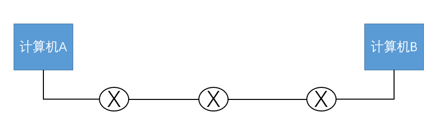

- 发送延迟：计算机中的数据包从开始发送到离开网卡所用的时间。
- 传播延迟：数据包从出网卡到路由器所用的时间。
- 排队延迟：数据包在路由器的接口处排队等待处理所用的时间。
- 处理延迟：路由器在处理数据包时选择最佳路径所用时间。

除此之外还有后面所讲的播放延迟。

#### 1.3.因特网是非等时的

- 模拟的多媒体信号经过采样和模数转换变为数字信号，再组装成分组。这些分组的发送速率是**恒定的（等时的）**。
- 传统的因特网本身是**非等时的**。因此经过因特网的分组变成了**非恒定速率**的分组。

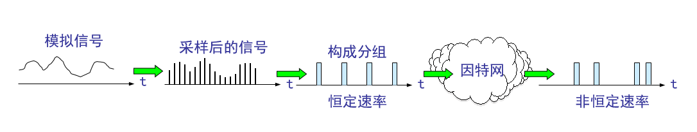

#### 1.4.在接收端设置缓存

- 接收端需设置适当大小的缓存。当缓存中的分组数达到一定的数量后再以恒定速率按顺序把分组读出进行还原播放。
- 缓存实际上就是一个先进先出的队列。图中标明的 *T* 叫做**播放时延**。

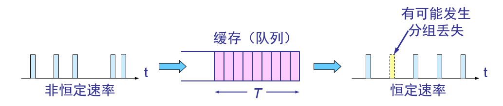

#### 1.5.缓存的影响

- 缓存使所有到达的分组都经受了迟延。
- 早到达的分组在缓存中停留的时间较长，而晚到达的分组在缓存中停留的时间则较短。
- 以非恒定速率到达的分组，经过缓存后再以恒定速率读出，就能够在一定程度上消除了时延的抖动。但我们付出的代价是增加了时延。

#### 1.6.举例

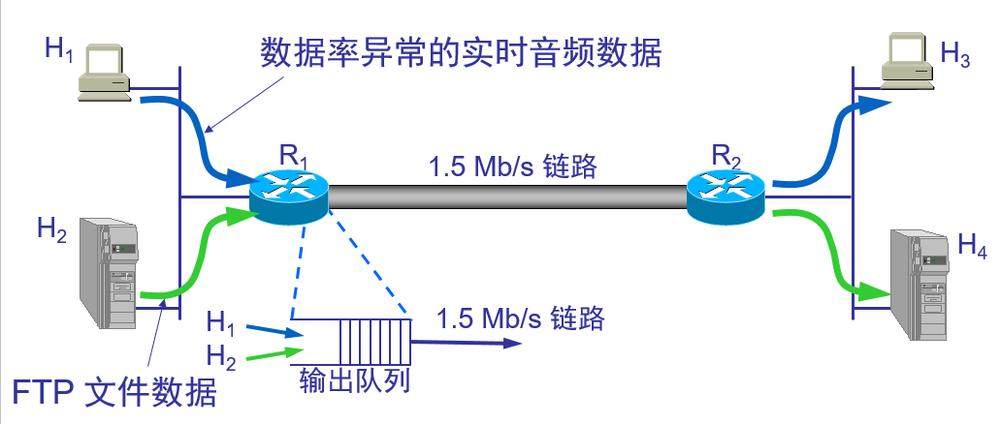

互联网上的带宽不稳定，是波动的。由于存在拥塞控制机制，当网络出现拥塞时会降低传输速度，导致网速不恒定。但是如果我们想要看电影，就要求网速要恒定才能流畅地看电影。如果网速不恒定，当网络卡顿时，电影数据不能及时传输到用户处导致电影停止播放。

- 解决这个问题的方法为在用户播放器处设疑一个缓存，当媒体服务器上的电影等多媒体数据通过Internet传输到用户处时，先把这些数据放入缓存中，出现卡顿时没有数据传输过来也没关系，等网络通畅，数据到了继续按顺序放入缓存。
- 随后，用户上的播放器从缓存中均匀地读数据，保证电影按规定的恒定速率播放。这样即使有的数据一时没有传输过来也没关系，因为缓存还没有读取完，只要在播放器读取完缓存前数据能传输过来补充缓存，电影就能正常播放。
- 所以，视频流传输到用户处并不是立即播放，而是先放入缓存里排队，然后用户的视频播放软件才会从缓存里面取数据，这样就能保证速度均匀了。
- 在客户端设置的缓存还能弥补数据包没有按顺序到达的问题。由于存在缓存，不连续的数据包可以等待缺失的数据包到达后组成连续的数据一起被读取。

在客户端处设置一个缓存，播放时有一个等待时间称为**播放时延**。这样就能弥补网速不恒定的问题，缺点是增加了等待时间。这就是为什么我们在看视频的时候会有缓存条，视频文件并不会马上播放，而是先缓存再播放。

#### 1.7.在Internet上传输音频视频需要解决的问题

- 在传送**时延敏感**(delay sensitive)的实时数据时，不仅传输时延不能太大，而且时延抖动也必须受到限制。
- 对于传送实时数据，很少量分组的丢失对播放效果的影响并不大（因为这是由人来进行主观评价的），因而是可以容忍的。**丢失容忍**(loss tolerant)也是实时数据的另一个重要特点。
- 由于分组的到达可能不按序，但将分组还原和播放时又应当是按序的。因此在发送多媒体分组时还应当给每一个分组加上**序号**。这表明还应当有相应的协议支持才行。
- 要使接收端能够将节目中本来就存在的正常的短时间停顿（如音乐中停顿几拍）和因某些分组的较大迟延造成的“停顿”区分开来。这就需要增加一个**时间戳**(timestamp)，以便告诉接收端应当在什么时间播放哪个分组。

#### 1.8.因特网提供的三种音频/视频服务

- **流式(streaming)存储音频/视频** ——边下载边播放。

  **流媒体**(streaming media)，即流式音频/视频。流媒体特点就是“边下载边播放” (streaming and playing) 。

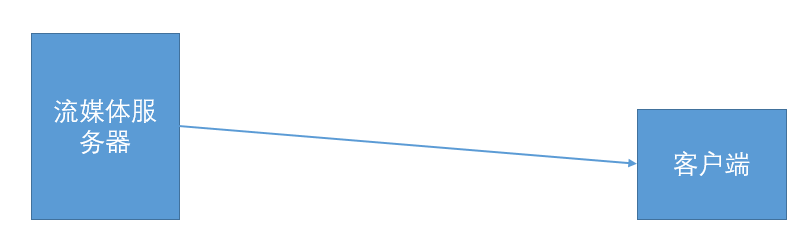

如图，流媒体服务器上已经存储了视频文件，客户端只需要点播这个视频，该视频就会从流媒体服务器上传输过来。客户端一边下载一边播放，播放时还能快进倒退和本地视频一样。

这种方式的好处是：（1）节省用户硬盘空间。“边下载边播放”结束后，用户的硬盘上不会留下有关播放内容的任何痕迹。（2）除此之外，还有利于保护版权。即流媒体服务器上的视频客户端只能在线播放，不能下载和传播。其实，现在很多网站上的视频都是只能在线播放而不能下载，因为视频是加密的，这也是一种版权保护。

- **流式实况音频/视频** ——边录制边发送 ，即现场直播。

  比如球赛的现场直播：

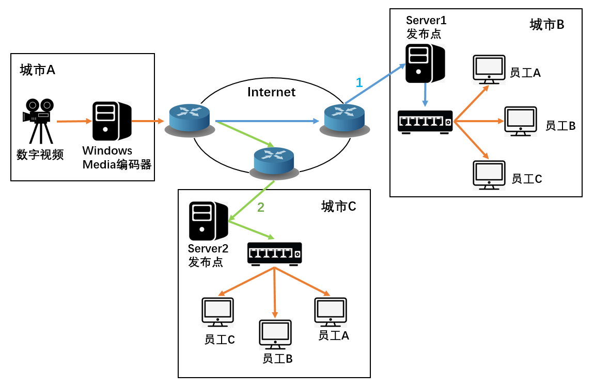

如图，有一摄像机在录制球赛，摄像机接在一台计算机上，计算机上安装一个编码软件，负责把录制的音频视频编码成适合不同设备的分辨率和格式。计算机再连接一个流媒体服务器，流媒体服务器接交换机或其他网络设备，交换机再连接很多的计算机。这些计算机通过网络访问流媒体服务器来观看直播，流媒体服务器上的视频源来自计算机，计算机的视频源来自摄像机，通过这样一级一级的连接实现球赛直播。

- **交互式音频/视频**——实时交互式通信。比如QQ视频聊天。

# 二、流式存储音频/视频

#### 1.1.下载文件的传统方法：

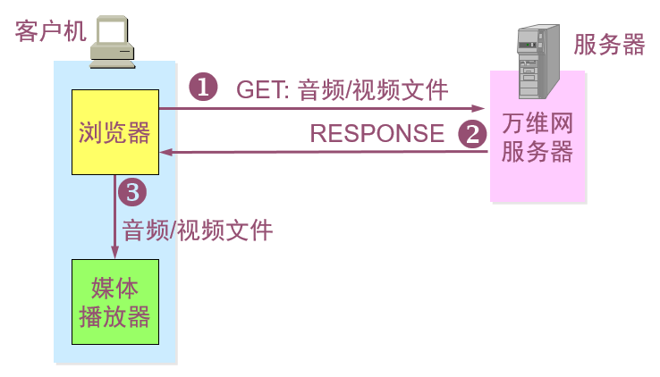

传统的浏览器从服务器下载音频/视频文件：

① 用户从客户机(client machine)的浏览器上用 HTTP 协议向服务器请求下载某个音频/视频文件。

② 服务器如有此文件就发送给浏览器。在响应报文中就装有用户所要的音频/视频文件。整个下载过程可能会**花费很长的时间**。

③ 当浏览器**完全收下**这个文件后，就可以传送给自己机器上的媒体播放器进行解压缩，然后播放。

#### 1.2.具有元文件的万维网服务器

**元文件**就是一种非常小的文件，它描述或指明其他文件的一些重要信息。

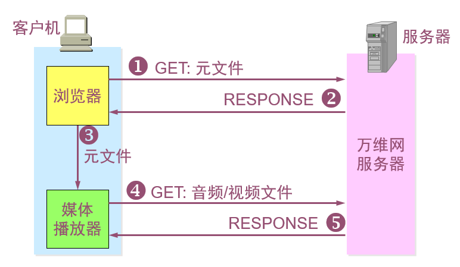

① 浏览器用户使用 HTTP 的 GET 报文接入到万维网服务器。这个超链指向一个元文件。这个元文件有实际的音频/视频文件的统一资源定位符 URL。

② 万维网服务器把该元文件装入 HTTP 响应报文的主体，发回给浏览器。

③ 客户机浏览器调用相关的媒体播放器，把提取出的元文件传送给媒体播放器。

④ 媒体播放器使用元文件中的 URL ，向万维网服务器发送 HTTP 请求报文，要求下载音频/视频文件。

⑤ 万维网服务器发送 HTTP 响应报文，把该音频/视频文件发送给媒体播放器。媒体播放器边下载边解压缩边播放。

#### 1.3.媒体服务器

- **媒体服务器**也称为**流式服务器**(streaming server) ，它支持流式音频和视频的传送。
- 媒体播放器与媒体服务器的关系是客户与服务器的关系。
- 媒体播放器不是向万维网服务器而是向媒体服务器请求音频/视频文件。
- 媒体服务器和媒体播放器之间采用另外的协议进行交互。

> **使用媒体服务器 **

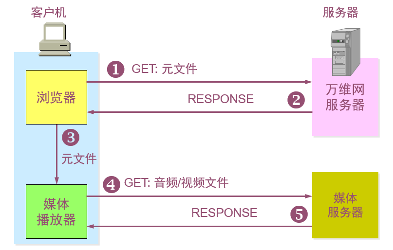

① ~③ 前三个步骤仍然和上一节的一样，区别就是后面两个步骤。

④ 媒体播放器使用元文件中的 URL 接入到**媒体服务器**，请求下载浏览器所请求的音频/视频文件。下载可以借助于使用 UDP 的任何协议，例如使用实时运输协议 RTP。

⑤ 媒体服务器给出响应，把该音频/视频文件发送给媒体播放器。媒体播放器在迟延了若干秒后，以流的形式边下载边解压缩边播放。

**流媒体服务器应用二：现场直播**

除了上述所讲的用户借助流媒体服务器播放音频视频之外，还可以使用流媒体服务器实现会议或球赛的现场直播。

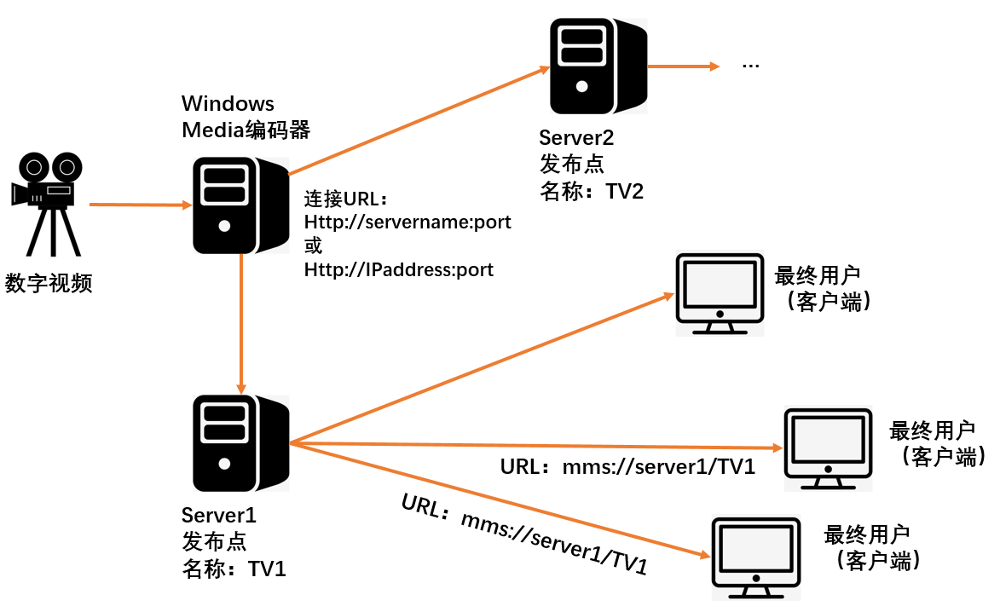

- 如图，通过摄像机拍摄得到实况数字视频，摄像头的一端连接计算机，在计算机上安装编码器软件，编码器软件能将摄像头采集到的视频进行编码，得到各种分辨率和格式的视频文件。
- 编码完成后计算机把视频文件发送到流媒体服务器上，然后，最终用户就可以通过访问流媒体服务器来观看现场直播。
- 用户观看的现场直播会因网络带宽不同而存在不同的时延。
- 可以看到，编码器软件只给流媒体服务器发送一份视频文件，而流媒体服务器作为发布点则根据用户数量发送多份视频文件，所以流媒体服务器的带宽成为了限制多少用户同时在线看直播的瓶颈。
- 另外，拥有编码器软件的计算机可以给多个流媒体服务器提供视频流，实现流媒体服务器的负载分摊，为更多用户提供视频直播服务。

#### 1.4.现实案例

公司的领导在城市A给城市B和C的分公司员工开会，如图所示：

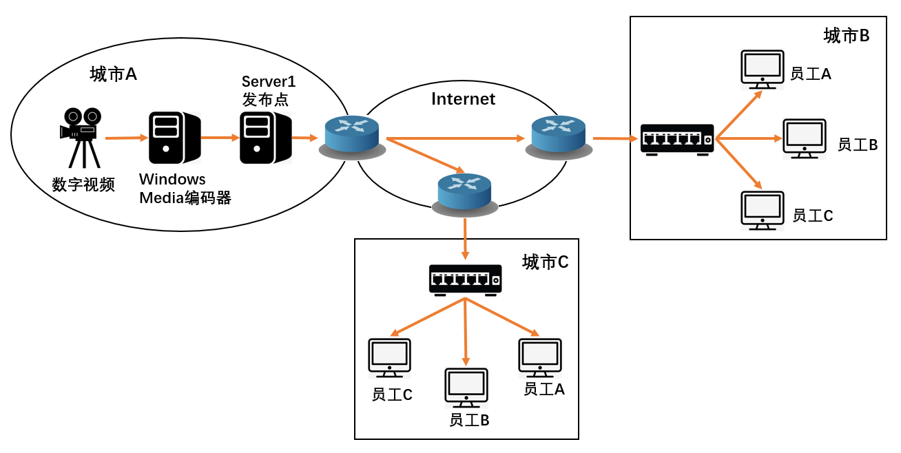

- 城市A、B和C三个局域网通过Internet连接在一起，公司领导通过摄像机和计算机的编码软件录制视频。
- 如果把流媒体服务器设置在城市A，那么城市B和C的员工想要观看领导讲话就需要连接到城市A的流媒体服务器上，并且有多少个员工观看，城市A的流媒体服务器就需要发送多少份视频文件。
- 假设城市B有50名员工，城市C有60名员工，那么城市A的流媒体服务器就要通过Internet分别给城市B和C发送50和60份视频文件，这样网络的带宽明显不够，直接影响直播效果。解决办法如下图所示：

- 分别在城市B和C各部署一个流媒体服务器，那么城市A负责编码视频文件的计算机只需要通过Internet给城市B和C各发送一份视频文件即可。
- 城市B和C的员工再通过访问本城市的流媒体服务器即可观看直播，这样便解决了带宽问题。

通过以上例子可以知道：如果流媒体服务器作为现场直播的视频音频流的话，可以当作是一个视频音频的分发点。

# 三、交互式音频/视频

### 一、电路交换

先来讲讲打电话时采用的电路交换。

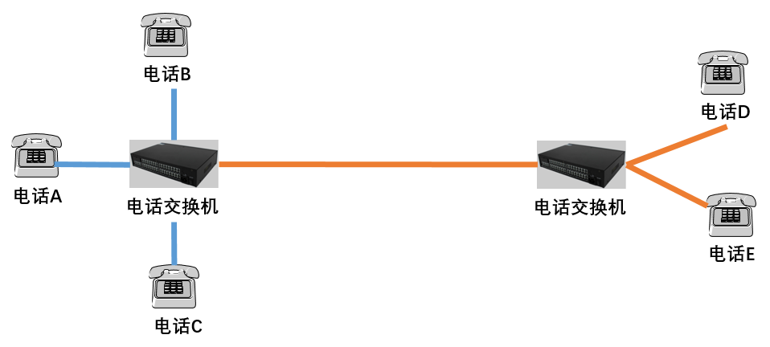

当电话A与电话B进行通话时，相当于电话交换机在内部用线把电话A和B连接在了一起，这时电话C再与电话B通话就会出现占线情况而无法拨通。当电话C与电话D进行通信时，电话交换机就会在电话C和D之间建立一条连接，相当于专线，通话完毕该连接被释放，其他电话才可以与电话C或D通话。

正常地打电话是通过电话交换机并采用电路交换的方式，经过建立连接、通话和释放连接的过程。

所以，有的时候我们给别人打电话会有这样的情况：您所拨打的号码正在通话中，请稍后再拨。这就是占线情况。

------

### 二、IP 电话概述

- **狭义的 IP 电话**就是指在 IP 网络上打电话。所谓“IP 网络”就是“使用 IP 协议的分组交换网”的简称。
- **广义的 IP 电话**则不仅仅是电话通信，而且还可以是在IP网络上进行交互式多媒体实时通信（包括话音、视像等），甚至还包括**即时传信**IM (Instant Messaging)。就是说只要是即时通信的都可以称之为IP 电话，包括qq语音、视频聊天。

#### 2.1.IP 电话举例

某单位的固定电话上写着：要想打长途先拨19777，然后再拨电话号码，这样会比较便宜，但是本地通话不便宜。这就是使用了下图所示的IP 电话的原因。

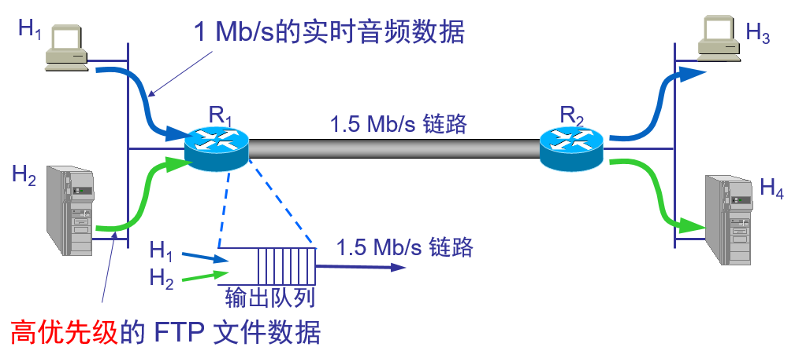

- 如图，城市A的电话通过电话交换机连接着。电话A想要与电话A2通话，信号走线路1，电缆较短成本低，所以便宜。
- 若城市A的电话想要与城市B的电话通话，要先拨区号比如010，由于信号走的是线路2，电缆比较长建设成本高，所以费用较高，这就是长途电话。

那为什么先拨19777打长途就能便宜呢？

- 如图所示，城市A和B的电话交换机都连接着一个网关，并且通过网关连接着Internet。当电话A播19777的时候，电话交换机把电话A的信号传输给网关A，拨区号010的时候，电话A的信号通过Internet传输到了城市B的网关B处，最后通过电话交换机中转信号到达电话B。由于信号走的是经过Internet的线路3，而不是线路2，所以打长途的费用比较便宜。
- 走Internet的语音信号会由于网络波动而出现声音质量差的情况。

#### 2.2.IP 电话网关的几种连接方法

- PC 到 PC；
- PC 到固定电话；
- 固定电话到固定电话；

可以看到，当电话信号走电话线时采用电路交换的传输方式，走因特网的时候采用分组交换的传输方式。

IP 电话通常再跨国公司应用较多，因为相比于国际长途，IP电话费用更少。

#### 2.3.IP 电话的通话质量

- IP 电话的通话质量主要由两个因素决定。一个是通话双方端到端的时延和时延抖动，另一个是话音分组的丢失率。但这两个因素是不确定的，是取决于当时网络上的通信量。
- 经验证明，在电话交谈中，端到端的时延不应超过 **250 ms**，否则交谈者就能感到不自然。

# 四、改进"尽最大努力交付"的服务

网络层的作用就是负责在不同的网段尽力转发数据包，但是负责中专数据包的路由器并不关心数据包的内容和优先顺序。而是先到达的数据包先处理，后到达的数据包排队等待处理，路由器处理不过来就丢弃。

但是，有的在互联网上传输的音频视频数据就应该优先传输，这就要求要改进网络层的功能，即改进网络层 "尽最大努力交付" 的服务，以保证着急的数据优先传输。

#### 1.1.使因特网提供质量保证的服务

- **服务质量 QoS** 是服务性能的总效果，此效果决定了一个用户对服务的满意程度。因此在最简单的意义上，有服务质量的服务就是能够满足用户的应用需求的服务。
- 服务质量可用若干基本的性能指标来描述，包括可用性、差错率、响应时间、吞吐量、分组丢失率、连接建立时间、故障检测和改正时间等。服务提供者可向其用户保证某一种等级的服务质量。

#### 1.2.改善的方面

主机 H1 和 H2 分别向主机 H3 和 H4 发送数据可通过以下方式实现流量控制：

- 为数据分组打上标记：

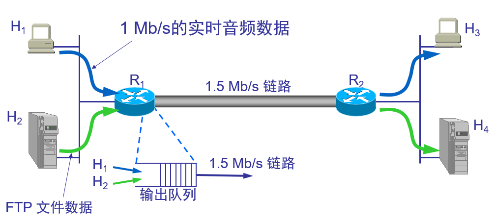

需要给不同性质的分组打上不同的**标记**。当 H1 和 H2 的分组进入 R1 时， R1 应能识别实时数据分组，并使这些分组以**高优先级**进入输出队列，先进行传输，而仅在队列有多余空间时才准许**低优先级**的 FTP 数据分组进入。

即1.5Mb/s带宽的链路优先使用1Mb/s带宽传输实时音频数据，满足它的传输需求，剩下的0.5Mb/s带宽再用来传输优先级低的FTP文件数据。这样FTP文件数据的传输带宽最多只能占到0.5Mb/s，以此优先保证实时音频数据的传输带宽需要。

- 为路由器增加分类机制：

应当使路由器增加**分类**(classification)机制，即路由器根据某些准则对输入分组进行分类，然后对不同类别的通信量给予不同的**优先级**。

例如，在路由器上设置只要遇到 源 / 目标 地址为某个地址的就优先传输。这样即使数据包没有设置优先级，路由器通过识别数据包的 源/目标 地址也能判断优先顺序。

- 对数据流进行通信量的管制(policing)：

路由器应能将对数据流进行通信量的**管制**(policing)，使该数据流不影响其他正常数据流在网络中通过。例如，可将 H1 的数据率限定为 1 Mb/s。R1 不停地监视 H1 的数据率。只要其数据率超过规定的 1 Mb/s，R1 就将其中的某些分组丢弃。

比如：限定传输音频数据的带宽为1Mb/s，如果传输某一音频数据需要的带宽为1.2Mb/s那么路由器丢弃多于1Mb/s的0.2Mb/s带宽传输的数据包。

- 在路由器中再增加调度机制：

应在路由器中再增加**调度**(scheduling)机制。利用调度功能给实时音频分配 1.0 Mb/s 的带宽，给传送FTP文件数据分配 0.5 Mb/s 的带宽（相当于在带宽为 1.5 Mb/s 的链路中划分出两个逻辑链路，彼此互不干扰），因而对这两种应用都有相应的服务质量保证。

- 在路由器中再增加呼叫接纳机制：
- 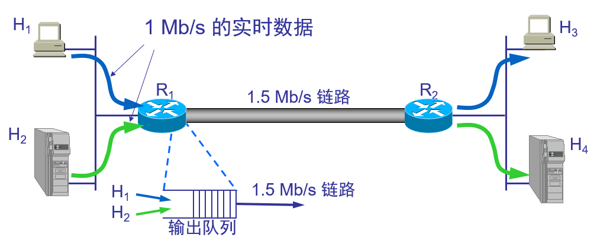

总数据率已超过了 1.5 Mb/s 链路的带宽。比较合理的做法是让一个数据流通过 1.5 Mb/s 的链路，而阻止另一个数据流的通过。这就需要**呼叫接纳**(call admission)机制。数据流要预先声明所需的服务质量。

比如：带宽为1.5Mb/s的链路，先对带宽需求为1Mb/s的第一个数据进行传输。随后路由器收到带宽需求也为1Mb/s的第二个数据传输请求，路由器一看剩下的0.5Mb/s带宽不能满足第二个数据传输的需求，于是路由器拒绝传输第二个数据。