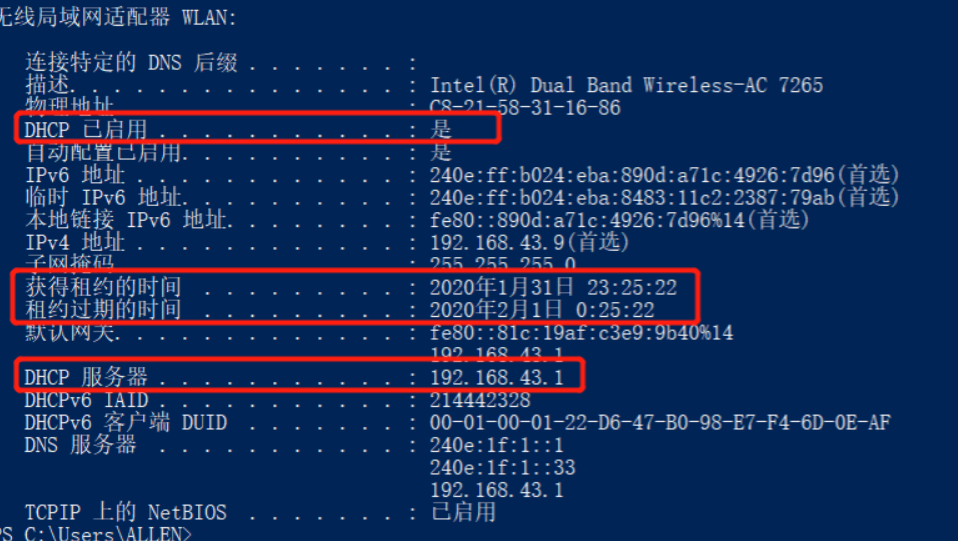
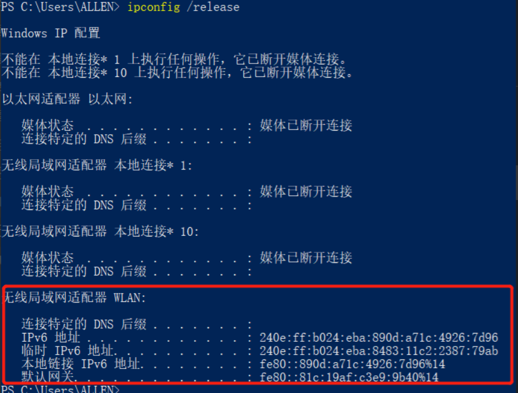
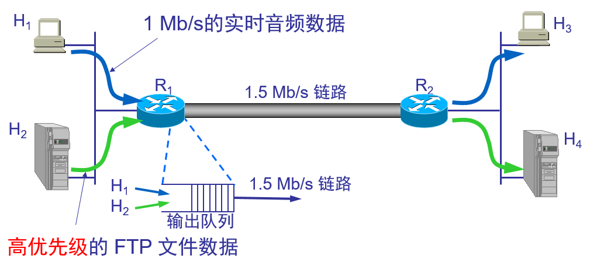

#  一、应用层概述

### 一、简介

数据传输的三种划分模型：


这些应用层协议可以想象为不同的服务，因为每一个服务需要用的不同的协议。

#### 1.1.应用层协议的特点

- 每个应用层协议都是为了解决某一类应用问题，而问题的解决又往往是通过位于不同主机中的多个应用进程之间的通信和协同工作来完成的。应用层的具体内容就是规定应用进程在通信时所遵循的协议。
- 应用层的许多协议都是基于客户服务器方式。

------

### 二、四层、五层和七层体系结构的区别

> **这里所说的是关于计算机数据通信的分层。**

#### 2.1.OSI七层模型

OSI七层协议模型主要是：

- 应用层（Application）；
- 表示层（Presentation）；
- 会话层（Session）；
- 传输层（Transport）；
- 网络层（Network）；
- 数据链路层（Data Link）；
- 物理层（Physical）。

#### 2.2.TCP/IP四层模型

TCP/IP是一个四层的体系结构，主要包括：应用层、运输层、网际层和网络接口层。从实质上讲，只有上边三层，网络接口层没有什么具体的内容。


#### 2.3.五层协议的体系结构

五层体系结构包括：

- 应用层；
- 运输层；
- 网络层；
- 数据链路层；
- 物理层。

五层协议只是OSI和TCP/IP的综合，实际应用还是TCP/IP的四层结构。为了方便可以把下两层称为网络接口层。

#### 2.4.三种模型结构：


# 二、域名系统DNS

### 一、域名简介

#### 1.1.DNS服务的作用

负责解析域名，将域名解析成IP地址。

#### 1.2.域名系统概述

- 由于32位的IP地址并不容易记忆，人们往往喜欢记忆网站的域名。所以当我们访问网站时，是通过输入的域名解析为对应IP地址，对该IP地址进行访问的。
- 名字到 IP 地址的解析是由若干个域名服务器程序完成的。域名服务器程序在专设的结点上运行，运行该程序的机器称为**域名服务器**。

#### 1.3.因特网的域名结构

- 因特网采用了**层次树状结构**的命名方法。
- 任何一个连接在因特网上的主机或路由器，都有一个**唯一**的层次结构的名字，即**域名**。
- 域名的结构由标号序列组成，各标号之间用**点**隔开：


- 上图的各标号：三级域名、二级域名等分别代表不同级别的域名。

#### 1.4.域名只是个逻辑概念

- 域名只是个逻辑概念，并不代表计算机所在的物理地点。
- 变长的域名和使用有助记忆的字符串，是为了便于人来使用。而 IP 地址是定长的 32 位二进制数字则非常便于机器进行处理。

#### 1.5.顶级域名 TLD (Top Level Domain)

- 国家顶级域名 **nTLD**：如: **.cn** 表示中国，**.us** 表示美国，**.uk** 表示英国，等等。

- 通用顶级域名 **gTLD**：最早的顶级域名是：

  **.com** （公司和企业）；

  **.net** （网络服务机构）；

  **.org** （非赢利性组织）；

  **.edu** （美国专用的教育机构）；

  **.gov** （美国专用的政府部门）；

  **.mil** （美国专用的军事部门）；

  **.int** （国际组织）；

  新增的有：

  **.aero** （航空运输企业）；

  **.biz** （公司和企业）；

  **.cat** （加泰隆人的语言和文化团体）；

  **.coop** （合作团体）；

  **.info** （各种情况）；

  **.jobs** （人力资源管理者）；

  **.mobi** （移动产品与服务的用户和提供者）；

  **.museum** （博物馆）；

  **.name** （个人）；

  **.pro** （有证书的专业人员）；

  **.travel** （旅游业）；

- 基础结构域名(infrastructure domain)：这种顶级域名只有一个，即 **arpa**，用于反向域名解析，因此又称为反向域名。

#### 1.6.因特网的域名空间


比如域名：www.cnblogs.com 。该域名由三部分组成：三级域名www；二级域名cnblogs；顶级域名com；每部分之间用**点**隔开。

需要注意的是：

- 域名也可以由两部分组成、四部分组成，域名组成部分数量是不定的；
- 并非所有的域名都以www开头，也可以使用其他的三级域名比如：mail.cnblogs.com 。只不过按照习惯通常把www作为域名的开头。

#### 1.7.关于域名注册

为了保证域名的唯一性，需要相关机构管理，我们想要申请域名则必须花钱购买。在购买域名时只需要选择相应的顶级域名和二级域名，若这两部分组成的域名全球唯一，那么在此基础上加上三级域名、四级域名组成的域名也都是全球唯一。

比如购买了域名：cnblogs.com，在此域名基础上派生出www.cnblogs.com 、mail.cnblogs.com等都是免费的，只要你有服务器派生出多少个域名都只用缴纳cnblogs.com一个域名的费用。并且由于cnblogs.com的全球唯一性，所以其派生出的域名都是全球唯一的。

### 二、域名服务器

- 域名服务器的作用为，把网站域名解析成对应的IP地址。
- 一个服务器所负责管辖的（或有权限的）范围叫做**区**(zone)。
- 每一个区设置相应的**权限域名服务器**，用来保存该区中的所有主机的域名到IP地址的映射。

#### 2.1.树状结构的 DNS 域名服务器

域名服务器有以下四种类型 :

- 根域名服务器
- 顶级域名服务器
- 权限域名服务器
- 本地域名服务器

关系为：


> **根域名服务器：**

- 根域名服务器是最重要的域名服务器。根域名服务器并不直接把域名直接转换成 IP 地址，而是存储着所有的顶级域名服务器的域名及其 IP 地址。在使用迭代查询时，根域名服务器把下一步应当查找的顶级域名服务器的 IP 地址告诉本地域名服务器。

- 当本地域名服务器无法解析特定的域名时，首先求助于根域名服务器。

  比如某本地域名服务器负责abc.com区域的域名解析，当本地用户输入abc.cn时，该本地域名服务器无法对其进行解析，于是第一时间求助于根域名服务器，询问负责.cn的顶级域名服务器的IP地址。

- 在因特网上共有13 个不同 IP 地址的根域名服务器，它们的名字是用一个英文字母命名，从a 一直到 m（前13 个字母）。

- 根域名服务器共有 13 套装置，它由分布在世界各地的许多台作为根域名服务器的机器组成。目的是为了方便用户，使世界上大部分 DNS 域名服务器都能**就近**找到一个根域名服务器。

  这些根域名服务器相应的域名分别是：

  a.rootservers.net；

  b.rootservers.net；

  …

  m.rootservers.net；

> **顶级域名服务器（即 TLD 服务器）**

- 这些域名服务器负责管理在该顶级域名服务器注册的所有二级域名。

  比如顶级域名服务器.CN负责所有以.CN结尾的域名的解析。

- 当收到 DNS 查询请求时，就给出相应的回答（可能是最后的结果，也可能是下一步应当找的域名服务器的 IP 地址）。

> **权限域名服务器 **

- 负责一个区的域名服务器。

  比如：在顶级域名服务器.com负责下的权限域名服务器abc.com，负责的是所有以abc.com结尾的域名的解析。

- 当一个权限域名服务器还不能给出最后的查询回答时，就会告诉发出查询请求的 DNS 客户，下一步应当找哪一个权限域名服务器。

  比如：在权限域名服务器abc.com负责下的用户查询域名xyz.com，该权限域名服务器无法告诉客户最终结果，而是告诉客户权限域名服务器xyz.com的IP地址。

> **本地域名服务器（默认域名服务器） **

- 本地域名服务器即在权限域名服务器下的负责更小区域的域名服务器。比如某个大学里面的域名服务器，某公司的域名服务器。
- 当一个主机发出 DNS 查询请求时，这个查询请求报文就发送给本地域名服务器。
- 可以安装字节的DNS服务器（本地域名服务器）。

#### 2.2.提高域名服务器的可靠性

- DNS 域名服务器都把数据复制到几个域名服务器来保存，其中的一个是**主域名服务器**，其他的是**辅助域名服务器**。
- 当主域名服务器出故障时，辅助域名服务器可以保证 DNS 的查询工作不会中断。
- 主域名服务器定期把数据复制到辅助域名服务器中，而更改数据只能在主域名服务器中进行。这样就保证了数据的一致性。

#### 2.3.域名解析过程举例


如图：根DNS的IP地址为100，里面存储着顶级域名服务器：com、net、edu、cn等的IP地址；顶级域名服务器com中存储着域名www.baidu.com对应的IP地址；顶级域名服务器net中存储着www.inhe.net对应的IP地址。

当指定DNS服务器IP地址为192的用户输入www.baidu.com域名时，IP地址为192的本地域名服务器没有查询到域名的信息，于是求助于IP地址为101的顶级域名服务器com。经查询，该顶级域名服务器（com）正好存储有该网址对应的IP地址，于是把域名解析出的IP地址告诉本地域名服务器，本地域名服务器再告诉用户。于是用户得以通过IP地址该网站。

当该用户输入www.inhe.net域名时，先在用户指定的本地域名服务器中查询，发现没有该域名的信息。于是本地域名服务器求助于顶级域名服务器com，com也没找到域名信息。于是顶级域名服务器com求助于根DNS服务器，根DNS服务器找到顶级域名服务器net的IP地址并把它告诉com，于是com通过IP地址102找到顶级域名服务器net，net找到www.inhe.net对应的IP地址后再告诉顶级域名服务器com，com再告诉本地域名服务器，本地域名服务器再告诉用户。最后用户得以通过该网站的IP地址访问该网站。

可见，顶级域名服务器com不知道的域名可以求助于根DNS服务器，根DNS服务器会告诉它去哪找相应域名，最后总能得到域名解析结果。所以，只要用户指定了一处DNS服务器，无论是88.88.88.88还是22.22.22.22，能把全球的域名解析出来。

> **总结**

- 主机向本地域名服务器的查询一般都是采用**递归查询**。如果主机所询问的本地域名服务器不知道被查询域名的 IP 地址，那么本地域名服务器就以 DNS 客户的身份，向其他根域名服务器继续发出查询请求报文。

  递归查询（较少用）：


本地域名服务器向根域名服务器的查询通常是采用**迭代查询**。当根域名服务器收到本地域名服务器的迭代查询请求报文时，要么给出所要查询的 IP 地址，要么告诉本地域名服务器：“你下一步应当向哪一个域名服务器进行查询”。然后让本地域名服务器进行后续的查询。

迭代查询：


> **域名服务器的高速缓存**

- 每个域名服务器都维护一个高速缓存，存放最近用过的名字以及从何处获得名字映射信息的记录。
- 可大大减轻根域名服务器的负荷，使因特网上的 DNS 查询请求和回答报文的数量大为减少。
- 为保持高速缓存中的内容正确，域名服务器应为每项内容设置计时器，并处理超过合理时间的项（例如，每个项目只存放两天）。

#### 2.4.安装自己的DNS服务器

自己的DNS服务器相当于负责区域更小的本地DNS服务器。

> **适用场景**

- 提供内网网站的域名解析服务。

  比如学校内网中可能存在许多的网站，这些网站仅供内部使用，并不在互联网上开放，域名可能与互联网中的部分网站冲突。这时可以再内网中安装一个DNS服务器，提供内网网站的域名解析服务。

  并且内网的DNS服务器也知道互联网中的根域名服务器地址，只要内网DNS服务器能够访问互联网，当内网用户访问外网时也能提供相应的域名解析服务。

- 降低到Internet的域名解析流量。

  即使无内部网站，假如校园内网2000人使用，每人访问百度时都要发送一个数据包给外网的DNS服务器进行域名解析，造成的网络流量是不可忽视的，若安装了内网DNS服务器只要有一个人访问百度，发送了一个数据包给外网的DNS服务器解析出来的IP地址会在内网DNS服务器上缓存一段时间，该段时间内内网的其余用户访问百度时，内网DNS服务器都能直接告诉它们缓存的IP地址，由此节省了重复域名解析造成的大量网络流量。

- 存在域环境。

**查看域名地址**

可通过以下命令在命令行窗口查看域名地址：以搜狐网为例

```
nslookup www.sohu.com
```


“非权威应答”表示，该域名的解析是借助外网的其他DNS服务器的。

# 三、动态主机配置协议DHCP

#### 1.1.动态主机配置协议 DHCP(Dynamic Host Configuration Protocol)

- **动态主机配置协议** DHCP 提供了**即插即用连网**(plug-and-play networking)的机制。
- 这种机制允许一台计算机加入新的网络和获取IP地址而不用手工参与。

#### 1.2.静态IP地址

处于相对固定网段中的计算机的IP地址。比如学校每间教室的多媒体计算机，学校机房的服务器等，它们的位置相对固定，所处的网段也固定，那么学生可通过静态的唯一的IP地址来访问这些计算机。

#### 1.3.动态IP地址

所处网段经常发生变化的计算机的IP地址。比如学生使用的笔记本电脑，在学校时所处的网段与在家时所处的网段不同，笔记本电脑在两地上网时的IP地址自然也不同。

#### 1.4.DHCP服务器请求IP地址的过程


- 需要 IP 地址的计算机在启动时就向 DHCP 服务器广播发送发现报文（DHCPDISCOVER），这时该主机就成为 DHCP 客户。
- 本网段中的所有计算机都能收到此广播报文，但只有 DHCP 服务器才回答此广播报文。
- DHCP 服务器先在其数据库中查找该计算机的配置信息。若找到，则返回找到的信息。若找不到，则从服务器的 IP 地址池(address pool)中取一个地址分配给该计算机。DHCP 服务器的回答报文叫做提供报文（DHCPOFFER）。
- 当同一网段内多台DHCP服务器都收到计算机发出的广播报文时，都会给计算机提供一个IP地址。计算机选择其中之一并向该DHCP服务器发送确认信息。收到确认信息的DHCP服务器再把分配的IP地址对应的子网掩码、网关和DNS地址等配置信息发送给计算机。没有收到确认信息的DHCP服务器则收回发出去的IP地址供其他发出申请的计算机使用。
- DHCP服务器分配地址时一个没有认证的过程，存在恶意安装错误DHCP服务器，给计算机分配错误地址的情况。所以，网段中的DHCP服务器数量要进行严格的管理。
- 可以再计算机中配置自己的DHCP服务器，这里不拓展。

**租用期(lease period)**

- DHCP 服务器分配给 DHCP 客户的 IP 地址的临时的，因此 DHCP 客户只能在一段有限的时间内使用这个分配到的 IP 地址。DHCP 协议称这段时间为**租用期**。
- 租用期的数值应由 DHCP 服务器自己决定。
- DHCP 客户也可在自己发送的报文中（例如，发现报文）提出对租用期的要求。

**释放租约**

可以使用以下命令：

```
ipconfig /all
```

查看本计算机的DHCP服务器相关配置：



- 可以看到本计算机使用的是动态IP地址，即启用了DHCP，计算机能够动态地获得IP地址。
- 也可以看到获得租约地时间和租约过期地时间；
- 还能看到给本计算机提供动态IP地址分配地DHCP服务器地IP地址为：192.168.43.1；

使用以下命令可释放租约，把DHCP分配地IP地址释放：

```
ipconfig /release
```

释放租约前：


释放租约后：



可使用以下命令请求DHCP服务器重新分配地址：

```
ipconfig /renew
```


#### 1.5.DHCP 中继代理(relay agent)

- 并不是每个网络上都有 DHCP 服务器，这样会使 DHCP 服务器的数量太多。现在是每一个网络至少有一个 DHCP **中继代理**，它配置了 DHCP 服务器的 IP 地址信息。
- 当 DHCP 中继代理收到主机发送的发现报文后，就以**单播方式**向 DHCP 服务器转发此报文，并等待其回答。收到 DHCP 服务器回答的提供报文后，DHCP 中继代理再将此提供报文发回给主机。


#### 1.6.跨网段地址分配


如图三个网段：192.168.1.0 、192.168.2.0 、192.168.3.0 只有一台DHCP服务器。可以更改如下配置使一台DHCP服务器给三个网段地计算机分配地址。

- 在DHCP服务器中创建三个网段：192.168.1 、 192.168.2 、 192.168.3 的作用域（地址池）。
- 在路由器的 6/1 和 6/0 端口分别配置如下命令：

```
ip helper-address 192.168.1.9
```

这条命令便可实现跨网段的地址分配。注意要在路由器对应网段的端口处配置。192.168.1.9为DHCP服务器的地址。

配置了该命令的路由器也称为**DHCP中继代理**。

- **过程**
  192.168.1网段的计算机通过广播的形式向DHCP服务器请求地址；通过配置路由器中连接其他网段的端口上述命令，这些网段中的计算机可通过单播的形式通过路由器转发向DHCP服务器请求地址。

  DHCP服务器通过区分收到的请求地址信息是单播还是广播来判定是本网段计算机请求地址还是其他网段计算机请求地址。

  最后DHCP服务器从三个网段的地址池中选出地址分别分配给三个网段。

> **DHCP服务器必须是静态地址**

因为DHCP服务器是根据该静态地址为本网段的计算机分配地址的。

**补充**

可以发现计算机向本网段的DHCP服务器请求地址时采用的是广播的方式，相当于知道MAC地址请求IP地址。这与之前讲的ARP协议通过IP地址请求MAC地址正好相反，可以说是逆向ARP协议，即RARP（反向地址转换）协议。

# 四、文件传送协议FTP1.1.概述

- **文件传送协议** FTP (File Transfer Protocol) 是因特网上使用得最广泛的文件传送协议。
- FTP 提供交互式的访问，允许客户指明文件的类型与格式，并允许文件具有存取权限。

#### 1.2.FTP 特点

- 文件传送协议 FTP 只提供文件传送的一些基本的服务，它使用 **TCP** 可靠的运输服务。
- FTP 的主要功能是减少或消除在不同操作系统下处理文件的不兼容性。
- FTP 使用**客户服务器方式**。一个 FTP 服务器进程可同时为多个客户进程提供服务。FTP 的服务器进程由两大部分组成：一个**主进程**，负责接受新的请求；另外有若干个**从属进程**，负责处理单个请求，主进程与从属进程的处理是并发地进行。

#### 1.3.FTP传输模式

- 文本模式：ASCII模式，以文本序列传输数据；
- 二进制模式：Binary模式，以二进制序列传输数据；2

#### 1.4.FTP 使用的两个 TCP 连接


- 第一个TCP连接为**控制连接**，客户端标准端口为21，用于发送FTP命令信息；
- 第二个TCP连接为**数据连接**， 服务器端标准端口为20，用于上传、下载数据。
- 数据连接的建立类型：
  - **主动模式：**服务器端从20端口主动向客户端发起连接；
  - **被动模式：**服务器端打开指定范围内的某个端口被动等待客户端发起连接。（此时服务器端不使用标准端口20）

#### 1.5.FTP采用的两个不同端口


- 客户进程使用**熟知端口(21)**与服务器进程建立控制连接；使用另一个端口建立数据连接。
- 服务器进程使用**熟知端口(20)**与客户进程所提供的端口建立数据传送连接；使用另一个端口与客户端进程建立控制连接。
- 由于 FTP 使用了两个不同的端口号，所以数据连接与控制连接不会发生混乱；在传输文件结束时客户端还可以利用控制连接发送请求终止传输信息。

#### 1.6.FTP主动模式与被动模式

主动模式下防护墙需要打开21和20端口。


被动模式下防火墙只打开21和20端口，FTP不能下载数据。


# 五、远程终端协议 TELNET

#### 1.1.概述

- TELNET 是一个简单的**远程终端协议**，也是因特网的正式标准。
- 用户用 TELNET 就可在其所在地通过 TCP 连接的23端口，使用主机名或 IP 地址登录到远程的另一个主机上，实现远程配置或操作计算机。
- 这种服务是透明的，不安全的，因此Windows默认是禁用TELNET服务的，现在也较少使用。

#### 1.2.客户服务器方式

- TELNET 也使用客户服务器方式。在本地系统运行 TELNET 客户进程，而在远地主机则运行 TELNET 服务器进程。
- TELNET 使用网络虚拟终端 NVT 格式：


客户软件把用户的击键和命令转换成 NVT 格式，并送交服务器。

服务器软件把收到的数据和命令，从 NVT 格式转换成远地系统所需的格式。

向用户返回数据时，服务器把远地系统的格式转换为 NVT 格式，本地客户再从 NVT 格式转换到本地系统所需的格式。

#### 1.3.其他应用

可以使用telnet命令测试某计算机是否开启相应端口的服务，相当于端口扫描工具。



上图测试的是地址为192.168.88.22计算机的80端口对应的Web服务，可以看到该计算机并不提供Web服务。

# 六、远程桌面协议RDP（Remove Desktop Protocol）

通过mstsc客户端远程连接计算机，并对其进行管理等操作。

与TELNET的区别在于，TELNET显示的是远程计算机的命令行窗口，而RDP为该计算机的图形界面，这样显得更加直观。

RDP=TCP+3389端口。

在运行界面输入mstsc，打开远程桌面登录界面，输入相应信息即可连接远程计算机。

Server是多用户操作系统，启用远程桌面可以多用户同时使用服务器。而Window xp和Window7是单用户系统，不能多个用户同时使用

# 七、万维网（WWW）

### 一、万维网概述

- **万维网** WWW (World Wide Web)是一个大规模的、联机式的信息储藏所。
- 万维网用链接的方法能非常方便地从因特网上的一个站点访问另一个站点，从而主动地按需获取丰富的信息。
- 这种访问方式称为“**链接**”。
- 万维网提供分布式服务：


#### 1.1超媒体与超文本

- 万维网是**分布式超媒体**(hypermedia)系统，它是**超文本**(hypertext)系统的扩充。
- 一个超文本由多个信息源链接成。利用一个链接可使用户找到另一个文档。这些文档可以位于世界上任何一个接在因特网上的超文本系统中。超文本是万维网的基础。
- 超媒体与超文本的区别是文档内容不同。超文本文档仅包含文本信息，而超媒体文档还包含其他表示方式的信息，如图形、图像、声音、动画，甚至活动视频图像。

#### 1.2.万维网的工作方式

- 万维网以**客户服务器**方式工作。
- **浏览器**就是在用户计算机上的万维网**客户程序**。万维网文档所驻留的计算机则运行**服务器程序**，因此这个计算机也称为**万维网服务器**。
- 客户程序向服务器程序发出请求，服务器程序向客户程序送回客户所要的万维网文档。
- 在一个客户程序主窗口上显示出的万维网文档称为**页面**(page)。

#### 1.3.万维网必须解决的问题

> 1.怎样标志分布在整个因特网上的万维网文档？

- 使用**统一资源定位符** URL (Uniform Resource Locator)来标志万维网上的各种文档。
- 使每一个文档在整个因特网的范围内具有唯一的标识符 URL。

> 2.用什么协议实现万维网上各种超链的链接？

- 在万维网客户程序与万维网服务器程序之间进行交互所使用的协议，是**超文本传送协议** HTTP (HyperText Transfer Protocol)。
- HTTP 是一个应用层协议，它使用 TCP 连接进行可靠的传送，一般使用80端口。

> 3.怎样使各种万维网文档都能在因特网上的各种计算机上显示出来，同时使用户清楚地知道在什么地方存在着超链？

- **超文本标记语言** HTML (HyperText Markup Language)使得万维网页面的设计者可以很方便地用一个超链从本页面的某处链接到因特网上的任何一个万维网页面，并且能够在自己的计算机屏幕上将这些页面显示出来。

------

### 二、统一资源定位符 URL

- 统一资源定位符 URL 是对可以从因特网上得到的资源的位置和访问方法的一种简洁的表示。
- URL 给资源的位置提供一种抽象的识别方法，并用这种方法给资源定位。

#### 2.1.URL 的一般形式

- 由以冒号隔开的两大部分组成，并且在 URL 中的字符对大写或小写没有要求。
- URL 的一般形式是：


#### 2.2.使用 HTTP 的 URL

使用 HTTP 的 URL 的一般形式:


- "http"——表示使用HTTP协议；
- "：//"——冒号和两个左斜杠是规定的格式；
- "<主机>"——表示主机的域名；
- "<端口>"——HTTP的默认端口号是80，通常可省略；
- "<路径>"——表示文件路径，若再省略文件的<路径>项，则 URL 就指到因特网上的某个主页(home page)。

------

### 三、超文本传输协议HTTP

#### 3.1.HTTP 的操作过程

- 为了使超文本的链接能够高效率地完成，需要用 HTTP 协议来传送一切必须的信息。
- 从层次的角度看，HTTP 是**面向事务**的(transaction-oriented)应用层协议，它是万维网上能够可靠地交换文件（包括文本、声音、图像等各种多媒体文件）的重要基础。

#### 3.2.HTTP 的报文结构

HTTP 有两类报文：

- 请求报文——从客户向服务器发送请求报文。
- 响应报文——从服务器到客户的回答。
- 由于 HTTP 是面向正文的(text-oriented)，因此在报文中的每一个字段都是一些 ASCII 码串，因而每个字段的长度都是不确定的。

#### 3.3.HTTP 请求报文的结构


报文由三个部分组成，即**开始行**、**首部行**和**实体主体**。在请求报文中，开始行就是请求行。

- **方法**字段——对所请求的对象进行的操作，即一些命令。请求报文的类型是由它所采用的方法决定的；

  > HTTP 请求报文的一些方法

  - OPTION：请求一些选项的信息；
  - GET：请求读取由 URL所标志的信息；
  - HEAD：请求读取由 URL所标志的信息的首部；
  - POST：给服务器添加信息（例如，注释）；
  - PUT：在指明的 URL下存储一个文档；
  - DELETE：删除指明的 URL所标志的资源；
  - TRACE：用来进行环回测试的请求报文；
  - CONNECT：用于代理服务器；

- **URL**字段——所请求的资源的 URL；

- **版本**字段——表示 HTTP 的版本；

#### 3.4.HTTP 响应报文的结构


响应报文的开始行是**状态行**。状态行包括三项内容，即 **HTTP 的版本**，**状态码**，以及解释状态码的简单**短语**。

- **状态码**

  状态码都由三个数字组成：

  - 1xx 表示通知信息的，如请求收到了或正在进行处理；
  - 2xx 表示成功，如接受或知道了；
  - 3xx 表示重定向，表示要完成请求还必须采取进一步的行动；
  - 4xx 表示客户的差错，如请求中有错误的语法或不能完成；
  - 5xx 表示服务器的差错，如服务器失效无法完成请求；

#### 3.5.超链接的工作过程


用户点击"链接"后所发生的事件 :

- 浏览器分析"文本"超链指向页面的 URL；

- 浏览器向 DNS 请求解析 www.123.edu.cn 的 IP 地址；

- 域名系统 DNS 解析出服务器的 IP 地址；

- 浏览器与服务器建立 TCP 连接

- 浏览器发出取文件命令：

  GET /chn/yxsz/index.htm。

- 服务器给出响应，把文件 index.htm 发给浏览器。

- TCP 连接释放。

- 浏览器显示“文本”文件 index.htm 中的所有文本。

#### 3.6.请求一个万维网文档所需的时间

RTT表示数据包（报文）往返时间。

#### 3.7.持续连接 (persistent connection)

- HTTP/1.1 协议使用持续连接。
- 万维网服务器在发送响应后仍然在一段时间内保持这条TCP连接，使同一个客户（浏览器）和该服务器可以继续在这条TCP连接上传送后续的 HTTP 请求报文和响应报文。
- 这并不局限于传送同一个页面上链接的文档，而是只要这些文档都在同一个服务器上就行。

#### 3.8.持续连接的两种工作方式

- **非流水线方式**：客户在收到前一个响应后才能发出下一个请求。与非持续连接相比节省了建立 TCP 连接所需的一个 RTT 时间。但服务器在发送完一个对象后，其 TCP 连接就处于空闲状态，浪费了服务器资源。
- **流水线方式**：客户在收到 HTTP 的响应报文之前就能够接着发送新的请求报文。一个接一个的请求报文到达服务器后，服务器就可连续发回响应报文。使用流水线方式时，客户访问所有的对象只需花费一个 RTT时间，使 TCP 连接中的空闲时间减少，提高了下载文档效率。

#### 3.9.在服务器上存放用户的信息

- 万维网站点使用 **Cookie** 来跟踪用户。
- Cookie 表示在 HTTP 服务器和客户之间传递的状态信息。
- 使用 Cookie 的网站服务器为用户产生一个唯一的识别码。利用此识别码，网站就能够跟踪该用户在该网站的活动。

------

### 四、代理服务器 (proxy server)

- **代理服务器**(proxy server)又称为万维网高速缓存(Web cache)，它代替浏览器发出 HTTP 请求；
- 可以在代理服务器中设置哪些网段的计算机能通过代理服务器上网，能通过代理服务器上什么网；
- 万维网高速缓存把最近的一些请求和响应暂存在本地磁盘中；
- 当与暂时存放的请求相同的新请求到达时，万维网高速缓存就把暂存的响应发送出去，而不需要按 URL 的地址再去因特网访问该资源。

#### 4.1.使用代理服务器的场合

> **1.节省内网访问 Internet 的带宽。**

安装代理服务器前：


内网的所有计算机上网的流量都通过这条2Mb/s的链路，这会造成该链路时延过大。

安装了代理服务器后：

- 浏览器访问因特网的服务器时，要先与校园网的代理服务器建立 TCP 连接，并向代理服务器发出 HTTP 请求报文。


若代理服务器已经存放了所请求的对象，则将此对象放入 HTTP 响应报文中返回给浏览器。


否则，代理服务器就代表发出请求的用户浏览器，与因特网上的源点服务器建立 TCP 连接，并发送 HTTP 请求报文。


源点服务器将所请求的对象放在 HTTP 响应报文中返回给校园网的代理服务器。


代理服务器收到此对象后，先复制在其本地存储器中（为今后使用），然后再将该对象放在 HTTP 响应报文中，通过已建立的 TCP 连接，返回给请求该对象的浏览器。


> **2.绕过路由器的防火墙访问外网**

- 路由器设置的防火墙会拦截目标地址或源地址为特定地址的数据包。
- 路由器只识别数据包的源地址和目标地址，不关心数据包内容。


如图所示，在国内的用户PC1想访问国外的某些网站时，路由器收到PC1的请求后，判断出目标地址为国外的某网于是路由器的防火墙截断了该请求，导致PC1无法成功访问；

如果PC1通过国外的代理服务器中转就可以访问外网。PC1发出的请求数据包目标地址为国外某代理服务器，请求数据包到达路由器时，路由器判断出数据包的目标地址不是防火墙设置的屏蔽地址，故能够把数据包传输给国外的代理服务器，代理服务器再把数据包传输给外网的源服务器；从外网返回的数据包通过代理服务器中转之后到达路由器时源地址变为代理服务器地址，故能绕开路由器的防火墙，成功到达PC1；由此PC1能够访问外网。

> **3.避免IP地址被跟踪**

当我们在网上发表言论时，有时候隐藏个人计算机的IP地址能够带来很大便利。通过代理服务器在网络上进行活动能够有效地防止个人计算机地IP地址被跟踪。

原理为改变数据包地目标地址或源地址，过程与"上2"类似。

------

### 五、浏览器

浏览器就是在用户计算机上的万维网**客户程序**，相当于客户端。

#### 5.1.浏览器的结构


#### 5.2.浏览器中的缓存

- 浏览器将它取回的每一个页面副本都放入本地磁盘的缓存中。
- 当用户用点击某个超链接时，浏览器首先检查磁盘的缓存。若缓存中保存了超链接的URL指向的文件，浏览器就直接从缓存中得到该文件副本而不必从网络获取，这样就明显地改善浏览器的运行特性。 。
- 但缓存要占用磁盘大量的空间，而浏览器性能的改善只有在用户再次查看缓存中的页面时才有帮助。许多浏览器允许用户调整缓存策略。

# 八、电子邮件

### 一、.概述

- **电子邮件**(e-mail)是因特网上使用得最多的和最受用户欢迎的一种应用。
- 电子邮件把邮件发送到收件人使用的邮件服务器，并放在其中的收件人邮箱中，收件人可随时上网到自己使用的邮件服务器进行读取。

#### 1.1.电子邮件使用的协议

- 发送邮件的协议：**SMTP**
- 读取邮件的协议：**POP3** 和 **IMAP**
- **MIME** 在其邮件首部中说明了邮件的数据类型(如文本、声音、图像、视像等)，使用 MIME 可在邮件中同时传送多种类型的数据。

#### 1.2.发送电子邮件的过程

简略图例为：


- 如图用户x在qq服务器上注册了邮箱：x@qq.com；用户y在163服务器上注册了邮箱：y@163.com；这样qq服务器和163服务器就会分别给用户x和y分配一块空间，称为邮局，地址为他们的邮箱地址。邮局分为收件箱与发件箱。
- 用户需要在计算机上安装邮件服务器的客户端，比如：Fox mail。用户x使用Fox mail通过身份验证后可登录到个人的邮箱：x@qq.com，并可以下载收件箱中的邮件。
- 当用户x想发邮件给用户y时，在Fox mail中新建邮件，邮件的目标地址为：y@163.com，并放入其发件箱中。随后Fox mail把发件箱中的邮件通过SMTP协议发送到邮局的收件箱中。邮局：x@qq.com通过DNS服务器查找邮件交换机录找出邮局：y@163.com的IP地址，并通过发件箱使用SMTP协议发送到邮局：y@163.com的收件箱中。最后，用户y使用Fox mail通过身份验证后，使用POP3或IMAP协议从邮局：y@163.com的收件箱中下载邮件。由此用户y收到用户x发出的邮件。

详细图例为：


- 用户代理 UA(User Agent) 就是用户与电子邮件系统的接口，是电子邮件客户端软件（如Fox mail）。
- 邮件服务器的功能是发送和接收邮件，同时还要向发信人报告邮件传送的情况（已交付、被拒绝、丢失等）。
- 邮件服务器按照客户服务器方式工作。邮件服务器需要使用发送和读取两个不同的协议。
- 一个邮件服务器收信时可作为服务器，发信时可作为客户。

> **几个重要步骤**

1.发件人调用 PC 机中的用户代理撰写和编辑要发送的邮件。

2.发件人的用户代理把邮件用 SMTP 协议发给发送方邮件服务器，

3.SMTP 服务器把邮件临时存放在邮件缓存队列中，等待发送。

4.发送方邮件服务器通过DNS服务器找到接收方邮件服务器地址后，其 SMTP 客户与接收方邮件服务器的 SMTP 服务器建立 TCP 连接，然后就把邮件缓存队列中的邮件依次发送出去。

5.运行在接收方邮件服务器中的SMTP服务器进 程收到邮件后，把邮件放入收件人的用户邮箱中，等待收件人进行读取。

6.收件人在打算收信时，就运行 PC 机中的用户代理，使用 POP3（或 IMAP）协议读取发送给自己的邮件。

**注意：**POP3 服务器和 POP3 客户之间的通信是由 POP3 客户发起的。

#### 1.3.电子邮件的组成

- 电子邮件由**信封**(envelope)和**内容**(content)两部分组成。
- 在邮件的信封上，最重要的就是收件人的地址。

#### 1.4.电子邮件地址的格式

- TCP/IP 体系的电子邮件系统规定电子邮件地址的格式如下：

  **收件人邮箱名@邮箱所在主机的域名 **

- 符号“@”读作“at”，表示“在”的意思。例如：电子邮件地址 Tom@qq.com 。"Tom"表示用户名，在该域名范围内是唯一的；qq.com"表示邮箱所在的主机的域名，必须是全世界唯一的。

------

### 二、邮件传送协议 SMTP

- SMTP 所规定的就是在两个相互通信的 SMTP 进程之间应如何交换信息。
- 由于 SMTP 使用客户服务器方式，因此负责发送邮件的 SMTP 进程就是 SMTP 客户，而负责接收邮件的 SMTP 进程就是 SMTP 服务器。
- SMTP 规定了 14 条命令和 21 种应答信息。每条命令用 4 个字母组成，而每一种应答信息一般只有一行信息，由一个 3 位数字的代码开始，后面附上（也可不附上）很简单的文字说明。

#### 2.1.SMTP 通信的三个阶段

1. 连接建立：连接是在发送主机的 SMTP 客户和接收主机的 SMTP 服务器之间建立的。SMTP不使用中间的邮件服务器。
2. 邮件传送
3. 连接释放：邮件发送完毕后，SMTP 应释放 TCP 连接。

------

### 三、邮件读取协议POP3 和 IMAP

#### 3.1.POP3协议

- 邮局协议 POP 是一个非常简单、但功能有限的邮件读取协议，现在使用的是它的第三个版本 POP3。
- POP 也使用客户服务器的工作方式。
- 在接收邮件的用户 PC 机中必须运行 POP 客户程序，而在用户所连接的 ISP 的邮件服务器中则运行 POP 服务器程序。

#### 3.2.IMAP 协议 (Internet Message Access Protocol)

- IMAP 也是按客户服务器方式工作，现在较新的是版本 4，即 IMAP4。
- 用户在自己的 PC 机上就可以操纵 ISP 的邮件服务器的邮箱，就像在本地操纵一样。
- IMAP 是一个联机协议。当用户 PC 机上的 IMAP 客户程序打开 IMAP 服务器的邮箱时，用户就可看到邮件的首部。

#### 3.3.IMAP 的特点

- IMAP最大的好处就是用户可以在不同的地方使用不同的计算机随时上网阅读和处理自己的邮件。
- IMAP 还允许收件人只读取邮件中的某一个部分。例如，收到了一个带有视像附件（此文件可能很大）的邮件。为了节省时间，可以先下载邮件的正文部分，待以后有时间再读取或下载这个很长的附件。
- IMAP 的缺点是如果用户没有将邮件复制到自己的 PC 机上，则邮件一直是存放在 IMAP 服务器上。因此用户需要经常与 IMAP 服务器建立连接。

**注意**

- 不要将邮件读取协议 POP 或 IMAP 与邮件传送协议 SMTP 弄混。
- 发信人的用户代理向源邮件服务器发送邮件，以及源邮件服务器向目的邮件服务器发送邮件，都是使用 SMTP 协议。
- 而 POP 协议或 IMAP 协议则是用户从目的邮件服务器上读取邮件所使用的协议。

------

### 四、基于万维网的电子邮件


- 电子邮件从 A 发送到网易邮件服务器是使用 HTTP 协议。
- 两个邮件服务器之间的传送使用 SMTP。
- 邮件从新浪邮件服务器传送到 B 是使用 HTTP 协议。

#### 4.1.通用因特网邮件扩充 MIME

> **MIME 概述**

SMTP 有以下缺点：

- SMTP 不能传送可执行文件或其他的二进制对象。
- SMTP 限于传送 7 位的 ASCII 码。许多其他非英语国家的文字（如中文、俄文，甚至带重音符号的法文或德文）就无法传送。
- SMTP 服务器会拒绝超过一定长度的邮件。
- 某些 SMTP 的实现并没有完全按照[RFC 821]的 SMTP 标准。

> **MIME 的特点**

- MIME 并没有改动 SMTP 或取代它。
- MIME 的意图是继续使用目前的[RFC 822]格式，但增加了邮件主体的结构，并定义了传送非 ASCII 码的编码规则。

> **MIME 和 SMTP 的关系 **


> **MIME 主要包括三个部分 **

- 5 个新的邮件首部字段，它们可包含在[RFC 822]首部中。这些字段提供了有关邮件主体的信息。
- 定义了许多邮件内容的格式，对多媒体电子邮件的表示方法进行了标准化。
- 定义了传送编码，可对任何内容格式进行转换，而不会被邮件系统改变。

> **MIME 增加 5 个新的邮件首部 **

- MIME-Version: 标志 MIME 的版本。现在的版本号是 1.0。若无此行，则为英文文本；
- Content-Description: 这是可读字符串，说明此邮件是什么。和邮件的主题差不多；
- Content-Id: 邮件的唯一标识符；
- Content-Transfer-Encoding: 在传送时邮件的主体是如何编码的；
- Content-Type: 说明邮件的性质；

> **MIME的内容传送编码 (Content-Transfer-Encoding) **

- 最简单的编码就是 7 位 ASCII 码，而每行不能超过 1000 个字符。MIME 对这种由 ASCII 码构成的邮件主体不进行任何转换。
- 另一种编码称为 quoted-printable，这种编码方法适用于当所传送的数据中只有少量的非 ASCII 码。
- 对于任意的二进制文件，可用 base64 编码。

> **MIME内容类型 **

- MIME的标准规定 Content-Type 说明必须含有两个标识符，即内容类型(type)和子类型(subtype)，中间用“/”分开。
- MIME 标准定义了 7 个基本内容类型和 15 种子类型。