## 下一代网际协议IPv6

### 一、解决 IP 地址耗尽的措施

- 从计算机本身发展以及从因特网规模和网络传输速率来看，现在 IPv4 已很不适用。
- 最主要的问题就是 32 位的 IP 地址不够用。

> 在 2019/11/25 UTC+1 15:35 时，一封来自欧洲 RIPE NCC 的邮件中得到确认：全球的IPv4地址已经彻底耗尽。

- 要解决 IP 地址耗尽的问题的措施：
  - 采用无类别编址 CIDR，使 IP 地址的分配更加合理。
  - 采用网络地址转换 NAT 方法以节省全球 IP 地址。
  - 采用具有更大地址空间的新版本的 IP 协议 IPv6。

------

### 二、IPv6 的基本首部

#### 2.1.IPv6的主要变化

- 更大的地址空间。IPv6 将地址从 IPv4 的 32 位 增大到了 128 位。
- 扩展的地址层次结构。
- 灵活的首部格式。
- 改进的选项。
- 允许协议继续扩充。
- 支持即插即用（即类似DHCP自动配置）
- 支持资源的预分配。

#### 2.2.IPv6 数据报的首部

- IPv6 将首部长度变为固定的 40 字节，称为**基本首部**(base header)。
- 将不必要的功能取消了，首部的字段数减少到只有 8 个。
- 取消了首部的检验和字段，加快了路由器处理数据报的速度。
- 在基本首部的后面允许有零个或多个扩展首部。
- 所有的扩展首部和数据合起来叫做数据报的**有效载荷**(payload)或**净负荷**。

#### 2.3.IPv6 数据报的一般形式

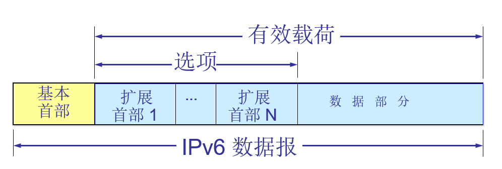

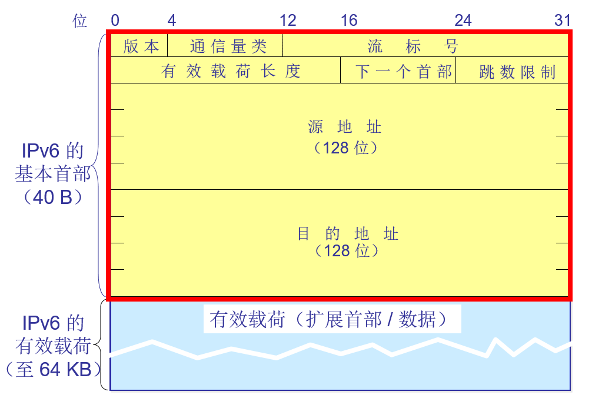

#### 2.4.IPv6基本首部的8个字段

- **版本**(version)—— 4 位。它指明了协议的版本，对 IPv6 该字段总是 6。
- **通信量类**(traffic class)—— 8 位。这是为了区分不同的 IPv6 数据报的类别或优先级。目前正在进行不同的通信量类性能的实验。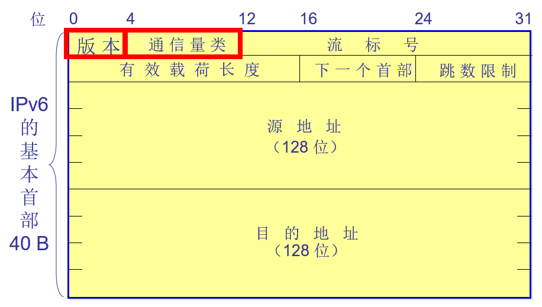

- **流标号**(flow label)—— 20 位。 “流”是互联网络上从特定源点到特定终点的一系列数据报， “流”所经过的路径上的路由器都保证指明的服务质量。

  所有属于同一个流的数据报都具有同样的流标号。

- **有效载荷长度**(payload length)—— 16 位。它指明 IPv6 数据报除基本首部以外的字节数（所有扩展首部都算在有效载荷之内），其最大值是 64 KB。

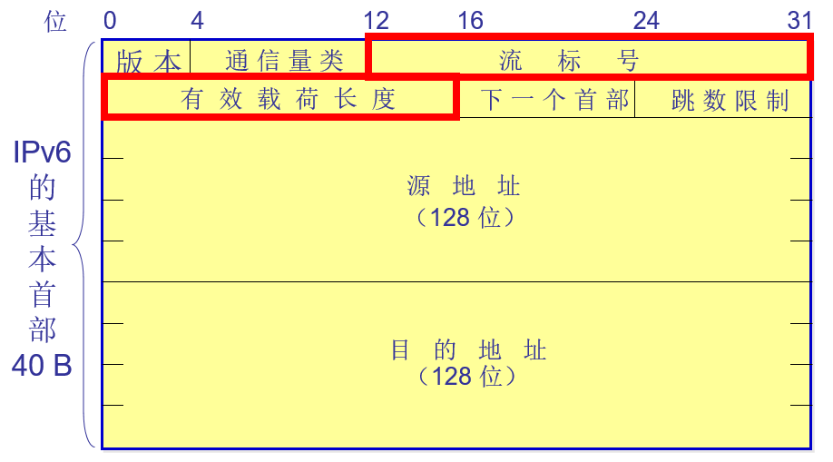

- **下一个首部**(next header)—— 8 位。它相当于 IPv4 的协议字段或可选字段。

- **跳数限制**(hop limit)—— 8 位。源站在数据报发出时即设定跳数限制。路由器在转发数据报时将跳数限制字段中的值减1。

  当跳数限制的值为零时，就要将此数据报丢弃。

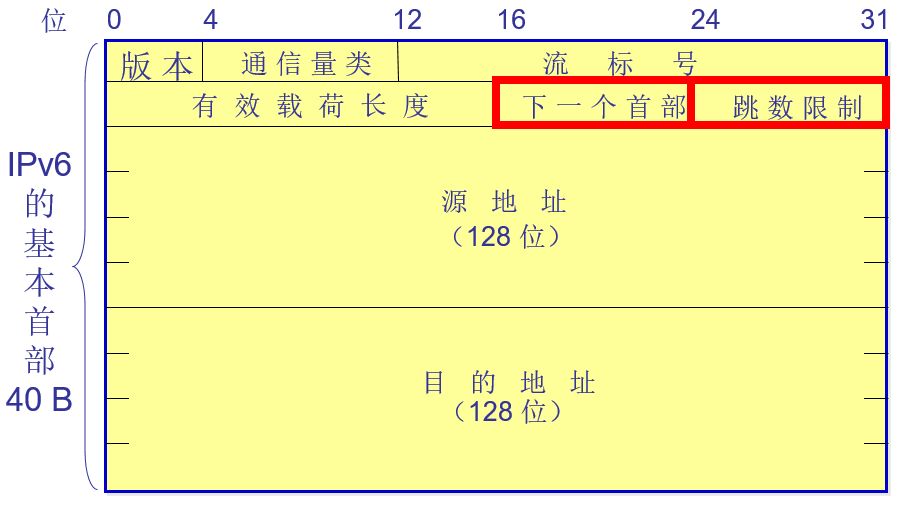

- **源地址**—— 128 位。是数据报的发送站的 IP 地址。
- **目的地址**—— 128 位。是数据报的接收站的 IP 地址。

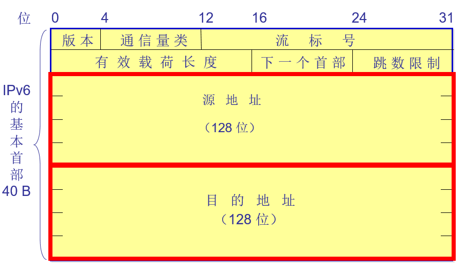

------

### 三、IPv6 的扩展首部

#### 3.1.扩展首部及下一个首部字段

- IPv6 把原来 IPv4 首部中选项的功能都放在**扩展首部**中，并将扩展首部留给路径两端的源站和目的站的主机来处理。
- 数据报途中经过的路由器都不处理这些扩展首部（只有一个首部例外，即逐跳选项扩展首部）。
- 这样就**大大提高了路由器的处理效率**。
- 无扩展首部：

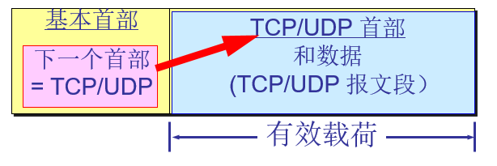

- 有扩展首部：

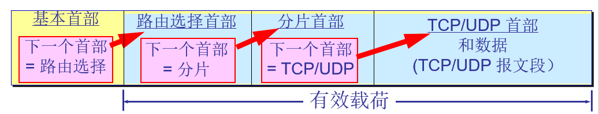

- 逐跳选项；
- 路由选择；
- 分片；
- 鉴别；
- 封装安全有效载荷；
- 目的站选项 ；

#### 3.2.扩展首部举例：分片首部

- IPv6 把分片限制交由源站来完成。源站可以采用最小 MTU（1280字节），或者在发送数据前完成路径最大传送单元发现(Path MTU Discovery)，以确定沿着该路径到目的站的最小 MTU。
- 分片扩展首部的格式如下：

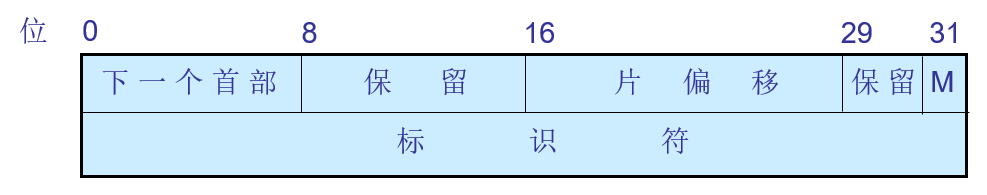

- IPv6 数据报的有效载荷长度为 3000 字节。下层的以太网的最大传送单元 MTU 是 1500 字节。分成三个数据报片，两个 1400 字节长，最后一个是 200 字节长。 数据报分为以下形式。

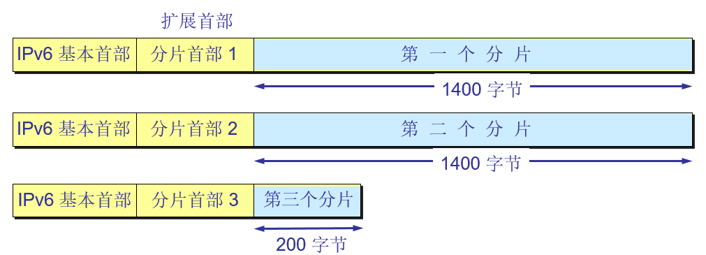

- 当路径途中的路由器需要对数据报进行分片时，就创建一个全新的数据报，然后将这个新的数据报分片，并在各个数据报片中插入扩展首部和新的基本首部。
- 路由器将每个数据报片发送给最终的目的站，而在目的站将收到的各个数据报片收集起来，组装成原来的数据报，再从中抽取出数据部分。

------

### 四、IPv6 的地址空间

#### 4.1.地址的类型与地址空间

IPv6 数据报的目的地址可以是以下三种基本类型地址之一：

- **单播**(unicast) 单播就是传统的点对点通信。
- **多播**(multicast) 多播是一点对多点的通信。
- **任播**(anycast) 这是 IPv6 增加的一种类型。任播的目的站是一组计算机，但数据报在交付时只交付其中的一个，通常是距离最近的一个。

> **结点与接口**

- IPv6 将实现 IPv6 的主机和路由器均称为**结点**。
- IPv6 地址是分配给结点上面的接口。
  - 一个接口可以有多个单播地址。
  - 一个结点接口的单播地址可用来唯一地标志该结点。

> **冒号十六进制记法**

- IPv6的 128 位地址每 16 位 用一个十六进制值表示，各值之间用冒号分隔，一共有8个十六进制数。

  如：68E6:8C64:FFFF:FFFF:0:1180:960A:FFFF；

  而IPv4则为 32 位的地址每 8 位用一个十六进制值表示，一共有4个十六进制数。

- 零压缩(zero compression)，即一连串连续的零可以为一对冒号所取代。

  如：FF05:0:0:0:0:0:0:B3 可以写成：FF05::B3

> **点分十进制记法的后缀法**

- 如：0:0:0:0:0:0:128.10.2.1 使用零压缩即可得出： ::128.10.2.1 。

- CIDR 的斜线表示法仍然可用。

  如：60 位的前缀 12AB00000000CD3 可记为：

   12AB:0000:0000:CD30:0000:0000:0000:0000/60；

  或 12AB::CD30:0:0:0:0/60；

  或 12AB:0:0:CD30::/60；

#### 4.2.地址空间的分配

IPv6 将 128 位地址空间分为两大部分。

- 第一部分是可变长度的类型前缀，它定义了地址的目的；
- 第二部分是地址的其余部分，其长度也是可变的；

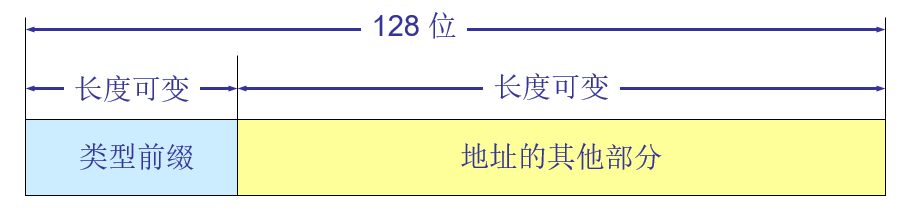

#### 4.3.特殊地址

IPv6具有比IPv4更复杂的IP地址结构。 IPv6已经为特殊目的保留了几个地址和地址符号。 参见下表:

| IPv6 Address | Meaning             |
| ------------ | ------------------- |
| ：：/ 128    | Unspecified Address |
| ：：/ 0      | Default Route       |
| ：：1 / 128  | Loopback Address    |

- **未指明地址** ：如表所示，地址0:0:0:0:0:0:0:0/128是 16 字节的全 0 地址，不指定任何内容，称为未指定地址。 简化后，所有的0被压缩为:: / 128。
- **默认路由**：在IPv4中，地址0.0.0.0与网络掩码0.0.0.0表示默认路由。 相同的概念也适用于IPv6，地址0:0:0:0:0:0:0:0，网络掩码全0表示默认路由。 应用IPv6规则后，此地址压缩为:: / 0。
- **环回地址**： IPv4中的环回地址由127.0.0.1到127.255.255.255系列表示。 但在IPv6中，只有0:0:0:0:0:0:0:1/128表示环回地址。 环回地址后，可以表示为:: 1/128。
- **基于 IPv4 的地址** 前缀为 0000 0000 保留一小部分地址作为与 IPv4 兼容的。
- **本地链路单播地址** ： 它仅供于在网段，或广播域中的主机相互通信使用。这类主机通常不需要外部互联网服务，仅有主机间相互通讯的需求。IPv4链路本地地址定义在**169.254.0.0/16**地址块。 IPv6定义在**fe80::/10**地址块。

> **前缀为 0000 0000 的地址 **

- 前缀为 0000 0000 是保留一小部分地址与 IPv4 兼容的，这是因为必须要考虑到在比较长的时期 IPv 4和 IPv6 将会同时存在，而有的结点不支持 IPv6。
- 因此数据报在这两类结点之间转发时，就必须进行地址的转换。

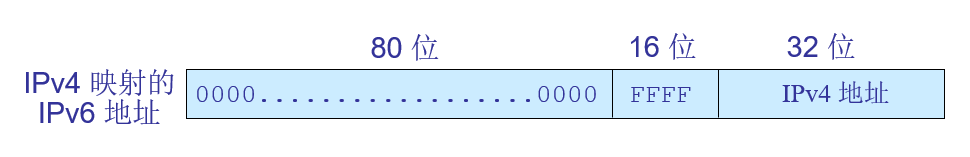

#### 4.4.全球单播地址的等级结构

IPv6 扩展了地址的分级概念，使用以下三个等级：

(1) 全球路由选择前缀，占 **48** 位。

(2) 子网标识符，占**16** 位。

(3) 接口标识符，占 **64** 位。

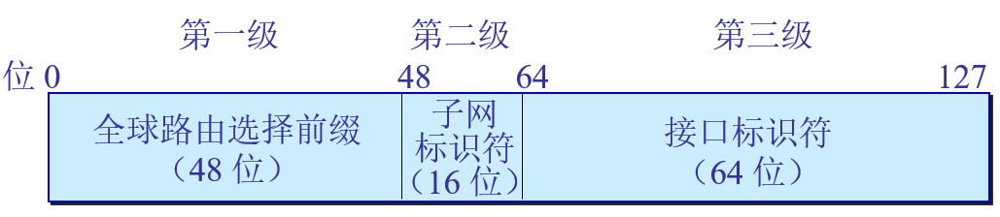

------

### 五、从 IPv4 向 IPv6 过渡

#### 5.1.概述

- 向 IPv6 过渡只能采用逐步演进的办法，同时，还必须使新安装的 IPv6 系统能够向后兼容。
- IPv6 系统必须能够接收和转发 IPv4 分组，并且能够为 IPv4 分组选择路由。
- **双协议栈**(dual stack)是指在完全过渡到 IPv6 之前，使一部分主机（或路由器）装有两个协议栈，一个 IPv4 和一个 IPv6。

#### 5.2.使用双协议栈从 IPv4 到 IPv6 的过渡

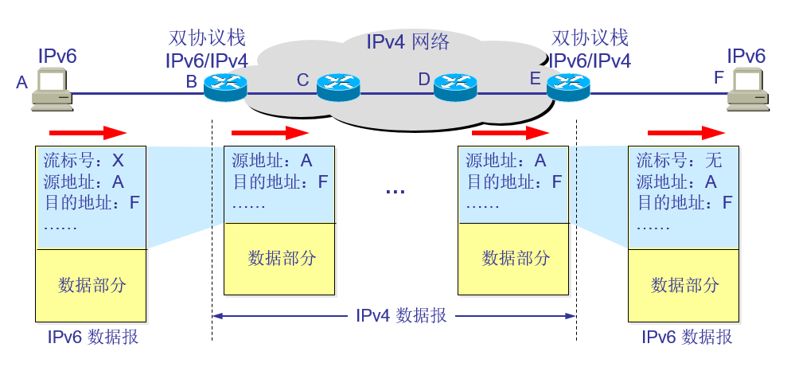

#### 5.3使用隧道技术从 IPv4 到 IPv6 过渡

