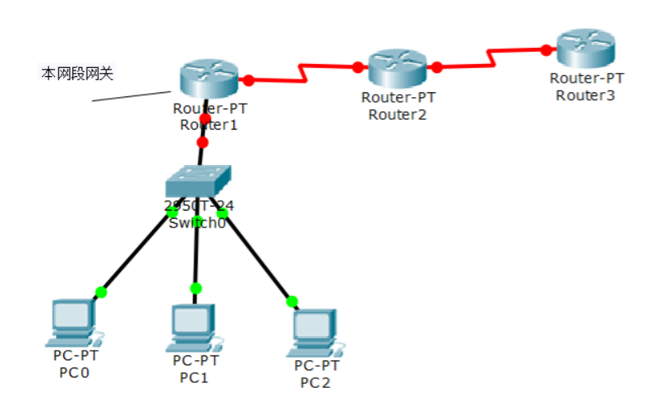
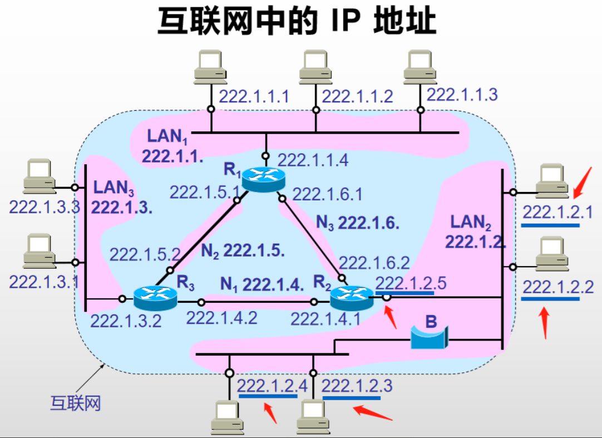
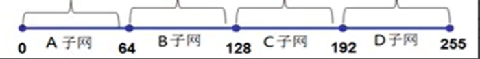
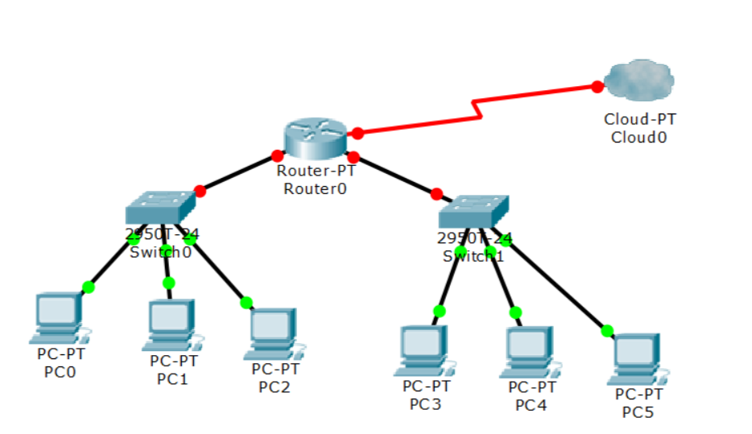
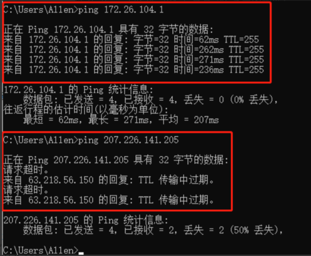
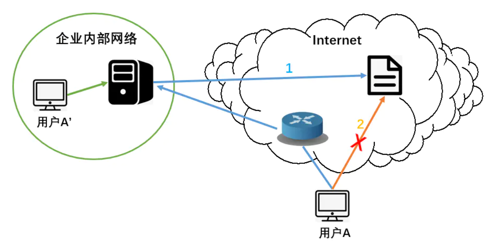

# 一、网络层同宫的两种服务

- 在计算机网络领域，网络层应该向运输层提供怎样的服务（“面向连接”还是“无连接”）曾引起了长期的争论。
- 争论焦点的实质就是：在计算机通信中，**可靠交付应当由谁来负责**？是**网络**还是**端系统**？
- 即A、B两端点通过多个路由器连接，数据在每两个路由器之间都要确认**可靠交付**（传输），还是仅在A、B两端口确认数据是否**可靠交付**。
- 显然如果每两个路由器之间都要确认一次数据传输的可靠性就会十分浪费性能，所以，如今**数据的可靠交付由端系统负责**。

**两种服务：网络层应该向运输层提供怎样的服务？**

- 虚电路服务
- 数据包服务

------

### 虚电路服务

- 数据包传输前先建立和确认一条虚电路，确认之后数据包不用加地址，直接通过虚电路由一端传送到另一端，这叫做**虚电路服务**。

**特点**

- 虚电路表示这只是一条**逻辑上的连接**，分组都沿着这条逻辑连接按照存储转发方式传送，而并不是真正建立了一条物理连接。
- 请注意，电路交换的电话通信是先建立了一条**真正的连接**。因此分组交换的虚连接和电路交换的连接只是类似，但并不完全一样。


如果该虚电路断了，H1与H2不能通过其他电路传送数据，即只能通过配置好的虚电路传送数据。

------

### 数据报服务

- 数据包写上目标地址与原地址，通过路由器识别地址转发到相应目的地，这叫**数据报服务**。
- 网络层向上只提供简单灵活的、**无连接的**、**尽最大努力交付**的**数据报服务**。
- 网络在发送分组时不需要先建立连接。每一个分组（即 IP 数据报）独立发送，与其前后的分组无关（不进行编号）。
- 网络层不提供服务质量的承诺。即所传送的分组可能出错、丢失、重复和失序（不按序到达终点），当然也不保证分组传送的时限。

**特点**

- 数据包的传输路径会根据数据包中的原地址和目的地址动态确定传输路线，有多种可能。即使最佳路径断了，也可以通过其他路径传输，只是速度没那么快，非常可靠。
- 由于传输网络不提供端到端的可靠传输服务，这就使网络中的路由器可以做得比较简单，而且价格低廉（与电信网的交换机相比较）。
- 如果主机（即端系统）中的进程之间的通信需要是可靠的，那么就由网络的主机中的运输层负责（包括差错处理、流量控制（即A发快了，B让停停）等）。
- 采用这种设计思路的好处是：网络的造价大大降低，运行方式灵活，能够适应多种应用。
- 因特网能够发展到今日的规模，充分证明了当初采用这种设计思路的正确性。


**虚电路服务与数据报服务的对比**


**明确现在互联网用的就是数据报服务**

# 二、虚拟互联网

**网络互联的设备**

**中间设备**又称为**中间系统**或**中继（relay）系统**。

- 物理层中继系统：**转发器**（repeater），可以理解为**接线器**（Hub）；
- 数据链路层中继系统：**网桥**或**桥接器**（bridge）；
- 网络层中继系统：路由器（router）；
- 网络层以上的中继系统：**网关**（gateway）；**网关就是到其他网段路由器接口的地址**。

**网络互联设备：路由器**

- 当中继系统是转发器或网桥时，一般并不称之为网络互连，因为这仅仅是把一个网络扩大了，而这仍然是一个网络；
- 网关由于比较复杂，目前使用得较少；
- 互联网都是指用路由器进行互连的网络；
- 由于历史的原因，许多有关 TCP/IP 的文献将网络层使用的路由器称为**网关**



上图中，三台计算机想要访问互联网等其他网段必须经过网关Router1；但可以访问本网段。同时也可以为计算机设置多个网关，如图所示


如图，PC2通过网关Router1访问互联网；也可以通过网关Router4访问互联网。

**总结**：网关就像一道门，计算机的数据想要出去必须通过这道门；一台计算机可对应多个门。

> **某个网段的网关一般设置在连接该网段的路由器上，是路由器的一个端口地址；该网段的计算机通过网关（地址）找到该路由器并通过该路由器访问网络**


梳理一下PC1上网的过程，上网的实质就是同网段或不同网段内双方的通信。当需要访问的互联网与计算机在同一网段内，可以不经路由器中转直接通信，比如PC1可以不经路由器直接访问PC0；否则需要经过路由器中转才能访问其他网段的互联网，比如PC1想要访问其他网段的Cloud0 。

而判断通信双方是否在同一网段根据的是网关。某网段的网关一般设置在连接该网段的路由器上，是路由器上一个端口的IP地址，该地址属于路由器连接的网段。如图中PC1的IP地址为192.0.1.5与路由器的网关192.0.1.1同属网段192.0.1；其他的网段也是相同的原理，于是可以通过之前提到过的子网掩码求与运算比较连接各网段的路由器上的网关是否在同一网段。

所以，图中PC1需要访问Cloud0时，首先通过网关判断出了通信双方处于不同网段，随后PC1把数据报通过网关这个地址发送给Router0，路由器Router0通过查询内部路径表寻找传输的最佳路径，当中转到路由器Router1时，Router1发现数据报中的目标IP地址与自己的网关同属一个网段，最后将数据报传输给该网段下的Cloud0完成通信。这就是访问网络的过程。

**互联网的问题**

互联在一起的网络要进行通信，会遇到许多问题需要解决，如：

- 不同的寻址方案；
- 不同的最大分组长度；
- 不同的网络接入机制；
- 不同的超时控制；
- 不同的差错恢复方法；
- 不同的状态报告方法；
- 不同的路由选择技术；
- 不同的用户接入控制；
- 不同的服务（面向连接服务和无连接服务）；
- 不同的管理与控制方式 ；

**分组在互联网中的传送**


这里我们只考虑，各设备的网络层如何在各设备中中转从而到达目的地址。

**互联网络与虚拟互联网络**


- 互联网络：里面充满了各种网络设备，有着不同的技术。
- 虚拟互联网络：计算机访问互联网中其他计算机的时候，不用考虑网络中的其他设备，整个Internet相当于一个大的网络是虚拟的，它屏蔽了网络的复杂性，比如网络中每一个服务器都有IP地址，计算机直接访问该IP地址就行了。这就是虚拟互联网络，我们只需要知道访问的IP地址就可以了，不需要关心网络内部如何连线。

**虚拟互连网络的意义**

- 所谓虚拟互连网络也就是逻辑互连网络，它的意思就是互连起来的各种物理网络的异构性本来是客观存在的，但是我们利用 IP 协议就可以使这些性能各异的网络从用户看起来好像是一个统一的网络。
- 使用 IP 协议的虚拟互连网络可简称为 IP 网。
- 使用虚拟互连网络的好处是：当互联网上的主机进行通信时，就好像在一个网络上通信一样，而看不见互连的各具体的网络异构细节。

**IP协议简介**

网际协议 IP 是 TCP/IP 体系中两个最主要的协议之一。与 IP 协议配套使用的还有四个协议：（**网络层使用的只有这四个协议**）

- 地址解析协议 ARP
  (Address Resolution Protocol)
- 逆地址解析协议 RARP
  (Reverse Address Resolution Protocol)
- 网际控制报文协议 ICMP
  (Internet Control Message Protocol)
- 网际组管理协议 IGMP
  (Internet Group Management Protocol)

**网络层4个协议之间的层次**


图中可见，网络层中的四个协议中，ARP协议较为底层，IP协议依赖于ARP协议。ICMP协议依赖于IP协议；IGMP协议依赖于ICMP协议

# 三、IP地址

**IP 地址及其表示方法**

- 我们把整个因特网看成为一个单一的、抽象的网络。IP 地址就是给每个连接在因特网上的主机（或路由器）分配一个在全世界范围是唯一的 32 位的标识符。
- IP 地址现在由**因特网名字与号码指派公司**ICANN (Internet Corporation for Assigned Names and Numbers)进行分配 。

**IP 层次结构**


由于当初美国国防部一开始设计TCP/IP协议的时候，没想过把全球的计算机连接起来，所以当时设计的IP 地址只有32位，发展到如今已显得不够用了。IP地址其实就是一串数字，是一个可以直接访问公网的地址，现在已成为一种资源。所以说开发个人网站要买公网IP地址。这里讲解的是**IPv4**版本的内容，如今慢慢地往**IPv6**版本转变。

- IP地址分为网络部分（**网络ID**）和主机部分（**主机ID**），每一个网段属于以固定的网络地址，如图中的三个网段的**网络ID**分别为**192.168.1.0**、**192.168.2.0**、**192.168.3.0**。这样计算机只关心数据发到哪个网段的网络地址上，而不再关心具体发到某一台计算机的**主机ID**。就好像电话号码分区号是一样的，前面几位号码管地区，后面号码管该地区的特定用户。
- 所以同一个网段的计算机**网络ID**都一样，不同的是跟在网络ID后面的各计算机的**主机ID**.

**IP 地址的编址方法**

- **分类的 IP 地址**。这是最基本的编址方法，在 1981 年就通过了相应的标准协议。
- **子网的划分**。这是对最基本的编址方法的改进，其标准[RFC 950]在 1985 年通过。
- **构成超网**。这是比较新的无分类编址方法。1993 年提出后很快就得到推广应用。

**分类IP地址**

- 每一类地址都由两个固定长度的字段组成，其中一个字段是**网络号 net-id**，它标志主机（或路由器）所连接到的网络，而另一个字段则是**主机号 host-id**，它标志该主机（或路由器）。
- 两级的 IP 地址可以记为：


网络地址（也可以成为网络号）唯一指定了每个网络。向一网络中的每台计算机都共享相同的网络地址，并用它作为自己IP的值的一部分。


- 为了方便我们把32位IP地址划分为4个字节（每个字节表示8位2进制）表示的地址。即：


- A类地址网络号字段有**8位**，以**0**开头，主机号字段有**24位**，即该网段可以容纳2的24次方台计算机。
- B类地址网络号地址有**16位**，以**10**开头，主机号字段有16位，即该网段可以容纳2的16次方台计算机。
- C类地址网络号地址有**24位**，以**110**开头，主机号字段有8位，即该网段可以容纳2的8次方台计算机。
- D类地址：多播使用，网络号地址以**1110**开始；E类地址：研究所用，网络号地址以**1111**开始；（都是比较少见）

**点分十进制记法 **


- 即每8位二进制数用一个十进制数来表示，每个十进制数之间用点隔开 来表示IP地址。

**常用的三种类别的 IP 地址 **


- A类地址中的127比较特殊，在运行中输入可以访问本电脑的共享资源。一般是不可用的。

  - > 127.0.0.1 这个地址通常分配给 loopback 接口。loopback 是一个特殊的网络接口(可理解成虚拟网卡)，用于本机中各个应用之间的网络交互。只要操作系统的网络组件是正常的，loopback 就能工作。Windows 中看不到这个接口。事实上整个 127.* 网段都算能够使用，比如你 ping 127.0.0.2 也是通的。 但是使用127.0.0.1作为loopback接口的默认地址只是一个惯例。并且localhost指向的也是127.0.0.1这个地址。

- 表中可看出，若为A类 IP 地址，则表示 IP 地址的四个十进制数中的第一个表示网络号，后面三个十进制数表示主机号。比如：126.0.0.1.第一位十进制数在1~126之间表示，所以IP地址的第一位十进制数126表示网络号，后面的三位十进制数：0.0.1表示主机号，即1号主机。

- B与C类 IP 地址同理；

  - 如 IP 地址：160.32.32.34；由于第一位十进制数在128~191内，故为B类 IP 地址，即前两位数160.32 为网络地址号，后两位数：32.34为主机号。
  - 如 IP 地址：221.31.31.23；由于第一位十进制数在192~223内，故为C类地址，即前三位数221.31.31 为网络地址号，第四位数：23为主机号。

  > **举例**


可见在指定 IP 地址过程中，只要输入IP地址，子网掩码就会根据 IP地址中的第一个十进制数判断出是哪类IP 地址，并自动完善相应地址。比如图中的132开头的 IP 地址被判断为B类地址，前两个十进制数表示网络号。

> **实际上 IP 地址是标志一个主机（或路由器）和一条链路的接口。**

**互联网中的 IP 地址**

- 在同一个局域网上的主机或路由器的IP 地址中的网络号必须是一样的。（一个路由器与若干接线器和若干计算机连接形成的网络就是一个局域网）
  图中的网络号就是 IP 地址中的 net-id，可见同一个局域网内它们 IP 地址的网络号都为**222.1.2**（由开头的222可知是C类 IP 地址，所以前三位数是网络号）。



由于路由器每个端口连接不同的网段，所以路由器总是具有两个或两个以上的 IP 地址。
路由器的每一个接口都有一个不同网络号的 IP 地址。


- 两个路由器直接相连的接口处，可指明也可不指明 IP 地址。如指明 IP 地址，则这一段连线就构成了一种只包含一段线路的特殊“网络” 。常不指明 IP 地址。

**特殊的几个地址**

- 127.0.0.1：本地环回地址，localhost地址。

- 169.254.0.0：（169.254*）改地址为没有人给Windows分配IP地址，或者Windows请求不到地址后，自动给自己生成的凑合着用IP 地址。虽然显示能上网，但是这个网是指由多台一样申请不到IP地址，使用自分配的，以169.254开头的IP地址的计算机组成的网段，该网段内可以通信，但是无法访问公网。

- 保留的私网地址：在互联网上这些地址没有给服务器用，可以给企业或学校来用。

  - 保留的A类地址：10.0.0.0；

  - 保留的B类地址：172.16.0.0——172.31.0.0；（由于为B类 IP 地址，前两位为网络号，即保留了16个B类 IP 地址）；例如本机的学校IPv4地址就是172.26.105.78；即供学校等用的保留地址。

  - 保留的C类地址：192.168.0.0——192.168.255.0；（由于为C类 IP 地址，前三位为网络号，即保留了256个C类 IP 地址）；

  - 由于保留的私有地址不在互联网上公开，这些地址属于校园网或企业内网，所以**用户无法通过互联网访问这些 IP 地址**。（因为这些地址不存在于互联网，互联网上的路由器不知道怎么走，所以无法访问）

    > **公网地址**：存在于互联网上，并且被统一规划的地址，任何地方的任何用户都能访问。

**子网掩码**

> **作用**

- 子网掩码（subnet mask）又叫做网络掩码、地址掩码，它是一种用来指明一个IP地址的哪些位标识的是主机所在的子网以及哪些位标识的是主机的位掩码。子网掩码不能单独存在，它必须结合IP地址一起使用。

- 子网掩码只有一个作用，就是将某个IP地址划分成网络地址和主机地址两部分。

- 如果一台计算机的IP地址配置为172.16.122.204，子网掩码为255.255.0.0（例子见上）。将其IP地址和子网掩码都写陈二进制，进行与（&&）操作，即只有1和1运算才得1，其余得0.这样经过IP地址和子网掩码做完与运算后。主机位不管是什么值都归零，网络位的值保持不变，这样就得到该计算机所处的网段为：172.16.0.0。

  - 例如计算机A：

    IP地址：192.168.80.123；

    子网掩码为：255.255.255.0；

    网关地址为：192.168.80.1；

    计算机B IP地址为：192.168.90.123；

    - A的子网掩码与B 进行与运算，并主机位归零得：192.168.90.0与A的192.168.80.0不在一个网段，A向B发数据会交由网关192.168.80.1处，由网关寻求其他路径传输到B。
    - 若A的子网掩码改为255.255.0.0（子网掩码可以自动分配也可以手动指定），再进行上述操作，得到192.168.0.0与A在一个网段。则A可不经网关直接给B发送数据。

- **与运算如下**


- 由于子网掩码四个十进制数中若不为0就是255，而255二进制表示全是1，所以255与任何数的二进制做与运算都能使原数不变。
- 如果子网掩码写错了，会导致与运算出错，从而导致通信故障。因此子网掩码也需要正确地配置。

# 四、子网划分

> **下面讨论的例子都以C类网络为基础**
>
> **下面提到的网络位与主机位、网络号与主机号、网络ID与主机ID是等同的一组概念**

**一个网段的情况**

某公司有两个部门，每个部门100台计算机，通过交换机连接，组成局域网，通过路由器连接Internet。这两个部门的200台计算机使用192.168.0.0的C类网络，该网段的子网掩码为255.255.255.0，连局域网的路由器接口配置使用该网段的第一个可用IP地址：192.168.0.1

> **注意**：虽然路由器可以使用该网段的任何可用IP地址，为了避免该网段计算机的地址和路由器的地址冲突，一般将路由器设置为该网段的第一个可用的IP地址或最后一个可用的IP地址。


- 如果交换机接了200台计算机，由于该网段可用地址为2~254（1位路由器所用地址），所以使用该网段地址给200台计算机分配主机号并不浪费。

**等分成两个子网**

为了安全考虑，打算将这两个部门的计算机分为两个网段，中间使用路由器隔开。

现在将**192.168.0.0 、255.255.255.0**这个C类地址划分成两个网段：


- 要把IP地址：192.168.0.0，划分为两个子网段。由于该C类IP地址前三位网络位已固定，所以我们可以通过将IP地址的第四位即主机位右移一位（子网掩码右移一位），并把这一位二进制数划分给该IP地址的第三位网络号，如图所示：该二进制位有两种可能0或1，所以可以区分为两个子网。（用一个十进制数表示八位二进制数只是个习惯，实际可以IP地址的第三位十进制数可以表示多于8位的二进制数，比如上面的9位）；
- 原本第四位主机位是8位二进制数，最大为1111 1111，右移一位，并把该为归为网络位，即在主机位中仍然是8位，但是第8位归属网络位，固定变为0或1；
  - 当第8位为0时，加上固定位的8位二进制数范围为：0000 0000 ~ 0111 1111，即0127；所以该子网，即A子网范围为192.168.0.1192.168.0.126（因为主机位不能全为0或1，所以0与127不能用）；
  - 当第8位为1时，加上固定位的8位二进制数范围为：1000 0000 ~ 1111 1111，即128255；所以该子网，即B子网范围为192.168.0.129192.168.0.254（同样，主机位不能全为0或1，所以128与255不能用）；
- 划分子网之后，子网掩码的第四位变为1000 0000即十进制表示为128；
- 主机号（主机地址）不能全为0，也不能全为1；当主机地址全为1是即为255，该地址是一个广播地址，会向所有计算机发送数据，不能作为计算机的IP地址。
- **划分两个子网后网络规划如图所示**


- 配地址时，A子网与B子网分别属于两个不同的网段。A子网网段地址范围为192.168.0.0192.168.0.126；B子网网段地址范围为192.168.0.128192.168.0.255；并且A、B子网的子网掩码都为255.255.255.128

  > **注意了8个1组成的二进制数:1111 1111，对应的十进制数为2的1个数次方-1；如1111 1111表示十进制数：2的8次方-1，即255**

- 根据习惯连接A或B子网的路由器，使用的是A或B子网网段中的第一个有效IP地址，即192.168.0.1或192.168.0.129；它们的子网掩码也都为255.255.255.128。

- 并且计算机的网关地址同样也为相应子网网段中的第一个有效IP地址。如图中的计算机网关地址为B子网中的第一个有效IP地址：192.169.0.129；

> 通过划分子网掌握**两个常识**

- 子网掩码不一定都是255.255.255.0，也可能是255.255.255.128；
- 网段中的第一个有效地址不一定是1（即192.168.0.1），也可能是129（即192。168.0.129）；

> **总结：等分子网其实是将主机位的8位二进制数表示的0~255线段，等分为所需份数**

二等分


四等分



**等分为4个子网**

加入公司有4个部门，每个部门有50台计算机，现在使用192.168.0.0/24这个C类网段，从安全考虑你打算每个部门的计算机放置到独立的网段，这就要求你将192.168.0.0/24这个C类网络划分为4个网段，如何划分子网呢？


- 与二等分子网的分析过程一样，通过将子网掩码的最后8位二进制数右移两位，划分两位给网络位，从而实现子网划分。
- 划分给网络位的两位二进制数相对于右移的两位掩码位有四种可能取值：00、01、10、11。分别对应划分的四个子网A~D。
- A子网有效IP（网段）地址为：192.168.0.1 ~ 192.168.0.62（0与63不能作为计算机地址，0为主机位全0地址，63为主机位全1地址，即广播地址）；
- B子网有效IP（网段）地址为：192.168.0.65 ~ 192.168.0.126（64与127不能作为计算机地址，64为主机位全0地址，127为主机位全1地址，即广播地址）；
- C子网有效IP（网段）地址为：192.168.0.129 ~ 192.168.0.190（128与191不能作为计算机地址，128为主机位全0地址，191为主机位全1地址，即广播地址）；
- D子网有效IP（网段）地址为：192.168.0.193 ~ 192.168.0.254（192与255不能作为计算机地址，192为主机位全0地址，255为主机位全1地址，即广播地址）；
- **二进制数1000 0000中1在第8位，表示的十进制数为2的7次方。**
- 可以观察出：**每个网段第一个能用的地址为网段起始等分节点（2的相应次方）+1；最后一个能用的地址为该网段结尾等分节点-2**。例如A子网，起始和结尾等分节点分比为0与64，所以A网段可用地址为1~62；
- A~D的子网掩码统一变为255.255.255.192;**规律为：整个网段等分为2的x次方段，那么子网掩码右移x位。**比如2等分，子网掩码右移1位：1000 0000 即128；四等分，子网掩码右移2位：1100 0000 即192；（1100 0000 =1000 0000 +128/2）。
- **总结：网段除一次2，子网掩码右移1位**

**等分为8个网段**


- 分析方法同上，要把一个C类网络等分成8个子网，子网掩码需要往右移3位，才能划分出8个子网，第8位、第7位和第6位都变成网络位。
- 各子网有效地址与统一的子网掩码，可根据上文所推导规律自行得出。

**当为点对点网络时，子网掩码右移6位，子网掩码最好为255.255.255.252**

> **注意：**子网划分是有规律的，比如划分为两个网段放200台计算机，一段放150台，另一段放50台，显然无论把150台计算机放在哪个网段都超过了128，这样是不行的，必须是逐次除2地划分。

### 不等分网段时

若要求把180台计算机分为100、50、30台，放入不同的网段


- 原理一样，先把总网段划分为符合计算机数量的相应长度。如这里有100 、50 、30台计算机，则需要的网段长度分别为128 、64 、32。
- 划分之后如图中A~C段所示，然后分别把100、 50 、30台计算机放在A、 B 、C网段。
- **与等分网段区别在于：不等分网段时，各段的子网掩码不在统一**。如本例：A 、B 、C网段的子网掩码分别为128、192 、224；（这里考虑的是C类地址的情况，即该地址为子网掩码地址中的第四位）

**练习**

IP 地址：192.168.0.101

子网掩码：255.255.255.192

判断该IP 地址属于哪一个网段。

- **解题思路**：首先我们并不知道整个网段是否是等分的，所以我们可以通过IP 地址的主机位归零，并结合子网掩码最后一位来判断。子网掩码最后一位为192转换为2进制数为：1100 0000；即子网掩码右移了两位。也就是把第7~8位（11）划分给了网络位。

  > **注意**：这里所指的划分是指：对内这两位属于网络位，主机位的操作不影响这两位，如主机位归零并不会影响这两位；对外仍然用一个十进制数表示这个由2位网络位和6位主机位组成的8位二进制数。

- **第一步**：通过子网掩码右移两位可判断出：划分的最小网段为总网段的1/4；

- **第二步**：再通过IP地址主机号归零：192.168.0.101 中101属于64~128这一网段，所以主机号归零为-->192.168.0.64（归零的只是6位主机位与划分给网络位的2位二进制数无关，所以对外表现出是64）下为图解；


- 由以上结论可以得出：该IP地址所属网段的第1个地址为64；再结合子网掩码位移数可得出：该网段为从地址64开始，长度为1/4总网段的网段。总网段长度为256,1/4为64，则所求地址属于的网段为：64128（实际可用地址为65126）。

**总结**：判断一台计算机所属网段，方法为两步走。

**补充说明**

> 子网掩码有两种写法。

- 第一种：IP地址：192.168.201.167；子网掩码：255.255.255.224.
- 第二种：IP地址与子网掩码：192.168.201.167 / 28；这里的/ 28 表示原子网掩码右移了（28-3X8）即4位（由于是C类网络子网掩码前个十进制数固定，这三个十进制数一共表示24位二进制数，最终子网掩码的位数要在24基础上加上子网掩码右移的位数）。

> 选择非全0或1的主机号

- 例如：192.168.201.168 / 30 与 192.168.201.169 / 30；哪个是主机号非全0或1的，符合要求的地址？

- 首先根据根据子网掩码可判断出：子网掩码右移了6位，即IP地址最后一个十进制数表示的8位二进制数为：1111 1100。其中前6位划分给了网络位，后2位：00为该IP地址主机位；

- 再把168化为二进制数为：1010 1000 ，即主机位为00，全为0不符合要求；169化为二进制为：1010 1001，即主机位为01，符合要求。所以应该选择192.168.201.169 / 30作为地址。

- **另一种方法**：子网掩码位数为30，则对应的IP地址主机位为32-30=2位，有：00,01,10,11四种可能所以168和169分别除4，可见当余数为00，或11（3）时都不满足要求。168除4余0,169除4余1，所以169满足要求。

  若IP地址为192.168.201.252 / 29 与 192.168.201.253 / 29，子网掩码位数为29，则对应IP地址主机位为3位，有8种可能，则252和253相应除8得余数分别为4与5，二进制表示：100与101都不为全0或1，即两个地址都符合要求（252:1111 1100；253:1111 1101按照第一种方法也可验证两个地址符合要求）；其他位数的主机位以此类推。主机位数少时采用该方法更简单。

**拓展**

将B类地址：172.16.0.0；子网掩码为255.255.0.0 划分为两个子网

- 与C类地址的划分规则一样，只不过C类网络划分的是IP地址的第4个十进制数表示的8位二进制数，划分B类网络划分它的第三个十进制数表示的8位二进制数就可以了。
- 结果为：172.16.0.1——172.16.127.254；与172.16.128.1——172.16.255.254；子网掩码都为255.255.128.0。

------

### 无分类编址 CIDR（无分类域间路由选择 ）

> **CIDR即为上述划分子网方法和规律的总结**

**CIDR 最主要的特点 **

- CIDR 消除了传统的 A 类、B 类和 C 类地址以及划分子网的概念，因而可以更加有效地分配 IPv4 的地址空间。
- CIDR使用各种长度的“**网络前缀**”(network-prefix)来代替分类地址中的网络号和子网号。
- 无分类的两级编址的记法是：


- CIDR 还使用“斜线记法”(slash notation)，它又称为CIDR记法，即在 IP 地址面加上一个斜线“/”，然后写上网络前缀所占的位数。例如：192.168.0.0/24，表示该IP地址网络号占24位，主机号占8位。

**CIDR 地址块**

- CIDR 把网络前缀都相同的连续的 IP 地址组成“**CIDR 地址块**”。
- 128.14.32.0/20 表示的地址块共有 212 个地址（因为**斜线后面的 20 是网络前缀的位数**，所以这个地址的主机号是 12 位）。
- 在不需要指出地址块的起始地址时，也可将这样的地址块简称为“/20 地址块”。
- 128.14.32.0/20 地址块的最小地址：128.14.32.0；128.14.32.0/20 地址块的最大地址：128.14.47.255；
- 全 0 和全 1 的主机号地址一般不使用。所以有效主机号为1~254。

### 2019 年 11 月 25 日，全球五大区域互联网注册管理机构之一的欧洲网络协调中心（RIPE NCC）宣布 IPv4 地址已全部用完。

# 五、子网合并，构造超网

**超网**


- 假设图中的交换机C接200台计算机，则正好给其分配一个C类网络：192.168.0（一个C类网络地址容量为254）；若计算机数量增加到400台，就需要在交换机C上接上交换机D，D再接上另外200台计算机。这时一个C类网路就不够分配了需要再拿一个C类网络分配给交换机D这个网段，即图中的192.168.1；
- 这种情况下，A计算机的IP地址与B计算机的子网掩码做与运算得：192.168.1，与B计算机的网关192.168.0不在一个网段。所以A与B不能直接通信。
- 有一种解决方法：在连接两个网段的路由器接口上设置两个地址，如图所示：192.168.1.1与192.168.0.1；（通常采用网段的第一个有效地址作为路由器网关地址）；这样让这个路由器的接口当两个网段的网关，这样A发出的数据包可经由路由器传给B。但是，这样效率低，因为本来两台计算机就存在通过交换机连接的物理连接。
- **更好的方法是合并子网，构造超网**。如何构造呢？如图所示，将192.168。0.0和192.168.1.0两个C类网络合并。将IP地址的第3个字节和第四个字节写成二进制，可以看到将子网掩码往左移1位，网络部分就一样了，这两个网段就是一个网段了。


合并后的网段子网掩码往前移动了一位变为：255.255.254.0；可用地址为192.168.0.1-192.168.1.254（这里的第三个字节表示与划分子网时一样，对内网络位减少了一位，对外仍用一个字节表示，即该字节由7位网络位和1位主机位组成，虽然写成192.168.1与192.168.0，但是在同一网段），IP地址的配置如图所示，这样A与B就可以不经路由器直接通过交换机通信了。


那么192.168.0与192.168.1合并之后总的网段是192.168.0还是192.168.1呢？合并后计算机A的IP地址为192.168.1.2对应子网掩码为255.255.254.0，则IP地址主机位归零后变为192.169.0.0，如图所示：子网掩码左移一位之后主机位变为9位，两个IP地址主机位归零都为192.168.0；所以总的网段为192.168.0；


> **以上讲解了合并两个C类网络192.168.0.0 ，255.255.255.0和192.168.1.0，255.255.255.0子网掩码往左移一位，可以合并为192.168.0.0,255.255.254.0。下面详细讲解合并规律。**

- 如下图所示，192.168.2.0，255.255.255.0和192.168.3.0，255.255.255.0字网掩码往左移1位，也可以合并为一个网段，IP地址主机位归零得192.168.2，即总网段为192.168.2.0，255.255.254.0。


那么如果要合并四个网段：

192.168.0.0 、192.168.1.0 、192.168.2.0 、192.168.3.0 呢？


- 如上图所示将子网掩码往左移2位，四个子网的网络部分就一样了，这四个网段就是一个网段了。合并后的掩码地址为255.255.252.0，通过IP地址主机位归零得：192.168.0，即四个子网合并成的总网段为192.168.0。
- 那么192.168.1.0与192.168.2.0可以合并吗？按照上述方法，可知：1与2化位二进制表示分别为：0000 0001 、0000 0010，可以看到子网掩码要左移两位二者的网络位才相同，但是子网掩码左移两位是把 192.168.0~3.0这四个网段都合并了，不符合要求，所以192.168.1.0与182.168.2.0不能合并。符合什么条件才能合并呢？
- **合并网络的规律总结**：如图所示


- 向左移动1位子网掩码可以合并0 、1网段；也可以合并2 、3网段；也可以合并4 、5网段；也可以合并6 、7网段。
- 通过向左移动2位子网掩码可以将连续的0 、1 、2 、3网段合并成一个网段；也可以将连续的4 、5 、6 、7网段合并成一个网段。
- 通过向左移动3位子网掩码，可以将0 、 1、 2、 3、 4、 5、 6、 7网段合并成一个网段。
- **上述只是表面规律，真正规律为：若要合并2的n次方个网段，在子网掩码往左移n位的情况下，能使需要合并的n个网段的网络位相同即可合并，否则不能合并。**例如合并2个网段，在子网掩码左移1位的情况下，能使两个网段的网络位相同的只有0和1、 2和3符合要求，所以1与2、1与3等都不能合并。
- **简单判断法**：判断192.168.117.0与192.168.118.0能否合并？让117与118都除以4，得余数分别为1与2；由于1与2不能合并所以这两个网段不能合并；也可以采用上面的规律来判断：117与118化为2进制分比为：0111 0101与0111 0110，可见子网掩码需要左移2位才能使二者的网路位相同，但是根据上面规律合并两个网段时子网掩码只能左移一位，所以两个子网不能合并。

**路由聚合(route aggregation)**

- 一个 CIDR 地址块可以表示很多地址，这种地址的聚合常称为**路由聚合**，它使得路由表中的一个项目可以表示很多个（例如上千个）原来传统分类地址的路由。
- 路由聚合也称为**构成超网**(supernetting)。
- 在这种定义中，CIDR 虽然不使用子网了，但仍然使用“掩码”这一名词（但不叫子网掩码）。
- 构成超网原理同上，只不过这里换了个说法。

# 六、IP 地址与MAC硬件地址

我们都知道数据通信要使用IP地址加MAC地址，两个地址缺一不可，下为原理图：


**1.下面介绍计算机A与计算机B通信的过程**


- 交换机基于数据帧的MAC地址转发数据帧，路由器基于数据包的IP地址转发数据包；
- 数据包在传输过程不变，经过网络设备数据帧要用新的物理层（MAC）地址重新包装；
- MAC地址决定了数据帧在网络设备中转过程中下一站由哪个设备接收，而IP地址决定了数据包的起0点和终点。

例如图中的使用M表示MAC地址，由于计算机A所处的10.0.0.2网段与计算机B所处的12.0.0.2网段不同，所以A与B不能直接通信，需要借助路由器中转。

首先，计算机发出数据帧1，里面标明了源IP地址与目标IP地址、 源MAC地址与目标MAC地址，这样数据帧1就可以通过交换机准确传输到目标MAC地址M2,即路由器Router1处；

路由器通过查找路由表确定到12.0.0.2的网段的路径，并把该数据帧发现通向该路径的M3接口处，M3接口再对数据帧1进行封装改变源MAC地址和目标MAC地址，IP地址不变并发出数据帧2；

以此类推，最终数据帧传输到12.网段的路由器上，该路由器再通过同网段的交换机把数据帧3发送到计算机B处，完成通信。

**注意**

- 我们把数据传输过程中数据帧中不变的部分：即数据+IP地址（目标地址与源地址）称为**数据包**；
- 数据包加上MAC地址（目标地址与源地址）之后整体称为**数据帧**，数据帧中的MAC地址过一个网络设备变一次。
- **IP地址与MAC地址区别：IP地址决定数据包最终要到达的计算机（终点）；MAC地址决定中转过程中下一站到哪个设备（中转站）去。**

**应用**



- 如果在交换机Switch0这个网段中的PC2中安装代理服务器（比如CCProxy）来控制该网段的其他计算机是否能上网；
- 当在同一网段中，可以直接通过MAC地址通信，所以PC2中的代理服务器只需要设置本网段中的哪些MAC地址可以上网，就可以实现对本网段中的PC1、 PC2实现上网控制。
- 当在不同网段时，比如使用PC2控制Switch1这两个段的所有计算机是否能上网，则在代理服务器中不仅要设置哪些MAC地址能上网，而且还要设置哪些IP地址能上网-。

------

### 2.ARP&RARP协议

**ARP简介**

- 不管网络层使用的是什么协议，在实际网络的链路上传送数据帧时，最终还是必须使用硬件地址。
- 每一个主机都设有一个 ARP 高速缓存(ARP cache)，里面有所在的局域网上的各主机和路由器的 IP 地址到硬件地址的映射表。
- 当主机 A 欲向本局域网上的某个主机 B 发送 IP 数据报时，就先在其 ARP 高速缓存中查看有无主机 B 的 IP 地址。如有，就可查出其对应的硬件地址，再将此硬件地址写入 MAC 帧，然后通过局域网将该 MAC 帧发往此硬件地址。

**ARP MAC地址欺骗**

前面说过，网络层一共使用四个协议：IP、 ARP、 ICMP、 IGMP协议。ARP协议负责把IP地址解析成MAC地址，依靠广播作为解析方式。所以说网上的广播时避免不了的。


如下图所示：


四台计算机PC0PC3通过交换机连接在一起，四台计算机的物理地址分别为M1M4；如果PC0的10.0.0.2地址想ping（访问）PC1的10.0.0.3地址，那么PC0必须知道PC1的MAC地址。

方法为PC0发布一个同网段所有计算机都能收到的广播，广播内容为询问10.0.0.3地址对应的MAC地址。PC1收到之后就会给PC0发送相应的MAC地址信息，PC0就会把收到的该MAC地址当做10.0.0.3的MAC地址。随后通信发出的数据帧目标MAC地址都为该接收到的MAC地址即M2。

正因为ARP通过广播解析通信方MAC地址的方式造成了许多的网络安全问题。比如常说的抓包就是利用ARP协议的这种安全漏洞。

**造成安全漏洞的原因为**：

- PC1告诉PC0，10.0.0.3对应的MAC地址为M2，PC0收到之后不做验证就直接确信并使用该MAC地址作为目标MAC地址发送数据了。我们都知道交换机在转发数据的时候，只会把数据转发给目标地址不会转发给其他连接交换机的非目标地址，这样其他计算机是无法截获通信信息的。
- 如果PC3想截获PC0与PC1之间通信的数据包，当PC0发出广播询问目标MAC地址时，PC3也收到了广播信息，在PC1给PC0发送完正确MAC地址M2后，PC3再向PC0发送错误MAC地址M4，由于PC0并不会检验收到的目标MAC地址是否正确，所以M4会覆盖M2成为PC0确信的目标MAC地址。
- 随后PC0开始通讯，就会把数据发送到PC3中，PC3再把数据发送给PC1 。通过这样一个MAC地址欺骗，所有流经MAC地址M1和M2的数据帧都经过了 M4使窃听数据成为可能。

**应用举例：P2P终结者**


如图所示：四台计算机通过一个交换机连接在一起，再通过一个路由器连接网络，其中PC3的MAC地址为M2，路由器的MAC地址为M1。正常情况下PC0PC2访问网络时，由于网络与它们本身不在同一个网段上，所以需交由路由器的网关进行中转，路由器的网关地址为M1；如果PC3想控制PC0PC2的上网带宽，就可以通过安装P2P终结者类似的软件实现。

P2P终结者的原理为：当PC0PC2解析路由器网关地址时，路由器告诉它们是M1,PC3通过MAC地址欺骗再告诉它们假的路由器网关地址M2，这样PC0PC2包含上网请求的数据包都会发送到假网关地址M2即PC3处（即PC0PC2所有的流量都会经过M2），PC3知道路由器的真实网关地址为M1，PC3先对PC0PC2发来数据包进行处理再把这些数据包转发给真正的路由器网关地址M1。通过这种方式实现对PC0~PC2上网带宽的管控。

如果PC0~PC2直接解析路由器网关地址访问网络，无论PC3是无法管控它们的上网，所以P2P终结者这些软件必须配合ARP欺骗来实现。

**网络执法官**


网络执法官的功能为：同一网段内的一台计算机（比如PC3），可以控制其他计算机（比如PC0~PC2）是否能上网，或者其中一台计算机（如PC0）能与哪些计算机通信，不能与哪些计算机通信。

实现原理：当PC3中安装了网络执行官软件后，PC0PC2想访问网络并解析路由器网关地址时，PC3告诉它们一个不存在的MAC地址M8；随后PC0向M8发送数据帧时，交换机收到后经过查找发现M8地址不存在，要求PC0重发数据帧，又查询不到M8地址，最后该数据帧被丢弃，于是PC0PC2谁也上不了网。

**解决方案：安装ARP防火墙**

沿用上图在PC0中安装ARP防火墙之后，PC0想访问网络并解析路由器网关时，当接收到第一个由路由器发出的真正的网关地址M1时就在PC0中把该地址写死，之后再接受到其他MAC地址也不覆盖M1，由此实现防止ARP地址欺骗。

**仿真验证**

由于高版本Windows系统如Win7、 Win10对ARP修改操作有所限制，所以使用虚拟机Windows2003仿真。

- 在命令行窗口输入命令：

`arp -a`


可以查看相应计算机连接的多个路由器的网关及其对应的MAC地址。

- 随后与其他网络的一个地址建立通信：


发现当前是可以与其他网络中的地址建立通信的。说明该计算机内缓存的路由器网关对应的物理地址是正确的。

再次查看计算机缓存的网关及其对应MAC地址。


然后修改该路由器网关192.168.80.1对应的MAC地址，即把原来的00-50-56-c0-00-08改为00-50-56-c0-00-09，并再次查看计算机缓存的网关及其对应的MAC地址。

arp -s 192.168.80.1 00-50-56-c0-00-09
arp -a

```


可以看出，修改后的网关192.168.80.1对应的MAC地址变为静态“static”，即以后进行数据通信都以该管理员指定的MAC地址为准，不再使用ARP解析的MAC地址。

* 最后再次与其他网络的202.99.168.8地址进行通信：
```

ping 202.99.168.8

```


可以发现现在无法建立通信了，这里管理员指定的网关对应MAC相当于上问题到的ARP MAC地址欺骗。不过与同网段的其他计算机还是能通信的，如与192.168.80.12：
```

ping 192.168.80.12

```


**现实案例**


一家公司的某单位有三台服务器PC0~PC2，其中只有服务器PC2上不了网，其他两台服务器都能上网。首先排除了物理层的原因，最后确认问题是：PC2没有正确地解析到网关的MAC地址。如何知道该计算机缓存了错误的网关MAC地址呢？可以在能上网的计算机PC1与不能上网的计算机PC2的命令行窗口中都输入：arp -a，分别查看同一网关对应的MAC地址，通过比较可得知PC1中正确的网关对应MAC地址与PC2中错误的网关对应地址。

-- --

### 逆向ARP：RARP

  **RARP**


物理地址通过RARP协议得到IP地址的过程叫做地址请求。计算机的IP地址默认是自动获得的，也就是计算机可通过自身物理地址申请对应的IP地址，这正好与ARP解析相反，这叫做逆向ARP即RARP，计算机请求IP的地址的过程就是逆向ARP的过程。
```

# 七、数据报

**1.IP 数据报的格式**

- 一个 IP 数据报由首部和数据两部分组成。（数据报也可以说是数据包）
- 首部的前一部分是固定长度，共 20 字节，是所有 IP 数据报必须具有的。
- 在首部的固定部分的后面是一些可选字段，其长度是可变的。


**2.IP 数据报首部的固定部分中的各字段**


从图中可看到，数据报首部可分为固定部分和可变部分，固定部分为了五行，每行32位即4个字节。

- **版本**——占 4 位（第一行四个字节中0~3位），指 IP 协议的版本该 IP 协议的版本号为 4 (即 IPv4)；

- **首部长度**——占 4 位（第一行四个字节中4~7位），表示首部总的长度（固定+可变部分）；可表示的最大数值是 15 个单位(一个单位为 4 字节)因此 IP 的首部长度的最大值是 60 字节。

- **区分服务**——占 8 位（第一行四个字节中8~15位），区分服务。即该段设置了数据报的优先程度，若要想实现数据报优先传输还需要在路由器端配置相应的区分服务设置。只有在使用区分服务（DiffServ）时，这个字段才起作用。在一般的情况下都不使用这个字段 。

- **总长度**——占 16 位（第一行四个字节中16~31位），指首部和数据之和的长度，单位为字节，因此数据报的最大长度为 65535 字节。总长度必须不超过最大传送单元 MTU。

- **标识**(identification)——占 16 位（第二行四个字节中1~15位），它是一个计数器，用来产生数据报的标识，即每产生一个数据报贴上一个标识。

- **标志**(flag)——占 3 位（第二行四个字节中16~18位），目前只有前两位有意义。
  标志字段的最低位是 **MF** (More Fragment)。MF = 1 表示后面“还有分片”。**MF** = 0 表示最后一个分片。
  标志字段中间的一位是 **DF** (Don't Fragment) 。只有当 DF = 0 时才允许分片。

  即标志表示该数据报是否分片了？是第几个分片？

- **片偏移**——占12 位（第二行四个字节19~31位）指出：较长的分组在分片后某片在原分组中的相对位置。片偏移以 8 个字节为偏移单位。

> **IP 数据报分片举例**


以太网传输的数据报数据部分一般都是1500个字节。如果有个数据报数据部分为3800字节（数据报总长度超过路由器的对大传送单元**MTU**） 就需要分为若干个数据报片发送。

如图中分为三个数据报片发送，在每个数据报片的首部都要写上原数据报首部的信息，包括目标IP 地址等，并编上号。数据报片的数据部分第一个字节表示偏移，每个数据报片的偏移 = 该报片数据部分的第一个字节号 / 8，如图所示。

- **生存时间**——占 8 位（第三行四个字节中0~7位）记为 TTL (Time To Live)数据报在网络中可通过的路由器数的最大值。即计算机发出数据时会附带一个TTL值，该值在数据报每经过一个路由器就自减1，等到某路由器接收到该数据报发现其TTL值变为0时不在中转该数据报，而是将其丢弃并向最初发送者返回一个ICMP报文。TTL的设置可以防止数据报无限循环传输。


> **TTL简单举例**



在命令行窗口尝试与本计算机的默认网关地址通信：ping 172.26.104.1，发现TTL值为255，因为访问的是本计算机的网关在同一网段上，不用经过其他路由器中转便可直接访问（Linux默认TTL值为255）；

于是我尝试与美国的某个IP地址通信：ping 207.226.141.205，会得到IP 地址为63.218.56.150的路由器发来的回复：“TTL传输中过期”。说明在通信数据报在传输到该路由器上时TTL值已为0，随后该路由器将通信数据报自行销毁并给最初发出数据者（即本计算机）一个回复。

**此外**，还可以通过指定TTL的值，观察哪个路由器给计算机回复TTL过期信息，以此来跟踪通信数据报传输过程中途经的路由器：

```
ping 207.226.141.205 -i 1
```

指定通过 “-i 1“ 指定TTL值为1，即数据报中转到第一个路由器中就销毁了。


可以看到本计算机向IP地址：207.226.141.205，发出的包含通信请求的数据报经过的第一个路由器IP地址为本计算机的网关：172.26.104.1；第二个路由器的IP地址为10.0.2.37 。

- **协议**——占 8 位（第三行四个字节8~15位）字段指出此数据报携带的数据使用何种协议。


协议字段里一般使用协议号来标识相关协议，比如其中一部分为：


**首部校验和**——占 16 位（第三行四个字节16~31位）字段只检验数据报的首部不检验数据部分，目的是验证数据报的首部有无错误。


**检验过程**


好比寄快递，发件方在快递单上写上收件人、地址、电话，然后根据这些信息得到一个校验和并写在快递单上；快递员收到这个快递之后检查对应的信息是否出错，出错了就不发了，并不在乎快递内的东西是否出错。也就是说该字段仅检查数据报的首部有无错误不关心数据部分。

- 第四行的四个字节表示：**源地址**；
- 第五行的四个字节表示：**目的地址**；

------

**3.IP 数据报首部的可变部分**

- IP 首部的可变部分就是一个选项字段，用来支持排错、测量以及安全等措施，内容很丰富。
- 选项字段的长度可变，从 1 个字节到 40 个字节不等，取决于所选择的项目。
- 增加首部的可变部分是为了增加 IP 数据报的功能，但这同时也使得 IP 数据报的首部长度成为可变的。这就增加了每一个路由器处理数据报的开销。
- 实际上这些选项很少被使用。

------

**4.抓包验证**

这里所说的“抓包”指的是计算机通信的**数据报**，也可以叫做**数据包**。

- 首先回顾一下数据报的格式：


使用抓包软件Wireshark抓包如下：


选中某一数据包之后，下面的四栏选项显示的是数据包的具体内容，从上往下分别是：数据帧信息、数据链路层信息、网络层信息、运输层信息。

- 打开数据链路层信息栏：


可以发现数据链路层添加的内容：目标MAC地址、源MAC地址、协议类型：在数据链路层指明了网络层使用的协议是IPv4。

- 打开网络层信息栏：


其中：


**Version：4**表示**版本**字段，值4表示网络层使用IPv4协议与数据链路层指定的协议类型一致；

**Header Length**表示**首部长度**字段，值为20表示数据包首部为20个字节；


**Differentiated Services Field**表示**区分服务**字段，它的值**0x00**表示该数据包默认没有区分服务；

**Total Length**表示**总长度**字段，它的值1500表示整个数据包的总长度为1500字节；

**Identification**表示**标识**字段，表示该数据包的编号为61121，查看相邻的数据包可发现其标识为61122：


验证了计算机发送数据包时会按顺序给数据包加上连续的标识。


**Flags**表示**标志**字段，看看出该数据包并没有分片；

**Flagment offset**表示**片偏移**字段，由于数据包没有分片，所以片偏移为0；

**Time to live**即**TTL**表示**生存时间**字段；


**Protocol**表示**协议**字段，TCP（6）表示使用该数据包使用TCP协议传输，6为TCP协议的协议号；

**Header checksum**表示**首部检验和**字段，validation disabled表示首部检验和验证失败；

**Source**表示**源地址**字段；

**Destination**表示**目标地址**字段。

# 八、IP 转发分组的流程

**数据路由**：路由器在不同网段转发数据包；

**网络畅通的条件**：数据包能去能回；

- 从源网络发出时，沿途的每一个路由器必须知道到目标网络下一跳给哪个接口；
- 从目标网络返回时，沿途的每一个路由器必须知道到源网络下一跳给哪个接口；


> 可以看到网段1~5对应的地址主机号都是归零的，即配置路由器端口网段地址时主机号要归零。如端口B连接的网段2地址：172.16.0.0 / 24 。

- 如图所示，计算机PC0 ping PC1，网络要想通，要求沿途的路由器Router0、 Router1、 Router2和Router3都必须有到**192.168.1.0/24**网络的路由（路由器中存储路径的路由表中的信息），这样数据包才能到达PC1；

- PC1要回应数据包给PC0，沿途所有的路由器必须有到**192.168.0.0 /24**网络的路由，这样数据包才能回来。

- 由于网段1和2直连路由器Router0，所以不用给Router0的路由表手动添加关于网段1和2的路径信息。但是Router0路由表内是没有与Router0非直连网段3 、4 、5的相关路径信息的，需要管理员手动添加。同理Router1直连网段2 、3，非直连网段1 、4 、5，所以需要手动添加网段1 、4 、5路径信息。这叫做**静态路由**。

- **举例**：如上图，PC0想要访问Router0的B端口，由于不在同一网段，PC0先把数据包给Router0的A端口（网关），路由器Router0就会自动把数据包转给B端口。B端口收到数据包之后向PC0发出一个回复数据包，Router0直连1网段所以知道到PC0要怎么走，所以Router0自动把回复的数据包通过A端口转给PC0；数据包**能去能回**，所以PC0访问Router0的B端口时不用手动给Router0添加路径信息，Router0会自动中转数据包；

  如果PC0想要访问Router1的C端口，同样不在同一个网段，PC0先把数据包给Router0的A端口，由于Router0直连1 、2网段，所以Router0知道去Router1的C端口怎么走，然后Router1自动把数据包转给C端口。C端口收到数据包之后向PC0发出一个回复数据包，但是Router1直连的是2 、3网段，与1网段非直连，所以如果不给Router1手动输入关于网段1的相关路径信息，Router1将无法把数据传回PC0，数据包**能去不能回**，造成通信失败。

- 因此，判断两个地址能否通过路由器自动中转数据，要看数据包在两个地址间是否**能去能回**。

------

**查看Windows本地路由表**

在命令行窗口输入以下命令：


**可以发现Windows的默认网关就是默认路由。**

只加IP地址和子网掩码没设置网关的话，就到不了其他网段，也就是说不知道到其他网段的路由。

以下为为计算机添加路由表的命令：

```
route add 0.0.0.0 mask 0.0.0.0 10.7.86.1
```

三个地址分别是网络目标IP地址、 网络掩码和网关。

**现实意义：例子**


- **问题：**一个计算机有两个网卡1和2，它们对应的网关分别是A和B；网卡1通过网关A访问网络，网卡2通过网关B访问企业内网；出现的问题为Internet上的其他计算机与该计算机通信时断时通。

- **原因：**由于该计算机存在两个网关就意味着存在两个默认路由，也就意味着该计算机认为到其他网段有两条路径，但是却不知道一条路径通Internet，另一条路径通企业内网，而是认为两条路径是等价的，可以随意选择路径访问；

  所以当Internet上的计算机如C “ping” PC-PT的时候时不时会造成丢包。因为计算机C向PC-PT发数据包时只能通过网关A这条路径，但是PC-PT给计算机C发送数据包时却认为通过网关A和B两条路径都可以，都等价；所以PC-PT发出的数据包一部分通过网关A路径正常发送到计算机C，另一部分数据包则通过网关C路径发送到企业内网导致丢包，造成访问速度变慢，这是因为发生丢包时上层协议会要求重传，所以只会导致通信速度变慢，而不会导致无法通信。

- **解决方案：**删除网卡2的默认路由，手动添加路由：

  ```
  route add 172.16.0.0 mask 255.255.255.0 172.16.0.1
  ```

  这样设置之后，网卡1通过默认路由访问Internet，网卡2通过指定路由访问公司内网，彼此互不影响。这就是在Windows上添加路由表的意义。

  > **经验**：存在多张网卡时，禁用所需使用的那张网卡之外的其余网卡，保证只有一个默认网关，防止出现路由表错误。

  **再如：**


PC0一个网卡连接Internet把A设为网关，另一网卡连接一个交换机组成的内网，内网内的计算机通过PC0连接Internet，所以内网计算机需要把B作为网关，但是PC0连接内网的网卡不用设置网关，否则会出现路由表错误。

**故障判断规律**：通与断的次数相当很大可能是路由问题；通的次数多，断的次数少很大可能是网络阻塞的问题。

------

### 网络负载均衡

**配置和验证网络负载均衡**

如图所示：192.168.0.0/24网段的PC0到192.168.3.0/24网段的PC1有两条路①和②，可以通过设置网络中路由器的路由来实现：PC0到PC1走线路① / ②，PC1到PC0走线路② / ①。从而实现负载均衡控制。


图中：

Router0直连192.168.2.0和192.168.1.0网段，所以只需要手动添加网段192.168.0.0和192.168.3.0的路由便可在Router0中实现PC0到PC1的数据自动中转。

Router1直连192.168.5.0和192.168.4.0网段，所以只需要手动添加网段192.168.0.0和192.168.3.0的路由便可在Router1中实现PC0到PC1的数据自动中转。

Router3中删除路由192.168.5.2（192.168.1.2）即可实现PC0到PC1只走路线①（②）；

Router2中删除路由192.168.2.1（192.168.4.2）即可实现PC1到PC0只走路线②（①）；

**最长前缀匹配**

- 使用 CIDR 时，路由表中的每个项目由“网络前缀”和“下一跳地址”组成。在查找路由表时可能会得到不止一个匹配结果。
- 应当从匹配结果中选择具有最长网络前缀的路由：**最长前缀匹配**(longest-prefix matching)。
- 网络前缀越长，其地址块就越小，因而路由就越具体(more specific) 。

例如：目的地址 D = 206.0.71.128。路由表中的路由：A：206.0.68.0 / 22；B：206.0.71.128 / 25 ；A路由主机位10位，B路由主机位7位，B路由更具体，根据最长前缀匹配原则匹配B路由。

**使用二叉线索查找路由表**

- 为了进行更加有效的查找，通常是将无分类编址的路由表存放在一种层次的数据结构中，然后自上而下地按层次进行查找。这里最常用的就是**二叉线索**(binary trie)。

例：用 5 个前缀构成的二叉线索：


先将前缀按相同的位排列好，再按每位逐级分支查找。如现分为01开头和10开头的，在分别每一位分支查找下去，查找深度是5。如果为32位前缀构成的二差线索查找深度为32。

# 九、国际控制报文协议ICMP

**ICMP简介**

- ICMP 用于主机或路由器报告差错情况和提供有关异常情况的报告（检测网络错误）。
- ICMP 不是高层协议，而是 IP 层的协议。

**ICMP 报文的格式 **


**ICMP 报文的类型**

- ICMP 报文的前 4 个字节是统一的格式，共有三个字段：即**类型**、**代码**和**检验和**。接着的 4 个字节的内容与 ICMP 的类型有关。
- ICMP报文可分为两大类：一、有关信息采集和配置的ICMP报文(称为**查询报文**（query）或者**信息类报文**(information message)),二、有关IP数据报传递的ICMP报文（称为**差错报文**（error message））.
- ICMP **差错报告报文**有许多种比如 ：
  - 终点不可达；比如传输数据过程中，中间某一路由器不知道到目标地址怎么走，该路由器就会发回该报文。
  - 源点抑制(Source quench)； 即反馈发包速度过快；
  - 时间超过 ；
  - 参数问题 ；
  - 改变路由（重定向）(Redirect) ；


- 如图三个网段：1,2,3，可以把网段1的网关设置在A处，那么PC0访问PC2时，PC0把数据发送到网关A，经Router0转发到达PC2；如果是PC0访问PC1那么PC0同样也会先把数据发送到网关A，Router再中转到Router1再到PC1，而重定向就是，当PC0发数据给网关A时，Router0给PC0返回一个ICMP差错报告报文，告诉PC0直接发到Router1处更快到达PC1。
- 报文类型字段（Type）及代码字段（Code）含义对照：

| 类型TYPE | 代码CODE | 用途\|描述 Description                                       | 查询类Query | 差错类Error |
| :------- | :------- | :----------------------------------------------------------- | :---------- | :---------- |
| 0        | 0        | Echo Reply——回显应答（Ping应答）                             | √           |             |
| 3        | 0        | Network Unreachable——网络不可达                              |             | √           |
| 3        | 1        | Host Unreachable——主机不可达                                 |             | √           |
| 3        | 2        | Protocol Unreachable——协议不可达                             |             | √           |
| 3        | 3        | Port Unreachable——端口不可达                                 |             | √           |
| 3        | 4        | Fragmentation needed but no frag. bit set——需要进行分片但设置不分片比特 |             | √           |
| 3        | 5        | Source routing failed——源站选路失败                          |             | √           |
| 3        | 6        | Destination network unknown——目的网络未知                    |             | √           |
| 3        | 7        | Destination host unknown——目的主机未知                       |             | √           |
| 3        | 8        | Source host isolated (obsolete)——源主机被隔离（作废不用）    |             | √           |
| 3        | 9        | Destination network administratively prohibited——目的网络被强制禁止 |             | √           |
| 3        | 10       | Destination host administratively prohibited——目的主机被强制禁止 |             | √           |
| 3        | 11       | Network unreachable for TOS——由于服务类型TOS，网络不可达     |             | √           |
| 3        | 12       | Host unreachable for TOS——由于服务类型TOS，主机不可达        |             | √           |
| 3        | 13       | Communication administratively prohibited by filtering——由于过滤，通信被强制禁止 |             | √           |
| 3        | 14       | Host precedence violation——主机越权                          |             | √           |
| 3        | 15       | Precedence cutoff in effect——优先中止生效                    |             | √           |
| 4        | 0        | Source quench——源端被关闭（基本流控制）                      |             |             |
| 5        | 0        | Redirect for network——对网络重定向                           |             |             |
| 5        | 1        | Redirect for host——对主机重定向                              |             |             |
| 5        | 2        | Redirect for TOS and network——对服务类型和网络重定向         |             |             |
| 5        | 3        | Redirect for TOS and host——对服务类型和主机重定向            |             |             |
| 8        | 0        | Echo request——回显请求（Ping请求）                           | √           |             |
| 9        | 0        | Router advertisement——路由器通告                             |             |             |
| 10       | 0        | Route solicitation——路由器请求                               |             |             |
| 11       | 0        | TTL equals 0 during transit——传输期间生存时间为0             |             | √           |
| 11       | 1        | TTL equals 0 during reassembly——在数据报组装期间生存时间为0  |             | √           |
| 12       | 0        | IP header bad (catchall error)——坏的IP首部（包括各种差错）   |             | √           |
| 12       | 1        | Required options missing——缺少必需的选项                     |             | √           |
| 13       | 0        | Timestamp request (obsolete)——时间戳请求（作废不用）         | √           |             |
| 14       |          | Timestamp reply (obsolete)——时间戳应答（作废不用）           | √           |             |
| 15       | 0        | Information request (obsolete)——信息请求（作废不用）         | √           |             |
| 16       | 0        | Information reply (obsolete)——信息应答（作废不用）           | √           |             |
| 17       | 0        | Address mask request——地址掩码请求                           | √           |             |
| 18       | 0        | Address mask reply——地址掩码应答                             |             |             |

**ICMP 差错报告报文的数据字段的内容 **


如果网络设备1与网络设备2通信，图中A表示网络设备2收到的来自网络设备1的数据报，该数据报并无有用数据，仅起询问是否能通信作用；B表示该设备返回的数据报，图中演示的是A-->B的过程。首先保留A的首部和数据字段中的前8字节，在IP数据报前面添加ICMP的前8字节形成ICMP差错报告报文，再在ICMP差错报告报文前面添加网络层地址形成B数据报；

**抓包演示**


我们尝试与两个地址建立通信并抓取通信过程中的数据报，其中一个不能通信的地址：207.226.141.205；另一个为能够通信的地址：202.99.160.68 。抓包总览如下图所示：


**不能通信：**

- 172.26.105.78（本计算机IP地址）——>207.226.141.205时：


**Internet Control Message Protocol**即表示网际控制报文协议**ICMP**。

可以看到该ICMP报文的类型（Type）为8，对应代码（Code）为0，表示Echo request——回显请求（Ping请求），属于查询报文。

可以以看到后面还有检验和等字段，检验了上面讨论的ICMP报文字段结构。

- 207.226.141.205 ——> 172.26.105.78时：


可以看到该ICMP报文的类型（Type）为11，对应代码（Code）为0，表示Time-to-live exceeded——传输期间生存时间TTL为0，属于差错报告报文。

**能够通信：**

- 172.26.105.78（本计算机IP地址）——>202.99.160.68时：


可以看到该ICMP报文的类型（Type）为8，对应代码（Code）为0，表示Echo request——回显请求（Ping请求），属于查询报文。

- 202.99.160.68 ——> 172.26.105.78时：


可以看到该ICMP报文的类型（Type）为0，对应代码（Code）为0，表示Echo Reply——回显应答（Ping应答），属于查询报文。

**ping命令诊断网络故障**

- PING（Packet Internet Grope），因特网包探索器，用于测试网络连接量的程序。Ping发送一个ICMP回声请求消息给目的地并报告是否收到所希望的ICMP回声应答。
- ping指的是**端对端**连通，通常用来作为可用性的检查，但是某些病毒木马会强行大量远程执行ping命令抢占你的网络资源，导致系统变慢，网速变慢。严禁ping入侵作为大多数防火墙的一个基本功能提供给用户进行选择。
- 如果你打开IE浏览器访问网站失败，你可以通过ping命令测试到Internet的网络连通，可以为你排除网络故障提供线索，下面展示ping命令返回的信息以及分析其原因。
  - 目标主机不可到达


目标网络不可到达


请求超时


- 说明丢包了。
- 通过延迟评估网络带宽


可以看到最小延迟为54ms，最大延迟57ms，平均延迟55ms。

当 ping 本计算机网关的时候延迟小，速度快：


- - **总结：**ping命令只能检测两端口通或不通。

**pathping命令跟踪数据包路径**


当PC0 ping PC1时不通，可能是1~4处某一处或多处断了，也可能是PC1没有开机。而使用PC0 pathping PC1时，从PC0到PC1，每经过一个路由器都会通过该路由器给PC0发回一个数据包说明PC0到该路由器的路径是通的。即Router1给PC0发回一个数据包则表示1、 2通；Router2给PC0发回一个数据包表示1、 2、 3通。在网络排错中具有很强的实用意义。

- **另一种情况**


PC0 pathping PC1时，数据包可以通过Router0，但是Router0设置了进入的数据包无法追踪该路由器，则Router0不会给PC0返回一个数据包。

- **演示**

  输入命令：

  ```
  pathping www.bilibili.com
  ```

  表示从本计算机访问“www.bilibili.com”该网站的服务器，并追踪途经的各个中转路由器。


同时pathping命令还会统计通信方到每个中转路由器的丢包率，由此可以看出从哪到哪丢包严重，网络延迟大，据此可以优化网络。

> 相同类型的有trace route命令，该命令较为简略不会统计丢包率，这里不做讨论。

# 十、因特网的路由选择协议

### 一、有关路由选择协议的几个基本概念

#### 1.1.关于“最佳路由”

- 不存在一种绝对的最佳路由算法。
- 所谓“最佳”只能是相对于某一种特定要求下得出的较为合理的选择而已。
- 实际的路由选择算法，应尽可能接近于理想的算法。
- 路由选择是个非常复杂的问题
  - 它是网络中的所有结点共同协调工作的结果。
  - 路由选择的环境往往是不断变化的，而这种变化有时无法事先知道。

#### 1.2.从路由算法的自适应性考虑

- **静态**路由选择策略——即非自适应路由选择，需要手动添加路由表，其特点是简单和开销较小，但不能及时适应网络状态的变化。
- **动态**路由选择策略——即自适应路由选择，不需要手动添加路由表，其特点是能较好地适应网络状态的变化，但实现起来较为复杂，开销也比较大。

> **一般比较大型的网络，靠人力无法维护使用动态路由协议，比较小的局域网使用静态路由协议**

#### 1.3.分层次的路由选择协议

- 因特网采用分层次的路由选择协议。
- 因特网的规模非常大。如果让所有的路由器知道所有的网络应怎样到达，则这种路由表将非常大，处理起来也太花时间。而所有这些路由器之间交换路由信息所需的带宽就会使因特网的通信链路饱和。

#### 1.4.自治系统 AS(Autonomous System)

- 自治系统 AS 的定义：在单一的技术管理下的一组路由器，而这些路由器使用一种 AS 内部的路由选择协议和共同的度量以确定分组在该 AS 内的路由，同时还使用一种 AS 之间的路由选择协议用以确定分组在 AS之间的路由。
- 现在对自治系统 AS 的定义是强调下面的事实：尽管一个 AS 使用了多种内部路由选择协议和度量，但重要的是一个 AS 对其他 AS 表现出的是一个**单一**的和**一致的路由选择策略**。

#### 1.5.因特网有两大类路由选择协议

- **内部网关协议 IGP** (Interior Gateway Protocol) 即在一个自治系统内部使用的路由选择协议。目前这类路由选择协议使用得最多，如 RIP 和 OSPF 协议。
- **外部网关协议EGP** (External Gateway Protocol) 若源站和目的站处在不同的自治系统中，当数据报传到一个自治系统的边界时，就需要使用一种协议将路由选择信息传递到另一个自治系统中。这样的协议就是外部网关协议 EGP。在外部网关协议中目前使用最多的是 BGP-4。


自治系统之间的路由选择也叫做：**域间路由选择**(interdomain routing)；
在自治系统内部的路由选择叫做：**域内路由选择**(intradomain routing) 。

------

### 二、内部网关协议 RIP(Routing Information Protocol)

#### 2.1.特点

- 路由信息协议 RIP 是内部网关协议属于动态路由协议， 内部网关协议（IGP）中最早得到广泛使用的协议（开放非标准协议）。
- RIP 是一种分布式的基于**距离向量**的路由选择协议。
- 仅和**相邻路由器**交换信息。
- 交换的信息是当前本路由器所知道的**全部信息**，即自己的路由表。
- 按固定的时间间隔**交换路由信息**（周期性广播），例如，每隔 30 秒。
- RIP 协议要求网络中的每一个路由器都要维护从它自己到其他每一个目的网络的**距离记录**。

#### 2.2.“距离”的定义

- 从一路由器到**直接连接**的网络的距离定义为 1。
- 从一个路由器到非直接连接的网络的距离定义为所经过的路由器数加 1。
- RIP 协议中的“距离”也称为“**跳数**”(hop count)，因为每经过一个路由器，跳数就加 1。
- 这里的“距离”实际上指的是“**最短**距离”。
- RIP 认为一个好的路由就是它通过的路由器的数目少，即“距离短”。
- RIP 允许一条路径最多只能包含 15 个路由器。
- “距离”的最大值为16 时即相当于不可达。可见 RIP 只适用于小型互联网。
- RIP 不能在两个网络之间同时使用多条路由。RIP 选择一个具有最少路由器的路由（即最短路由），哪怕还存在另一条高速(低时延)但路由器较多的路由。

#### 2.3.简化过程举例


- 网段2的PC1与网段1的PC0通信。

  数据包传输到路由器A处，下一跳可以是D，A就告诉D我连着1网段，然后D就记住了到1网段下一跳给A就行，并且经过1个路由器；

  再下一跳是E，D就告诉E我连着1网段，然后E记住了到1网段下一跳给D就行，并且经过2个路由器。

  再下一跳是F，E就告诉F我连着1网段，然后F记住了到1网段下一跳给E就行，并且经过3个路由器。

  再下一跳是C，F就告诉C我连着1网段，然后C记住了到1网段下一跳给F就行，并且经过4个路由器。最后数据包到达PC1。

  在A处下一跳也可以是B，以此类推只经过了2个路由器。目前为止C学到了从2网段到1网段有两条路径，分别需要经过2个或4个路由器，最后A保留C->B->A这条最佳路径。

- 假如3处断了，B就不能周期性地告诉C到网段1怎么走了，于是经过4个路由器的路线C->F->E->D->A成为可用的主路径；当3处重新连接，C就会重新使用C->B->A这一路径。这就是动态路由协议的好处，不用手动添加路由表，路由器会自动根据网络变化动态选择最佳路径（由）。

#### 2.4.为什么需要周期性广播？


如图：如果仅广播一次，A告诉B到网段1给我就行，之后A宕机了，B却不知道仍然把从C来的到网段1的数据包传给A，造成错误；如果周期性广播B每30s呼叫一次A，多次呼叫A都无回复，B就认为A去世了并告诉C以后到网段1别走这条路了。

周期性广播交换路由信息确保了能够根据设备故障造成的网络变化来动态更新最佳路由。

------

### 三、内部网关协议OSPF (Open Shortest Path First)

#### 3.1.OSPF 协议的基本特点

- “开放”表明 OSPF 协议不是受某一家厂商控制，而是公开发表的。
- “最短路径优先”是因为使用了 Dijkstra 提出的最短路径算法SPF
- OSPF 只是一个协议的名字，它并不表示其他的路由选择协议不是“最短路径优先”。是分布式的**链路状态协议**。

#### 3.2.三个要点

- **向本自治系统**中所有路由器**发送信息**，这里使用的方法是洪泛法。
- 发送的信息就是与本路由器相邻的所有路由器的链路状态，但这只是路由器所知道的**部分信息**。
- “链路状态”就是说明本路由器都和哪些路由器相邻，以及该链路的“**度量**”(metric)。
- 只有当链路状态**发生变化**时，路由器才用洪泛法向所有路由器发送此信息。

#### 3.3.链路状态数据库(link-state database)

- 由于各路由器之间频繁地交换链路状态信息，因此所有的路由器最终都能建立一个链路状态数据库。
- 这个数据库实际上就是**全网的拓扑结构图**，它在全网范围内是一致的（这称为链路状态数据库的同步）。
- OSPF 的链路状态数据库能较快地进行更新，使各个路由器能及时更新其路由表。OSPF 的更新过程收敛得快是其重要优点。

#### 3.4.OSPF 的区域(area)

- 为了使 OSPF 能够用于规模很大的网络，OSPF 将一个自治系统再划分为若干个更小的范围，叫作**区域**。
- 每一个区域都有一个 32 位的区域标识符（用点分十进制表示）。
- 区域也不能太大，在一个区域内的路由器最好不超过 **200** 个。


- 划分区域的好处就是将利用洪泛法交换链路状态信息的范围局限于每一个区域而不是整个的自治系统，一个区域内的链路状态发生变化不影响其他区域，这就减少了整个网络上的通信量。
- 在一个区域内部的路由器只知道本区域的完整网络拓扑，而不知道其他区域的网络拓扑的情况。
- OSPF 使用层次结构的区域划分。在上层的区域叫作**主干区域**(backbone area)。主干区域的标识符规定为0.0.0.0。主干区域的作用是用来连通其他在下层的区域。

#### 3.5.OSPF 的特点

- OSPF 不用 UDP 而是直接用 IP 数据报传送。
- OSPF 对不同的链路可根据 IP 分组的不同服务类型 TOS 而设置成不同的代价。因此，OSPF 对于不同类型的业务可计算出不同的路由。
- 如果到同一个目的网络有多条相同代价的路径，那么可以将通信量分配给这几条路径。这叫作多路径间的负载平衡。
- 所有在 OSPF 路由器之间交换的分组都具有鉴别的功能。
- 支持可变长度的子网划分和无分类编址 CIDR。
- 每一个链路状态都带上一个 32 位的序号，序号越大状态就越新。

#### 3.6.OSPF的基本操作流程


#### 3.7.OSPF 分组


- 类型1，问候(Hello)分组。
- 类型2，数据库描述(Database Description)分组。
- 类型3，链路状态请求(Link State Request)分组。
- 类型4，链路状态更新(Link State Update)分组，用洪泛法对全网更新链路状态。
- 类型5，链路状态确认(Link State Acknowledgment)分组。

#### 3.8.OSPF 的其他特点

- OSPF 还规定每隔一段时间，如 30 分钟，要刷新一次数据库中的链路状态。
- 由于一个路由器的链路状态只涉及到与相邻路由器的连通状态，因而与整个互联网的规模并无直接关系。因此当互联网规模很大时，OSPF 协议要比距离向量协议 RIP 好得多。
- OSPF 没有“坏消息传播得慢”的问题，据统计，其响应网络变化的时间小于 100 ms。

#### 3.9.指定的路由器(designated router)

- 多点接入的局域网采用了**指定的路由器**的方法，使广播的信息量大大减少。
- 指定的路由器代表该局域网上所有的链路向连接到该网络上的各路由器发送状态信息。

#### 3.10.与RIP协议的区别

- 相同点：都是**开放式**的**动态路由协议**；
- 度量值为带宽，支持多区域，触发式更新（不以固定时间广播式更新）
- 三个表：邻居表（Hello），链路状态表，计算路由表。

#### 3.11.仿真配置OSPF

------

### 四、外部网关协议 BGP

- BGP 较新BGP 是不同自治系统的路由器之间交换路由信息的协议。
- 边界网关协议 BGP 只能是力求寻找一条能够到达目的网络且比较好的路由（不能兜圈子），而并非要寻找一条最佳路由。
- 每一个自治系统的管理员要选择至少一个路由器作为该自治系统的“ **BGP 发言人**” 。

#### 4.1.BGP 发言人和自治系统 AS 的关系


- BGP 发言人往往就是 BGP 边界路由器，但也可以不是 BGP **边界路由器**。
- 一个 BGP 发言人与其他自治系统中的 BGP 发言人要交换路由信息，就要先建立 TCP 连接，然后在此连接上交换 BGP 报文以建立 BGP **会话**(session)，利用 BGP 会话交换路由信息。
- 使用 TCP 连接能提供可靠的服务，也简化了路由选择协议。
- 使用 TCP 连接交换路由信息的两个 BGP 发言人，彼此成为对方的邻站或对等站。
- 不同的自治系统使用的可以是不同的动态/静态协议，可以是RIP也可以是OSPF 。

#### 4.2.AS 的连通图举例


- BGP 所交换的网络可达性的信息就是要到达某个网络所要经过的一系列 AS。
- 当 BGP 发言人互相交换了网络可达性的信息后，各 BGP 发言人就根据所采用的策略从收到的路由信息中找出到达各 AS 的较好路由。

#### 4.3.BGP 发言人交换路径向量

图中主干网AS1连接两个自治系统AS2和AS3，它们分别连接两个区域。


自治系统 AS2 的 BGP 发言人通知主干网的 BGP 发言人：“要到达网络 N1, N2, N3 和 N4 可经过 AS2。”


- 主干网在收到AS2的通知以后就发出通知：“要到达网络N1，N2，N3，N4可沿路径AS1，AS2”。
- 同理，主干网还可以发出通知：“要到达网络 N5, N6 和 N7 可沿路径（AS1, AS3）。”

#### 4.4.BGP 协议的特点

- **BGP协议支持CIDR**。
- BGP建立时，交换整个路由表但之后只交换变化部分。
- BGP 协议交换路由信息的结点数量级是**自治系统的数量级**，这要比这些自治系统中的网络数少很多。
- 每一个自治系统中 BGP 发言人（或边界路由器）的数目是很少的。这样就使得自治系统之间的路由选择不致过分复杂。

#### 4.5.BGP-4 共使用四种报文

- 打开(**OPEN**)报文，用来与相邻的另一个BGP发言人建立关系。
- 更新(**UPDATE**)报文，用来发送某一路由的信息，以及列出要撤消的多条路由。
- 保活(**KEEPALIVE**)报文，用来确认打开报文和周期性地证实邻站关系。
- 通知(**NOTIFICATION**)报文，用来发送检测到的差错。

#### 4.6.BGP 报文具有通用的首部


### 五、路由器在网际互连中的作用

#### 5.1.路由器的结构

- 路由器是一种具有多个输入端口和多个输出端口的**专用计算机**，其任务是**转发分组**。也就是说，将路由器某个输入端口收到的分组，按照分组要去的目的地（即目的网络），把该分组从路由器的某个合适的输出端口转发给下一跳路由器。
- 下一跳路由器也按照这种方法处理分组，直到该分组到达终点为止。

#### 5.2.典型的路由器的结构


上图中的序号1，2，3分别表示物理层，数据链路层和网络层。可以看到路由器是在数据传输的网络层对数据报进行分组转发的。

#### 5.3.路由器中的交换结构分类

- 通过存储器：


通过总线：


通过互连网络：


#### 5.4.“转发”和“路由选择”的区别

- “**转发**”(forwarding)就是路由器根据转发表将用户的 IP 数据报从合适的端口转发出去。
- “**路由选择**”(routing)则是按照分布式算法，根据从各相邻路由器得到的关于网络拓扑的变化情况，动态地改变所选择的路由。

路由表是根据路由选择算法得出的。而转发表是从路由表得出的。在讨论路由选择的原理时，往往不去区分转发表和路由表的区别。

#### 5.5.路由器输入和输出端口对收到分组的处理

- 输入端口：

数据链路层剥去帧首部和尾部后，将分组送到网络层的队列中排队等待处理。这会产生一定的时延，称为处理时延。


- 输出端口：将交换结构传送来的分组发送到线路。

交换结构传送过来的分组先进行缓存（排队）。数据链路层处理模块给分组加上数据链路层的首部和尾部，随后交给物理层，物理层处理完后发送到外部线路 。


#### 5.6.分组丢弃

- 若路由器处理分组的速率赶不上分组进入队列的速率，则队列的存储空间最终必定减少到零，这就使后面再进入队列的分组由于没有存储空间而只能被**丢弃**。
- 由于路由器需要处理过多数据，导致输入或输出队列产生溢出是造成分组丢失的重要原因。

# 十一、IP 多播

### 一、IP 多播的基本概念

#### 1.1.简介

不使用多播时需要发送 90 次单播：


使用多播时只需要发送 1 次多播：


#### 1.2.IP 多播的一些特点

- 多播使用组地址：D 类IP地址支持多播。多播地址只能用于目的地址，而不能用于源地址。
- 永久组地址：由因特网号码指派管理局 IANA 负责指派。
- 多播的组成员是动态的。
- 可以使用硬件进行多播

------

### 二、在局域网上进行硬件多播

- 因特网号码指派管理局 IANA 拥有的以太网地址块的高 24 位为 **00-00-5E**。

- 因此 TCP/IP 协议使用的以太网多播地址块的范围是：

   从 00-00-5E-00-00-00

   到 00-00-5E-FF-FF-FF

- D 类 IP 地址可供分配的有 28 位，在这 28 位中的前 5 位不能用来构成以太网硬件地址。

#### 2.1.D 类 IP 地址与以太网多播地址的映射关系


### 三、网际组管理协议 IGMP 和多播路由选择协议

#### 3.1.IP多播需要两种协议

- 为了使路由器知道多播组成员的信息，需要利用**网际组管理协议 IGMP** (Internet Group Management Protocol)。
- 连接在局域网上的多播路由器还必须和因特网上的其他多播路由器协同工作，以便把多播数据报用最小代价传送给所有的组成员。这就需要使用**多播路由选择协议**。

> **IGMP 使多播路由器知道多播组成员信息 **


> **IGMP 的本地使用范围 **

- IGMP **并非**在因特网范围内对所有多播组成员进行管理的协议。
- IGMP **不知道** IP 多播组包含的成员数，**也不知道**这些成员都分布在哪些网络上。
- IGMP 协议是让连接在**本地局域网**上的多播路由器知道本局域网上是否有主机（严格讲，是主机上的某个进程）参加或退出了某个多播组。

> **多播路由选择协议比单播路由选择协议复杂得多**

- 多播转发必须动态地适应多播组成员的变化（这时网络拓扑并未发生变化）。请注意，单播路由选择通常是在网络拓扑发生变化时才需要更新路由。
- 多播路由器在转发多播数据报时，不能仅仅根据多播数据报中的目的地址，而是还要考虑这个多播数据报从什么地方来和要到什么地方去。
- 多播数据报可以由没有加入多播组的主机发出，也可以通过没有组成员接入的网络。

#### 3.2.网际组管理协议 IGMP

IGMP 是整个网际协议 IP 的一个组成部分。

- 和 ICMP 相似，IGMP 使用 IP 数据报传递其报文（即 IGMP 报文加上 IP 首部构成 IP 数据报），但它也向 IP 提供服务。
- 因此，我们不把 IGMP 看成是一个单独的协议，而是属于整个网际协议 IP 的一个组成部分。

> **IGMP 可分为两个阶段 **

- 第一阶段：当某个主机加入新的多播组时，该主机应向多播组的多播地址发送IGMP 报文，声明自己要成为该组的成员。本地的多播路由器收到 IGMP 报文后，将组成员关系转发给因特网上的其他多播路由器。
- 第二阶段：因为组成员关系是**动态**的，因此本地多播路由器要**周期性地探询**本地局域网上的主机，以便知道这些主机是否还继续是组的成员。

只要对某个组有一个主机响应，那么多播路由器就认为这个组是活跃的。但一个组在经过几次的探询后仍然没有一个主机响应，则不再将该组的成员关系转发给其他的多播路由器。

> **IGMP 采用的一些具体措施 **

- 在主机和多播路由器之间的所有通信都是使用 IP 多播。
- 多播路由器在探询组成员关系时，只需要对所有的组发送一个请求信息的询问报文，而不需要对每一个组发送一个询问报文。默认的询问速率是每 125 秒发送一次。
- 当同一个网络上连接有几个多播路由器时，它们能够迅速和有效地选择其中的一个来探询主机的成员关系。
- 在 IGMP 的询问报文中有一个数值 *N*，它指明一个最长响应时间（默认值为 10秒）。当收到询问时，主机在 0 到 *N* 之间随机选择发送响应所需经过的时延。对应于最小时延的响应最先发送。
- 同一个组内的每一个主机都要监听响应，只要有本组的其他主机先发送了响应，自己就可以不再发送响应了。

> **IGMP应用举例**


如图，三个城市的用户通过路由器连接。当城市A的老板要给城市B和C的员工开会时，包含城市A老板声音和图像的一个多播数据包通过路由器中转发往指定的多播地址。如有需要，多播数据包会在路由器D处复制成多份分别发往城市B和C的路由器。

连接城市C的路由器C需要扫描城市C的网段，看看有没有计算机属于该多播地址。只要该网段有一台计算机属于该多播地址（只要有一个员工参加会议），那么路由器C都会向上一级路由器D请求一份多播数据包。若没有，那么路由器C就会告诉路由器D不用发送多播数据包过来了。

#### 3.3.多播路由选择协议

- 多播路由选择协议尚未标准化。
- 一个多播组中的成员是动态变化的，随时会有主机加入或离开这个多播组。
- 多播路由选择实际上就是要找出以源主机为根结点的多播转发树。
- 在多播转发树上的路由器不会收到重复的多播数据报。
- 对不同的多播组对应于不同的多播转发树。同一个多播组，对不同的源点也会有不同的多播转发树。

> **转发多播数据报使用的方法**

- 洪泛与剪除：

这种方法适合于较小的多播组，而所有的组成员接入的局域网也是相邻接的。

- 隧道技术;


- 基于核心的发现技术：

这种方法对于多播组的大小在较大范围内变化时都适合。

> **几种多播路由选择协议 **

- 距离向量多播路由选择协议 DVMRP；
- 基于核心的转发树 CBT；
- 开放最短通路优先的多播扩展 MOSPF；
- 协议无关多播-稀疏方式 PIM-SM；
- 协议无关多播-密集方式 PIM-DM；

# 十二、虚拟专用网VPN

#### 1.1.两类地址

- **本地地址**——仅在机构内部使用的 IP 地址，可以由本机构自行分配，而不需要向因特网的管理机构申请。
- **全球地址**——全球唯一的IP地址，必须向因特网的管理机构申请。

#### 1.2.RFC 1918 指明的专用地址 (private address)

- **10**.0.0.0 到 **10**.255.255.255
- **172.16**.0.0 到 **172.31**.255.255
- **192.168**.0.0 到 **192.168**.255.255
- 这些地址只能用于一个机构的内部通信，而不能用于和因特网上的主机通信。
- 专用地址只能用作本地地址而不能用作全球地址。在因特网中的所有路由器对目的地址是专用地址的数据报一律不进行转发。

而虚拟专用网VPN技术实现的功能就是使全球地址也能访问本地地址。例如：


学生放假回家想要直接通过公网地址访问属于私网地址的校园网是不行的，而借助于VPN技术可以实现无障碍访问内网。使用了VPN技术，无论学生用户身处何处，都相当于把计算机搬到了学校内，可以无障碍访问校园网。

#### 1.3.远程访问VPN示意图


如图，一个用户出差在外，它的计算机公网地址为23.23.2.20。在企业内部有一个远程访问服务器(RAS)，上面有两个网卡，分别连接企业内网和外部因特网。企业内部有一台IP地址为10.0.0.2的WebServer。（RAS表示远程访问服务器，即VPN服务器）

若远程用户想要访问WebServer，先要向公司内部配置好的远程访问服务器拨号，拨号拨通之后，远程访问服务器就会给远程用户一个私网地址：10.0.0.8。即远程用户获得了两个IP地址：一个公网地址23.23.2.20，拨号后获得的一个私网地址10.0.0.8。然后该用户就有能力访问企业内网的WebServer了。

> VPN技术的实现过程为：

当远程用户与企业内网WebServer通信时，数据包中的源地址和目标地址都为私网地址，但是互联网上的路由器不转私网数据包。解决方法为：

- 远程用户在公网上访问企业内部服务器RAS时，先使用RAS服务器分配的私网地址作为数据包的源地址，企业内网的WebServer地址作为目标地址组成局域网数据包。然后远程用户再使用自己的公网地址作为源地址，RAS服务器的公网地址作为目标地址对局域网数据包进行封装，组成广域网数据包。由于广域网数据包的目标地址和源地址都为公网地址，所以数据包可以通过互联网顺利中转到企业内的RAS服务器上。
- 收到广域网数据包后，RAS服务器再去掉其中的公网目标地址和源地址，把数据包还原为局域网数据包，最后中转给WebServer。
- 同样的，从WebServer发出的数据包，经过远程访问服务器RAS中转至公网前，先对数据包进行封装，加上一层公网的目标地址和源地址
- 即远程用户和企业内配置好的远程访问服务器RAS都拥有一个私网地址和一个公网地址，在公网上通信时使用广域网数据包，在私网内通信时使用局域网数据包。

VPN技术的实质就是在互联网上传输私有数据，但是使用Internet传输私有数据是不安全的。可以通过采取一定的安全措施使得这个传输过程变得安全，比如采用PPTP 或 L2TP等传输协议对数据进行加密和拨号前进行身份验证等。通过这些手段相当于建立了一段安全的专线，可以不安全的环境安全地传输私有数据，这就叫做**虚拟专用网络**。

#### 1.4.创建VPN拨号连接

掌握VPN拨号技术可以帮助我们解决出差在外，远程连接公司内网VPN服务器，远程办公的需求



如图，远程用户A使用VPN技术，通过Internet访问企业内网相当于直接把电脑搬到企业里直接访问，如用户A'所示。但是当用户A想要访问Internet上的网站时，不能走线路2直接访问Internet，而是走的线路1，先访问企业内网，再在企业内网里访问Internet。相当于用户A在企业里访问Internet，绕了远路。

取消了上述选项的作用可以理解为：告诉远程用户A不用先把所有数据流量传输到企业内网，再让企业内网的服务器决定如何中转这些流量来访问Internet。而是使用用户A的公网地址，采用线路2直接访问Internet。即用户A到企业内网网段的流量走线路1，到其他网段的直接走线路2。

- 全部设置完成后，通过登录认证连接VPN服务器，连接成功后，会发现所连接的VPN服务器给本地计算机分配了一个私网地址。

#### 1.5.用隧道技术实现虚拟专用网

隧道技术是基于上述地VPN原理，实现数据在互联网上的安全传输的技术。


#### 1.6.内联网 intranet 和外联网 extranet


- 由部门 A 和 B 的内部网络所构成的虚拟专用网 VPN 又称为**内联网**(intranet)，表示部门 A 和 B 都是在**同一个**机构的内部。
- 一个机构和某些**外部机构**共同建立的虚拟专用网 VPN 又称为**外联网**(extranet)。

两种网络的实现都是基于 TCP/IP 协议。

#### 1.7.VPN技术的实际应用

- 内网互联：

> 情况一：


如图，分公司A与分公司B两个企业内网通过Internet连接在一起，两个分公司只要配置好各自的VPN(远程访问)服务器，就可以通过VPN隧道技术实现两企业内网间的无障碍访问，且企业内网用户无需拨号申请公网地址，相当于两个分公司的员工同在一个局域网下，只不过速度慢了点。

这种VPN技术在许多连锁店铺中经常用到，因为全国的连锁店每日的账目都需要通过网络来传输汇总。

> 情况二：


只要分公司A或B中的一方有配置VPN服务器，另一方就可以通过VPN服务器访问该分公司的内网。比如在上图中，分公司B配置了VPN服务器，那么分公司A的员工1就能通过该VPN服务器远程连接分公司B内网中的员工2 。

> 情况三：


分公司A和B双方都没有配置VPN服务器，分公司C配置了VPN服务器，那么分公司A和B都可以通过该VPN服务器访问其他分公司的内网用户。

- 访问外网：

访问外网，即所谓的翻墙，由于防火墙的限制，国内用户无法访问大多数的国外网站，而使用VPN技术可以实现无障碍访问外网。


大多数外国网站都会拦截来自国内网段的数据包，国内的用户A想要访问Internet上的外国网站，可以通过向布置在外国某内网里的VPN服务器拨号，以此来获得外国网段的公网地址，相当于把用户A搬到了外国的内网A里面。由此实现了对外国网站的访问。

我们平常使用的VPN软件，其原理就是向位于世界各地的VPN服务器拨号，以此获得外国网段的公网地址，实现外网访问。

# 十三、网络地址转换NAT与端口地址转换PAT

### 一、网络地址转换 NAT (Network Address Translation)

#### 1.1.网络地址转换简介

- 需要在专用网（内网）连接到因特网的路由器上安装 NAT 软件。装有 NAT 软件的路由器叫做 NAT路由器，它至少有一个有效的外部全球地址 IP*G*。
- 所有使用本地地址的主机在和外界通信时都要在 NAT 路由器上将其本地地址转换成 IP*G* 才能和因特网连接。

#### 1.2.网络地址转换的过程

- 内部主机 X 用本地地址 IP*X* 和因特网上主机 Y 通信所发送的数据报必须经过 NAT 路由器。
- NAT 路由器将数据报的源地址 IP*X* 转换成全球地址 IP*G*，但目的地址 IP*Y* 保持不变，然后发送到因特网。
- NAT 路由器收到主机 Y 发回的数据报时，知道数据报中的源地址是 IP*Y* 而目的地址是 IP*G*。
- 根据 NAT 转换表，NAT 路由器将目的地址 IP*G* 转换为 IP*X*，转发给最终的内部主机 X。

> **举例**

如图：


如图，当位于内网10网段的用户A想要访问Internet上的网站时，数据包可以出去，但是数据包返回时目标地址为内网地址，Internet中的路由器无法中转，所以内网的用户A无法访问Interner，并且可能存在多个相同的内网10网段。

那么我们平时是如何顺利访问Internet的呢？

- 连接内网的路由器至少有一个公网地址，如图中路由器X的公网地址111.24.0.1。用户A访问Internet上的网站时，数据包在内网传输时源地址为10.12.4.2目标地址为168.12.4.202，当数据包传输到路由器X处时，路由器将数据包的源地址改为了公网地址111.24.0.1 。
- 这样数据包的目标地址和源地址都是公网地址能去能回，当目标地址为111.24.0.1的返回数据包到达路由器X时，路由器再将数据包的目标地址改为10.12.4.2，最后转发给用户A。由此用户A能够顺利访问Intenet。
- 也就是说，连接内网与外网的路由器上的一个公网地址可以代表整个内网用户。比如一公网地址代表某学院内网的全部用户，该学院有人在网上干了坏事，根据公网IP地址查到的源头就是整个学院，学院内网里的全部用户都是嫌疑人。

#### 1.3.注意

严格意义上的NAT不会进行端口地址转换，因此并不节省公网IP地址。而通过端口地址转换PAT，能够节省公网IP地址。


如图，内网中有5位用户，但是只在路由器上配置了3个公网IP地址，那么只有先访问公网的3位用户能够替换到公网地址。由于没有公网地址替换，剩下的2位用户无法访问公网。

即：使用NAT内网的用户可以主动访问公网，但是公网用户不能主动访问内网。利用此特点有以下应用（包含NAT和PAT）：

> **应用举例**

场景一：

某公司有这样的需求，由于技术部有不能泄露的机密资料，现要求：技术部可以访问市场部网段，但市场部不能访问技术部网段，两个网段网管都可以访问。


解决方法为：

- 在网管的计算机上安装两个网卡A和B，网卡A连接及技术部网段，网卡B连接市场部网段。当技术部的用户访问市场部时先经过网管的计算机，使用网卡B地址做替换。这样一来，在市场部用户看来，来访的只是网管的计算机，而实际上是技术部的用户来访。
- 计算机间能够通信要求数据包有去有回，当技术部的用户向市场部发出的数据包经网管计算机的网卡B地址替换发向市场部后，网管的计算机上会留下这样的记录：哪个端口对应着技术部的哪个用户。当市场部的数据包返回时，网管的计算机就会按照之前保留的对应关系把数据包转给技术部的对应用户。由此实现数据包的有去有回。
- 另一方面，当市场部用户想要主动访问技术部时，由于网管计算机上没有相关的端口对应关系（端口映射），所以无法将数据包中转给技术部用户。可以这样想：网管相当于小区保安，小区的住户相当于技术部用户发出的数据包。由于保安处有每位住户对应的门牌信息，所以住户可以自由出入。但是，小区外的人保安不认识，所以不让进。

由此实现了：技术部能主动访问市场部，而市场部不能主动访问技术部。

场景二：

学校网管分配给教师一个IP地址，满足教师上课时的上网需求。如果学生也要上网那该怎么办呢？


解决方案为：在教师计算机上配置NAT和PAT，学生上网经过教师的计算机进行地址和端口转换。在网管看来只有教师在上网，其实教师和学生都在上网。

------

### 二、端口地址转换 PAT

#### 2.1.简介

当我们上网打开网页的时候，可以在命令行窗口通过以下命令查看建立的会话：

```
netstat -n
```


如图所示，红色框内为建立的TCP连接的源地址及其使用的端口，蓝色框为TCP连接的目标地址和端口。可以看到建立的每一个连接中源地址使用的端口都是不同的。

那么内网用户访问Internet是会不会出现以下情况呢？


如图，内网用户1和2访问公网网站时使用路由器的公网地址111.10.0.1替换，数据包可以顺利发出去，等到数据包返回时，源地址和端口为168.20.1.202：80，目标地址和端口为111.10.0.1：1234。但是，内网用户1和2可能都使用了1234端口，数据包可能是用户1发出的，也有可能是用户2发出的，此时路由器就不知道要把返回数据包转发给谁了。

解决该问题的方法为，当内网用户访问公网时，不仅要进行地址替换（NAT）也要进行端口替换（PAT），如下图所示：


如图，用户1或2访问公网网站时，无论源地址和端口是什么都统一替换为路由器分配的地址和端口。即用户1使用地址：111.10.0.1，端口：4000；用户2使用地址：111.10.0.1，端口：4001；

这样，如果返回的数据包目标端口为4000，那么路由器就知道要转给用户1；目标端口为4001，路由器就转给用户2；即使用户1和2原来使用的端口号一样路由器也知道该把数据包转给谁。

也就是说：**端口地址转换**就是由路由器为内网用户统一分配端口。

#### 2.2.端口地址转换的好处

能够大量节省公网IP地址。只需要一个公网IP地址就可以供整个内网的用户使用，内网中配置了公网地址的路由器负责给内网的所有用户统一分配端口，这样便能区分不同的内网用户。

#### 2.3.NAT的端口映射

> **什么是端口映射？**


如图，内网中有个地址为10.0.2.1的Web站点服务器，它的80端口提供Web服务，内网路由器上的公网地址为111.0.2.1，能让外网用户也能访问内网Web站点服务器的技术就是端口映射。

> **端口映射的作用**


可以配置内网路由器公网地址的80端口映射内网Web站点服务器的80端口，当公网用户A访问路由器公网地址的80端口服务时，路由器自动映射到内网的Web站点服务器的80端口上，这样公网用户就能访问内网Web站点服务器80端口提供的Web服务了。

如果，公网用户A想要通过远程桌面管理内网的计算机B和C，那么用户A就需要访问计算机B和C的3389端口（远程桌面使用3389端口）。但是内网路由器只有一个3389端口，只能映射一台计算机的3389端口，那该怎么办呢？其实并不要求内网路由器上的端口与所映射端口相同，只要不重复即可。即可以使用内网路由器的4000端口映射计算机B的3389端口，使用内网路由器的4001端口映射计算机C的3389端口。由此，用户A可以通过远程桌面管理内网的计算机B和C了。

解决公网访问私网的问题，使用**端口映射**是一种解决方案，前面讲到的**VPN技术**同样是一种可行的解决方案。